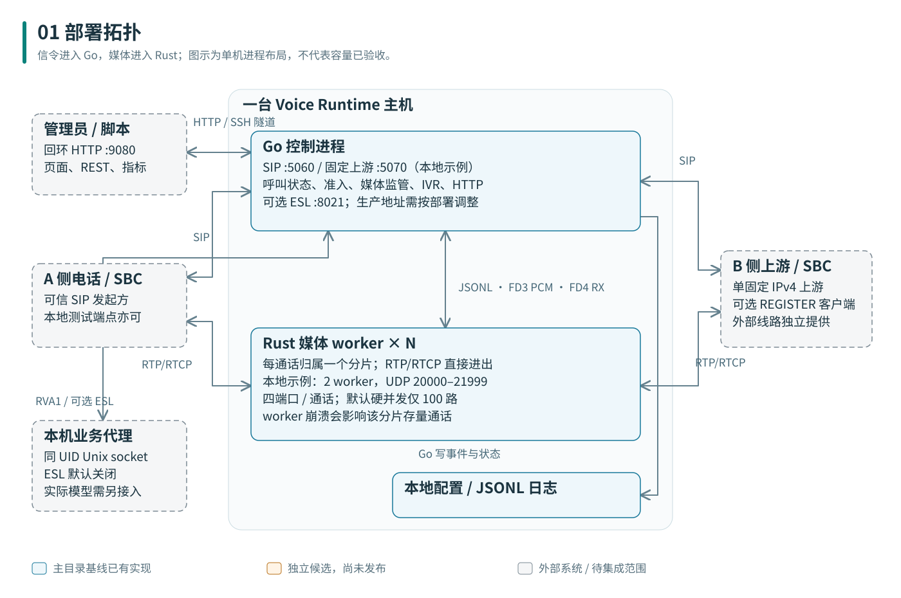
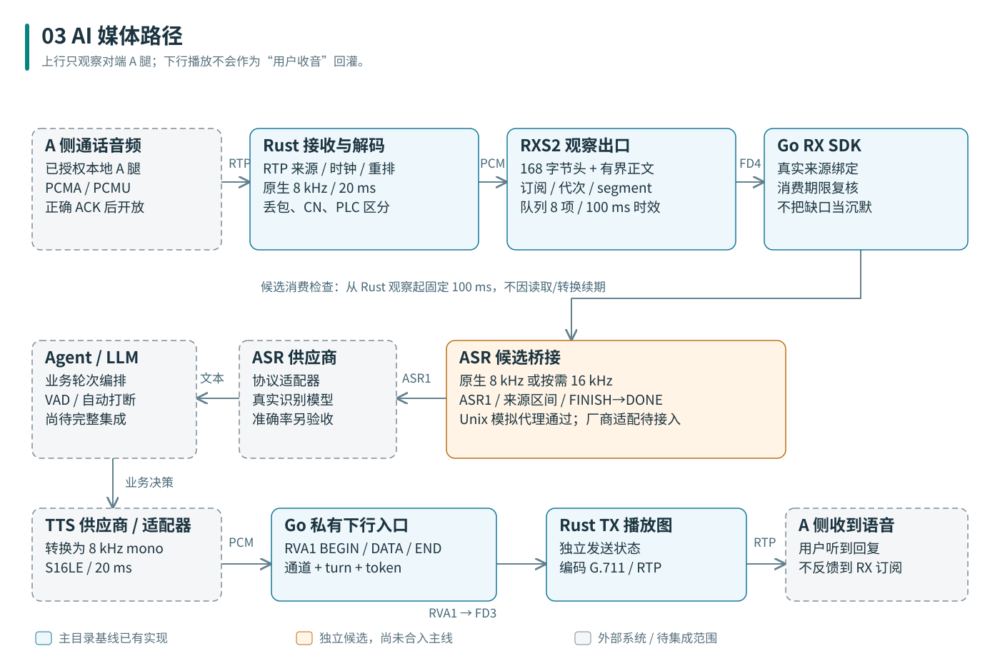
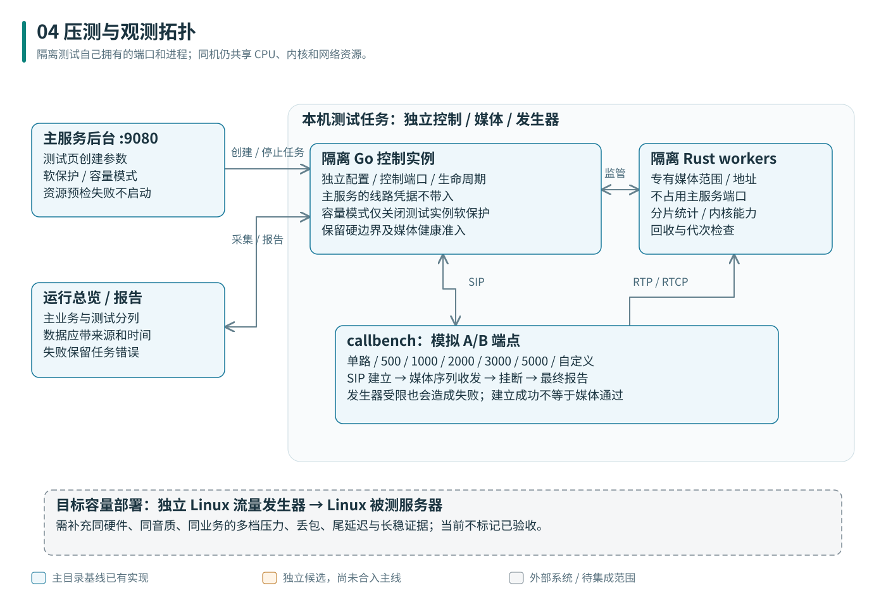

# 02 项目拓扑图

## 基线部署拓扑

主服务由一个 Go 控制进程和多个 Rust 媒体子进程组成。SIP 信令到 Go，RTP/RTCP 到 Rust；后台访问回环 HTTP。外部线路或可信 SBC 是独立系统，不包含在工程中。管理端通过本机浏览器或 SSH 隧道接入。

| 连线 | 方向与用途 | 默认/示例 |
|---|---|---|
| SIP | 可信 A 侧 ↔ Go ↔ 固定上游 B 侧 | 本地 UDP 5060，上游 5070；TCP/TLS 需显式配置 |
| 媒体 | A/B ↔ 分配该通话的 Rust worker | 本地示例 UDP 20000–21999，每通话预留四端口 |
| HTTP | 管理员/脚本 → Go | 127.0.0.1:9080；26 个操作及静态页面 |
| ESL | 本机业务控制 → Go | 默认关闭；显式示例 127.0.0.1:8021 |
| JSONL IPC | Go ↔ 每个 Rust 子进程 | stdin/stdout；诊断走 stderr |
| PCM/RX | Go ↔ Rust | 独立继承 FD3/FD4，不是网络监听端口 |
| RVA1 | 本机业务代理 → Go → Rust | 显式私有 Unix socket；流式 PCM 下行 |
| 文件 | Go → 本地持久化目录 | journal.path、追加 .admin.json 的管理状态 |

## 语音智能体接入拓扑

蓝色部分是基线已有媒体路径；橙色 ASR1 是已验证的独立候选；灰色模型和业务编排是外部/待集成范围。当前没有已实现的通用 gRPC/WebSocket Agent 服务，不应按图中的外部模块推断新增接口。

本地 RX 与下行 TX 相互独立。上行只观察对端 A 腿，不把本地 TTS 播放回灌成用户音频。内部保留原生采样率，ASR 分支需要 16 kHz 时才转换；不能将所有媒体写成统一 16 kHz 在线处理已完成。

## 压测拓扑与资源隔离

后台测试页启动自己的控制实例、媒体进程和发生器；主服务总览应将主业务与测试数据分开展示。同机测试仍共享 CPU、内核和网卡，端口分离不等于硬件隔离。独立 Linux 压测机是目标容量验收的推荐部署形式，不是本次已取得的运行环境。

测试子实例不会使用主服务线路凭据注册真实运营商。容量模式仅关闭它自己的业务软保护，硬并发/CPS、媒体健康和资源边界仍生效。不能占用主媒体范围来消除压测预检失败。

## 端口与容量规划

四端口块预算：`floor((port_end - port_start + 1) / 4)`。至少满足 `max_calls + ceil(calls_per_second × port_reuse_delay_ms / 1000)`。还需考虑每 worker 分区、已占用块、文件描述符与实际网络能力。

本地示例只有 100 路硬上限，不是万路部署配置。Linux 目标示例见 [原始配置](reference/config/linux-10000.example.json)，必须按真实 IP、CPU 和压测机调整并重新校验；填入 10000 不等于已经达到该性能。
