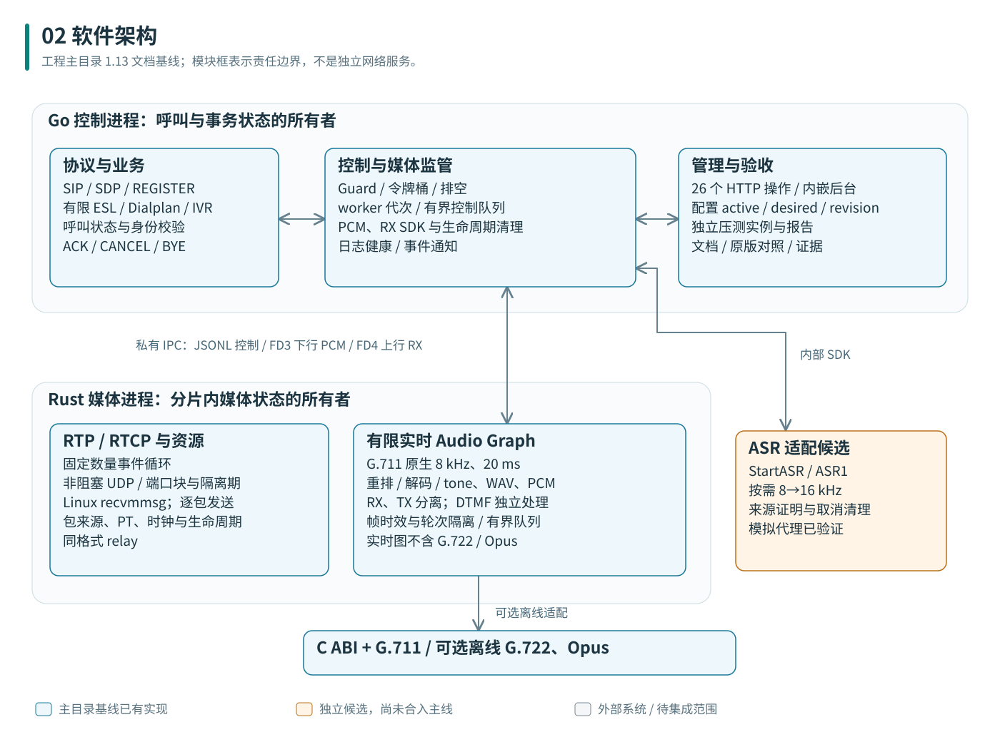
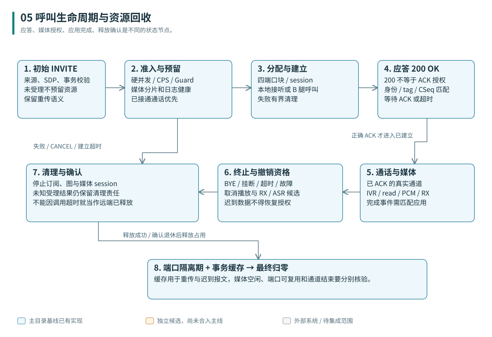

# 03 RustSwitch 软件架构

本章面向开发者说明模块责任、媒体路径、状态归属与故障边界。网络部署见 [部署拓扑](02-项目拓扑图.md)，字段和报文格式见 [HTTP 接口](04-HTTP接口文档.md) 与 [协议和 SDK](05-协议与SDK文档.md)。主工程代码位于 `source/main/`，ASR 候选位于 `source/asr-candidate/`。

## 进程与模块

Go 主循环拥有呼叫和事务状态，Rust worker 拥有分片内的媒体可变状态。固定数量的控制、IO、文件加载及清理执行者处理有界任务，不采用“一路通话一个 OS 线程”的媒体模型。候选 ASR 每流仍有固定三条 Go I/O 协程，不能扩大为整个系统协程数与并发完全无关。

一个 worker 对应独立的 Rust 媒体子进程，由 Go 分配通话并监督。分片数量在启动配置中确定；状态归属、队列容量和取消期限比单纯增加线程数量更关键。ASR 候选源码已公开，但尚未合入主工程及其默认运行路径。

| 逻辑层 | 责任 | 不在此层做的事 |
|---|---|---|
| 接入与控制 | 解析 SIP、建立 A/B 腿、处理 ACK/CANCEL/BYE、注册与认证、路由、IVR | 不逐个音频样本运行模型推理 |
| 准入与监管 | 硬限制、Guard、分片健康、日志健康、代次、命令优先级、进程重启 | 不把新呼叫限速应用到已有 ACK/BYE |
| 媒体事件循环 | 包头/来源验证、端口和会话槽、RTP 时钟、重排、G.711、播放、按键、发送期限 | 不等待外部 HTTP/ASR/LLM 或同步磁盘 |
| 媒体适配 | JSON 控制、FD3 PCM、FD4 RX、私有 RVA1、候选 ASR1 | 各自有版本和身份，不能互换报文 |
| 观测与管理 | HTTP、Prometheus、事件文件、配置工作区、真实测试证据 | 页面展示和配置导出不授予 FS 兼容通过 |
| 原生扩展 | 有版本的 C ABI 与固定依赖 | 不直接装载 FreeSWITCH 原模块或跨 ABI 抛 C++ 异常 |

## 代码组织与扩展入口

| 路径（相对 `source/main/`） | 修改时需要关注 |
|---|---|
| `control/internal/server/` | 呼叫主循环、Guard、定时器、注册、IVR、管理事务和测试任务的生命周期 |
| `control/internal/sip/`、`control/internal/esl/` | 报文语法、传输边界、返回语义和事件顺序 |
| `control/internal/media/` | 子进程监管、命令超时、进程代次、PCM/RX 数据通道和清理责任 |
| `media/src/media/` | 端口池、包校验、实时调度、媒体槽位及本地 G.711 图 |
| `media/src/audio/` | 独立离线音频 SDK、编解码和重采样；不能直接等同于实时 worker 能力 |
| `native/include/`、`native/audio/` | ABI、原生库加载、固定来源与第三方许可 |
| `control/internal/server/web/`、`control/internal/server/doc_assets/` | 内嵌页面和发布文档；接口变化必须同步机器合同和页面语义 |

候选新增的 `control/internal/asr/` 实现在候选树中评估。使用主工程时不能直接调用候选内部方法；将候选功能合入前，需要同时验证合同、资源限额、退出流程和真实业务集成。

## 三条媒体路径

**relay 路径：**RTP/RTCP 校验 → 固定对端校验 → 同格式透传。它不解码、不重采样，也不提供 RTP 混音和任意编码转码。

**G.711 双腿路径：**每腿独立 RTP 接收状态 → 有界重排/播放时钟 → PCMA/PCMU 解码 → 原生 8 kHz PCM → 对腿编码 → 独立 RTP/RTCP 发送。可进行限定 PCMA↔PCMU 转换；不是 G.722/Opus 实时图。

**本地 A 腿路径：**RX 接收/解码/观察与 TX 的 tone/WAV/PCM 各自推进。TX 供音需明确交接所有权；提示音、带提示的 read 与 PCM 不能任意混播。DTMF 与音频共享发送身份但保持各自时间语义。

上述实时路径与 `media/src/audio/` 的离线 `AudioFrame` SDK 分别演进：离线 SDK 支持 8/16/24/48 kHz 单声道 i16 样本、S16LE 字节接口和 10/20 ms 帧，原有构造入口保留 16 kHz 默认值，其他采样率使用显式入口。当前 G.711 实时路径和 RVA1 送音仍使用其合同要求的 8 kHz，详见[音频合同](reference/docs/api/audio-reference.md)。新增编码不能只改能力表，还必须补齐协商、拆包、时钟、状态恢复、播放调度和端到端验证。

## 关键身份与时间线

| 身份/时钟 | 含义与约束 |
|---|---|
| Call-ID | SIP 对话标识；A/B 独立 |
| UUID | 控制面真实通道身份；本地 A 腿不虚构 B 腿 |
| worker generation | 媒体进程代次；旧命令不得作用到重启后的 worker |
| session | 内部媒体资源身份，不是公开音频授权 token |
| turn_id / token | PCM 播放轮次及外部授权；新轮次不能重放旧音频 |
| subscription_id | RX 订阅身份；未知受理必须保留清理责任 |
| source generation / segment | 入站媒体来源与语音段；丢包/暂停/换源不能拼成连续真实语音 |
| PCM sample rate | 每秒真实采样数；与 RTP clock 分开 |
| RTP clock | G.711 8 kHz；G.722 音频 16 kHz 但 RTP 8 kHz；Opus RTP 48 kHz |
| 观察期限 | RXS2 从 Rust 观察开始固定 100 ms；读取、转换和重试不续期 |

这些身份承担不同职责。SIP Call-ID 不能替代媒体会话或播放授权，重启后的进程代次不能复用旧连接结果。实现取消和超时处理时，必须保留对“请求可能已被远端受理”的资源清理责任。

## 呼叫生命周期

初始 INVITE 通过准入后才预留呼叫/媒体。双腿桥接会建立 B 侧对话；本地接听只分配 A 侧。媒体分配成功后的 200 还不能替代真正收到正确 ACK。已有通话的连接、释放和终结始终拥有有限的优先推进通道。

挂断先撤销业务读写授权，再终止媒体并回收端口。事务重传缓存与短期 SIP 计时器可在 active_calls=0 后继续存活，必须在其合法期限后再判断泄漏。候选 ASR 还区分“网络/RX 资源关闭”与“业务取完 final”，不能只看槽位归零判断识别完成。

## 管理状态与持久化

启动 JSON 定义基础配置，管理状态文件保存 `desired`、Guard 和 XML 工作区。`GET /v1/config` 分别返回运行中的 `active`、待启动的 `desired` 及 `restart_required`；保存配置不直接替换已经运行的监听、媒体进程和硬限制。

管理写入采用共享 `revision` 处理并发更新，持久化成功后再提交相应状态。Guard 在线调整只影响后续新呼叫；配置和 XML 工作区的保存语义各不相同。事件日志使用有界异步队列，不是用于活动会话恢复的复制数据库。

## 故障边界

慢媒体消费者：有限排队、到期拒绝/显式缺口；不无限缓存。媒体 worker 崩溃：该分片通话会中断，其他分片继续，监督器递增代次后重启。控制进程或整机故障：当前没有存量通话无损接管。事件日志异步批量持久化，不能承诺 RPO=0。

Linux 已实现 recvmmsg 批量收包，发送仍逐包；sendmmsg、io_uring、AF_XDP、DPDK 和完整 NUMA 最优方案是后续可测方向。架构图不把这些优化画成当前已启用后端。

## 架构变化的验证要求

修改状态归属或媒体路径时，应至少覆盖正常建立/释放、重复请求、取消与超时、消费者过慢、worker 重启及旧代次数据。协议兼容变更还需要固定 FreeSWITCH 参考版本的同条件差分；性能变更应在相同硬件、编码和业务功能下比较吞吐、尾延迟、资源消耗与音频正确性。

固定分片和有界队列是当前设计手段，不是已经通过万路、故障零损失或全量 FreeSWITCH 兼容的证明。当前门禁与后续验收以 [能力状态](08-当前能力与验证状态.md)、[需求说明书](12-需求说明书.md) 和 [未完成清单](13-项目未完成清单.md) 为准。
