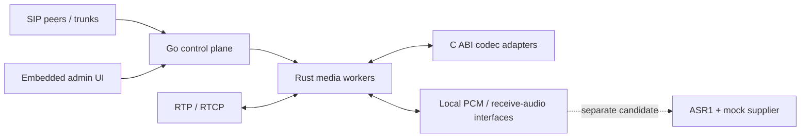

# RustSwitch — a FreeSWITCH alternative for Voice Agents

**Rust media. Go call control. C/C++ codec adapters. Built around real-time telephone audio.**

[简体中文](README.md) · **English**

[Get the source](source/main) · [Download a preview](https://github.com/weijiaxing1992-arch/yunfu-voice-runtime/releases) · [Quick start](QUICKSTART.md) · [Architecture](03-软件架构图.md) · [API reference](04-HTTP接口文档.md) · [Contribute](CONTRIBUTING.md)

RustSwitch, also called Yunfu Voice Runtime in the code and documentation, is an open-source voice runtime for inbound calls, outbound calling, and telephone Voice Agents. It aims to offer a focused alternative to FreeSWITCH, with gradual compatibility where it helps real migrations.

**Development preview:** the repository contains working implementations, buildable source, ARM64 runtime packages, and documented gaps. It is not yet a drop-in FreeSWITCH replacement. Full Voice Agent calls, complete protocol compatibility, and 5,000/10,000-call production capacity have not passed acceptance testing.

## Why RustSwitch?

Voice Agents need more than a connected call. They need timely audio, clear ownership of each conversation turn, bounded resource use, and evidence that survives failures.

RustSwitch's design puts those needs at the center:

- **Separate media from control.** Rust workers handle RTP and media state; Go manages calls, admission, supervision, and the administration console.
- **Expose audio to agent integrations.** Local PCM streaming and receive-audio interfaces provide a foundation for speech pipelines. A separate ASR candidate adds a mock-backed protocol implementation.
- **Make overload visible and controllable.** Concurrency, calls per second, and calls being established have explicit limits, with local configuration and test pages.
- **Make migration measurable.** Published interface contracts, a pinned FreeSWITCH comparison, and failure records show what is implemented, what is partial, and what still needs verification.

Higher capacity and lower resource use are engineering goals. This preview does not claim a measured advantage over FreeSWITCH.

## What is available today?

| Area | Included in this preview | Current boundary |
| --- | --- | --- |
| Telephone signaling | Restricted IPv4 SIP calls over UDP/TCP/TLS, a single fixed-upstream REGISTER/Digest client, exact-number local answering | No complete Sofia equivalent, multi-gateway registrar, or general-purpose originate API |
| Media | RTP/RTCP relay, limited real-time PCMA/PCMU processing, prompt/WAV playback, DTMF receive/send and restricted digit collection | Full IVR semantics and real-time G.722/Opus processing remain open |
| Agent audio foundation | Local PCM downlink, receive-audio access, session/generation/turn boundaries | A complete ASR–LLM–TTS agent is not included |
| ASR candidate | Separate ASR1 protocol, mock supplier, lifecycle controls, resampling and result provenance checks | Not merged into the main tree; the mock does not recognize speech |
| Operations | Embedded Chinese administration UI, admission limits, process supervision, SIP/media quick tests, load-test tooling | Production security, capacity and recovery require further acceptance work |
| Migration materials | HTTP contracts, SDK/protocol docs, editable diagrams, requirements, and 3,999 comparison records | Records include declarations and configuration entries; they are not a count of supported features |

The G.722 and Opus native adapters are available as optional backends. Their presence does not mean that every real-time media path supports those codecs. See the [current capability report](08-当前能力与验证状态.md) and [remaining work](13-项目未完成清单.md).

## Architecture



The default UI is embedded in the Go executable; it does not need a separate Node.js service. [Deployment topology](02-项目拓扑图.md), [software architecture](03-软件架构图.md), and [editable diagram sources](figures) explain process boundaries and the planned agent path.

## Try it locally

### Prebuilt runtime

Download the matching runtime archive from [Releases](https://github.com/weijiaxing1992-arch/yunfu-voice-runtime/releases), extract it, then run from the extracted package root:

```sh
python3 verify.py
cd main
chmod +x run.sh bin/*
./run.sh -check-config
# After configuration passes and the example ports are free:
./run.sh
```

Open `http://127.0.0.1:9080`. The examples bind to loopback and do not provide a real SIP trunk. Start with the isolated single-call test in the administration console; it does not use a browser microphone. Read [Quick start](QUICKSTART.md) before connecting a real line or changing listen addresses.

| Runtime archive | Platform | Notes |
| --- | --- | --- |
| macOS ARM64 | Apple Silicon, macOS 26+ | Includes optional G.722/Opus native libraries; development binaries are not Developer ID notarized |
| Linux ARM64 | Linux aarch64 | Static core binaries; optional G.722/Opus shared libraries are not included |

No prebuilt x86_64 package is provided in this preview. The Linux ASR candidate package has not passed a combined runtime test. Main and candidate use the same example ports and should not be started together.

### Build from source

Install Python 3.9+, Go 1.23+, Rust/Cargo 1.85+, and a C11 compiler with your platform's development tools. These are declared minimums; not every minimum-version combination has been rebuilt. Vendored dependencies are included; compilers are not.

```sh
git clone https://github.com/weijiaxing1992-arch/yunfu-voice-runtime.git
cd yunfu-voice-runtime
python3 delivery-tools/verify_delivery.py
python3 delivery-tools/build_source.py \
  --variant main \
  --output ../voice-runtime-build-main
```

Choose a new output directory outside the repository. This offline build does not start network services. The [Quick start](QUICKSTART.md) covers assembling the runtime, the optional native backends, and the separate ASR candidate.

## Read the project

Most detailed documentation and code comments are currently in Chinese. This English overview is an entry point, not a claim that every document is translated.

| Looking for | Start here |
| --- | --- |
| Main source and build tools | [source/main](source/main), [delivery-tools](delivery-tools) |
| Candidate work and patch provenance | [source/asr-candidate](source/asr-candidate), [source/patches](source/patches) |
| HTTP operations and data models | [HTTP API](04-HTTP接口文档.md), [data models](09-数据模型全文.md) |
| Protocols and SDKs | [Protocol and SDK guide](05-协议与SDK文档.md) |
| Running, diagnosing and testing | [User guide](06-使用说明.md), [operations and load testing](07-运维与压测说明.md) |
| FreeSWITCH migration gaps | [Capability status](08-当前能力与验证状态.md), [comparison data](backlog), [remaining work](13-项目未完成清单.md) |
| Requirements and full delivery inventory | [Requirements](12-需求说明书.md), [delivery inventory](DELIVERY.md) |
| Source and binary licensing | [Open-source scope](OPEN_SOURCE.md), [license scope](LICENSE_SCOPE.md), [third-party notices](THIRD_PARTY_NOTICES.md) |

The full materials archive also contains an offline `index.html`, source snapshots, editable diagrams, and selected historical evidence. Large archives and binaries are distributed through Releases.

## Acceptance and roadmap

The next priorities are concrete engineering work:

1. Repair documentation gates and refresh evidence against the exact published source.
2. Make load-test statistics consistent and diagnose the recorded relay failures.
3. Integrate real speech suppliers, VAD, streaming TTS and conversation-turn cancellation.
4. Extend call origination, registration, DTMF/IVR and useful ESL compatibility with paired tests.
5. Validate core codecs, complete Voice Agent calls, and sustained capacity on target Linux hardware.

The current main documentation gate reports expired `key-api-pcm-stream` evidence; the candidate gate reports a field dictionary that is behind its machine contract. Builds and package integrity checks do not resolve those gates. Historical pass counts must not be treated as a current compatibility percentage. See the [40 work packages and their acceptance conditions](13-项目未完成清单.md).

## Build this with us

Useful contributions include a reproducible SIP interoperability case, a fix with failure-path coverage, a clearer first-run guide, or a benchmark whose workload and hardware are fully described.

- [Report a bug or propose an improvement](https://github.com/weijiaxing1992-arch/yunfu-voice-runtime/issues)
- [Read the contribution guide](CONTRIBUTING.md) and [community guide](COMMUNITY.md)
- [Report a security issue](SECURITY.md)

If this direction is useful to you, **star the repository** to make it easier for other telephony and Voice Agent developers to discover. Real issue reports, reproducible results and thoughtful pull requests help the project move forward.

## License and attribution

Project-owned original code and documentation are licensed under [Apache-2.0](LICENSE). Third-party code and materials retain their own licenses, including LGPL-covered G.722 components and the FreeSWITCH, Opus, Go and Rust materials listed in [THIRD_PARTY_NOTICES.md](THIRD_PARTY_NOTICES.md). Read [LICENSE_SCOPE.md](LICENSE_SCOPE.md) before redistributing a combined package.

FreeSWITCH is referenced for compatibility and attribution. RustSwitch is an independent project, not an official FreeSWITCH distribution, and does not claim endorsement or certification by its upstream project.
