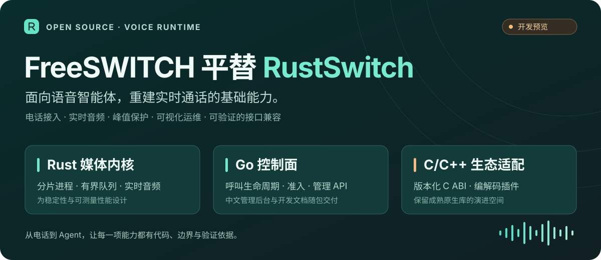
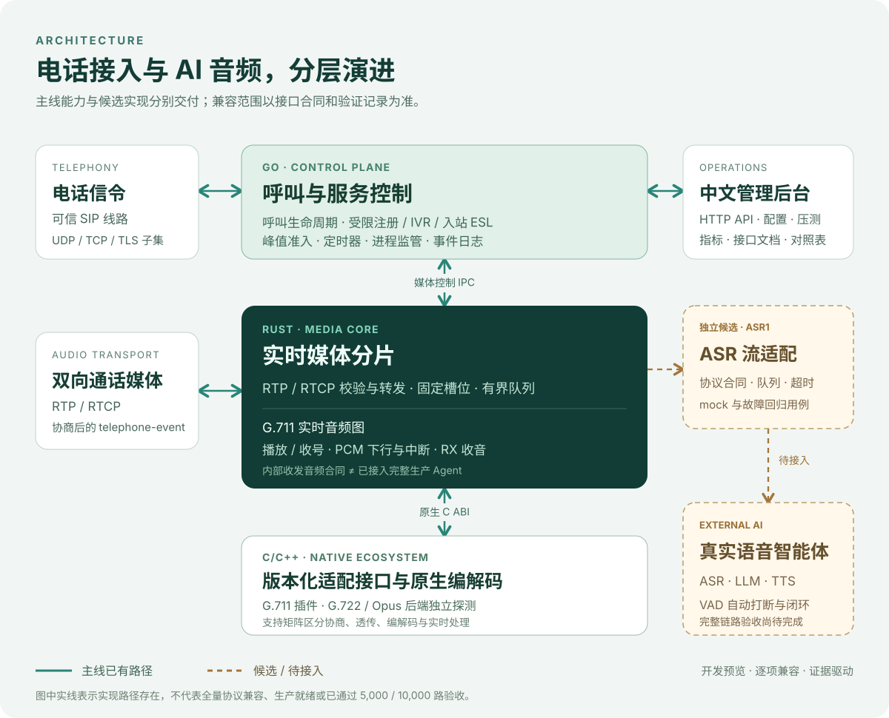
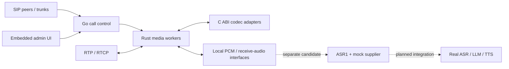
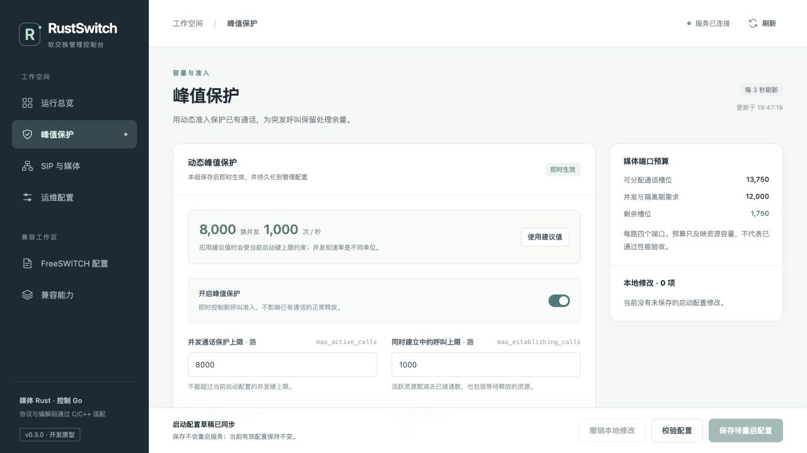

<div align="center">

# RustSwitch — a FreeSWITCH alternative

**Open-source real-time voice infrastructure · FreeSWITCH / PBX migration research**

Rust media · Go call control · C/C++ codec adapters

[简体中文](README.md) · **English**

[](08-当前能力与验证状态.md)
[](LICENSE_SCOPE.md)
[](https://github.com/weijiaxing1992-arch/yunfu-voice-runtime/stargazers)

[**Quick start**](QUICKSTART.md) · [**Download the preview**](https://github.com/weijiaxing1992-arch/yunfu-voice-runtime/releases/tag/v0.1.0-preview.20260908) · [**Documentation**](DOCUMENTATION.md) · [**API reference**](04-HTTP接口文档.md) · [**FreeSWITCH / PBX guide**](community/freeswitch-pbx-guide.en.md) · [**Contribute**](CONTRIBUTING.md)



</div>

RustSwitch, also named **Yunfu Voice Runtime** in the source and delivery materials, is a real-time telephony infrastructure project for Voice Agents. It separates Rust media processing, Go call control, and native C/C++ adapters, with a focus on telephone access, continuous audio, playback, digit interaction, resource protection, and observability.

The goal is to become a **FreeSWITCH alternative for telephone Voice Agent workloads**, adding compatibility where it supports actual migration requirements. This repository contains the main source, a separate ASR candidate, tests, pinned dependencies, documentation, and a published backlog. Runtime binaries and resource archives are distributed through GitHub Releases.

> **Development preview.** RustSwitch is not currently a drop-in replacement for every FreeSWITCH deployment. Complete 5,000/10,000-call capacity acceptance and a real ASR–LLM–TTS application loop remain unfinished. Implementation, limited validation, and engineering goals are reported separately in the [capability status](08-当前能力与验证状态.md).

Most detailed documentation, diagrams, administration screens, and code comments are currently in Chinese. This English overview provides an entry point; it does not imply that all materials have been translated.

## FreeSWITCH, PBX and SIP telephony

RustSwitch is relevant to engineers evaluating a **FreeSWITCH alternative, open-source PBX / IP PBX integration, SIP media server or telephone Voice Agent runtime**. Its focus is the call and media infrastructure required by AI conversations. Extension registration, conferencing, queues, voicemail, fax and other complete PBX services remain separate implementation and acceptance work.

| Evaluation area | Current scope | Guide |
| --- | --- | --- |
| FreeSWITCH migration | Pinned interface comparison, explicit differences and workload-specific acceptance | [Migration guide (Chinese)](community/freeswitch-migration.md) |
| PBX / IP PBX / softswitch | Media and call-control foundations; not a complete PBX distribution | [PBX concepts and FAQ](community/freeswitch-pbx-guide.en.md) |
| SIP trunk / REGISTER / Digest | One fixed upstream registration client; restricted UDP/TCP/TLS signaling | [Trunk contract](reference/docs/api/trunk-registration.md) |
| Inbound calls / outbound calls | Two-leg bridging and limited local answering; general `originate` is unfinished | [Calling reference](reference/docs/api/ai-calling-reference.md) |
| IVR / auto attendant / DTMF | Local-leg playback, digit collection and telephone-event subsets | [IVR contract](reference/docs/api/ivr-reference.md) |
| ESL / event socket / fs_cli | Inbound commands and events within a documented subset | [ESL reference](reference/docs/api/esl-reference.md) |
| XML dialplan | Configuration editing/export and a separate limited runtime dialplan | [Dialplan contract](reference/docs/api/dialplan-reference.md) |
| RTP / RTCP / codecs | Relay and G.711 real-time processing; optional offline G.722/Opus backends | [Protocol and codec boundaries](05-协议与SDK文档.md) |
| Voice Agent / conversational AI | PCM playback, receive audio and turn controls; a separate ASR1 candidate | [Architecture](03-软件架构图.md) |
| Call center / contact center | Telephony component research; ACD queues, agent distribution and recording need separate work | [PBX feature matrix (Chinese)](community/pbx-feature-matrix.md) |
| Concurrent calls / CPS | Admission control and isolated load tests; capacity requires actual workload validation | [Operations and testing](07-运维与压测说明.md) |

### PBX migration FAQ

**Is RustSwitch a drop-in FreeSWITCH replacement?** Migration must be evaluated against the deployment's trunks, modules, commands, events, dialplan and media requirements. The preview does not establish universal replacement compatibility.

**Can SIP extensions register with it?** The implemented fixed-upstream REGISTER client is different from a PBX extension registrar. A complete endpoint registration service and multiple gateways are unfinished.

**Can I reuse ESL clients, fs_cli and XML configuration?** Only the documented inbound ESL and runtime dialplan subsets apply. Exporting configuration does not execute the corresponding FreeSWITCH module.

**Does it include conferencing, queues, voicemail or browser WebRTC calling?** These are migration dependencies to assess, not complete features of this preview. See the [feature matrix](community/pbx-feature-matrix.md) for current implementation boundaries.

**Can I build an ASR/TTS voice bot?** The project supplies media foundations and an ASR streaming candidate. Real recognition, synthesis, VAD and Agent orchestration need further integration and end-to-end acceptance.

**Are 5,000 or 10,000 concurrent calls certified?** No. Relay, real codec processing and complete Voice Agent workloads have separate acceptance requirements. Configured limits are not measured capacity.

## Project and version identifiers

| Identifier | Meaning |
|---|---|
| RustSwitch / Yunfu Voice Runtime | Project names; the repository is `yunfu-voice-runtime` |
| [`v0.1.0-preview.20260908`](https://github.com/weijiaxing1992-arch/yunfu-voice-runtime/releases/tag/v0.1.0-preview.20260908) | Published initial development preview; source and runtime archives have their own integrity manifests |
| `source/main/` | The main project directory, distinct from the Git branch named `main` |
| `source/asr-candidate/` | A separately published ASR candidate that has not been merged into the main project |
| `1.13.0` | Main documentation baseline, separate from the release tag, Go application `0.3.0`, and Rust crate `0.2.0` |
| FreeSWITCH `1.11.3` | Pinned compatibility research baseline, not a statement about the latest upstream version or certification |

See the [changelog](CHANGELOG.md) for documentation and delivery changes. Reports should identify the release tag or Git commit and the source variant; a UI version alone does not establish that source, documentation, and binaries match.

## Who this is for

- **Voice Agent developers** evaluating telephone access and audio interfaces before integrating their own ASR, TTS, and application logic.
- **FreeSWITCH migration engineers** testing the specific trunks, commands, events, and media scenarios required by a deployment.
- **Media and systems developers** improving worker isolation, resource cleanup, overload handling, and reproducible benchmarks.
- **Operations and test engineers** validating behavior with the administration console, isolated call tests, metrics, and logs.

Start with the main project's isolated single-call SIP/media test. The current preview is intended for controlled development and acceptance environments; see [SECURITY](SECURITY.md) for deployment boundaries and vulnerability reporting.

## Design principles

| Concern | Approach |
|---|---|
| Separate media and control | Rust processes own RTP and media state; Go manages call lifecycle, admission, and process supervision |
| Explicit resource budgets | Fixed worker shards, bounded queues, port pools, and limits for concurrency, calls being established, and calls per second |
| Agent audio boundaries | G.711 real-time audio graph, PCM downlink, receive-audio interfaces, and session/generation/turn constraints |
| Native ecosystem reuse | Versioned C ABI adapters, with negotiation, relay, codec execution, and real-time processing assessed separately |
| Observable acceptance | Management APIs, samples, failure records, and isolated load tests tied to source, environment, and workload |
| Gradual compatibility | A fixed FreeSWITCH reference with differences, missing capabilities, and failed results retained |

Higher concurrency, lower resource use, and stable long-running calls are engineering goals. This preview has not demonstrated a complete, like-for-like performance advantage over FreeSWITCH.

## Current capabilities and boundaries

| Area | Available scope | Remaining work |
|---|---|---|
| Telephone access | Restricted IPv4 SIP UDP/TCP/TLS bridging, two-leg call lifecycle, fixed-upstream REGISTER/Digest client | General originate, multiple trunks, a complete registration server, and additional SIP dialog behavior |
| Media transport | RTP/RTCP validation and relay, negotiated telephone-event relay | SRTP, WebRTC/ICE, full terminating RTCP behavior |
| Audio and interaction | G.711 real-time graph, local playback/digit collection, PCM downlink/interruption, receive audio, limited IVR | Full IVR semantics, complete audio-path coverage, and dual-track recording |
| Codecs | G.711; optional G.722/Opus native backends and independent checks | Per-path real-time codec coverage and audio-quality acceptance; G.729/AMR/EVS extensions |
| Control interfaces | Project HTTP APIs, inbound ESL and runtime XML dialplan subsets | Complete FreeSWITCH commands, events, dialplan, and plugin semantics |
| Operations | Chinese console, admission protection, worker supervision, logs, single-call and load-test tools | Broader authentication/authorization, reliable statistics, and cross-host preservation of active calls |
| ASR candidate | Separate internal ASR1 contract, mock supplier, lifecycle and audio-provenance checks | Mainline integration, real recognition, TTS/LLM integration, and complete Agent acceptance |

The ASR mock does not recognize speech. A G.722 or Opus backend does not establish support for that codec in every real-time path. Detailed completion criteria are in the [remaining-work register](13-项目未完成清单.md).

## Architecture



Solid lines identify existing main-project paths; dashed lines identify candidate or planned integrations. Neither implies complete semantic acceptance. See [deployment topology](02-项目拓扑图.md), [software architecture](03-软件架构图.md), and [protocols and SDKs](05-协议与SDK文档.md).



## Administration console



*This is an unmodified screenshot from the project's v0.3 historical verification. Values such as 8,000 are configuration or resource budgets, not achieved capacity. Current fields and behavior are defined by the accompanying API documents.*

The console is embedded in the Go executable and needs no separate frontend service. It covers runtime overview, admission protection, SIP/media configuration, tests, interface documents, and the FreeSWITCH comparison.

## Quick start

### Prebuilt runtime

Download a matching runtime archive from the [preview release](https://github.com/weijiaxing1992-arch/yunfu-voice-runtime/releases/tag/v0.1.0-preview.20260908), extract it, and run from the package root:

```sh
python3 verify.py
cd main
chmod +x run.sh bin/*
./run.sh -check-config
# Start after configuration passes and the example ports are available.
./run.sh
```

Open the [local administration console](http://127.0.0.1:9080) and begin with the isolated single-call SIP/media simulation. This test does not use a browser microphone, and the defaults do not include a real SIP trunk.

| Runtime | Platform and boundary |
|---|---|
| macOS ARM64 | Apple Silicon, macOS 26+; optional G.722/Opus native libraries included; development binaries are not Developer ID notarized |
| Linux ARM64 | Linux aarch64 static core; optional G.722/Opus shared libraries are not included; the ASR candidate combination has not completed an integrated runtime test |

No prebuilt x86_64 runtime is provided. Defaults bind to loopback: SIP `5060`, fixed upstream `5070`, administration `9080`, a 100-call limit and 20 CPS. Main and candidate use the same ports and should be run separately. These values are defaults, not measured capacity. Follow [QUICKSTART](QUICKSTART.md) for complete instructions.

### Build from source

Install Python 3.9+, Go 1.23+, Rust/Cargo 1.85+, and a C11 development environment. Minimums come from source declarations and have not been tested in every combination; recorded builds use Go 1.27.1 and Rust 1.98.1.

```sh
git clone https://github.com/weijiaxing1992-arch/yunfu-voice-runtime.git
cd yunfu-voice-runtime
python3 delivery-tools/verify_delivery.py
python3 delivery-tools/build_source.py \
  --variant main --output ../rustswitch-build
```

Pinned dependency source is included, so the delivery build does not fetch dependencies online; compilers must be installed separately. Choose a new output directory outside the repository. This script verifies source snapshot manifests and only builds unmodified delivery source; it rejects edited source. For development changes, use the source project's Go/Cargo/Makefile entry points and report documentation-gate blockers explicitly. Snapshot mismatches after local edits are expected; do not rewrite historical manifests to bypass checks. See [Quick start](QUICKSTART.md) for runtime assembly and [CONTRIBUTING](CONTRIBUTING.md) for the development workflow.

## FreeSWITCH compatibility and acceptance

RustSwitch prioritizes common telephone Voice Agent paths and incrementally supports interfaces required by real migrations. Existing FreeSWITCH modules cannot be loaded directly as binary plugins. General PBX functionality, conferencing, video, fax, and all third-party modules are not claimed as completed in this preview.

The [3,999 comparison records](backlog/FreeSWITCH-全部逐项状态.csv) mix interfaces, declarations, configuration, and acceptance definitions. They **cannot be used directly as a compatibility-percentage denominator**. Migration decisions need these separate checks:

| Check | Evidence |
|---|---|
| Required protocol, command, and return semantics | [Pinned FreeSWITCH comparison standard](source/main/docs/freeswitch-compatibility/README.md) |
| Accepted inputs, configuration, and errors | [HTTP API](04-HTTP接口文档.md), [protocol and SDK guide](05-协议与SDK文档.md) |
| Runtime implementation versus configuration export | [Machine-readable comparison](backlog/FreeSWITCH-全部逐项状态.json) |
| Tests that apply to the selected source | [Validation status](08-当前能力与验证状态.md), [remaining work](13-项目未完成清单.md) |

The current main documentation gate records expired `key-api-pcm-stream` evidence; the candidate gate records a field dictionary behind its machine contract. These are encountered blockers, not an exhaustive list. Integrity checks, builds, functional tests, paired interoperability, and capacity acceptance establish different things. Historical passes do not automatically become current green results; see the [documentation and evidence guide](DOCUMENTATION.md).

## Development priorities

1. Repair delivery gates and statistical consistency, and refresh evidence against specific source revisions.
2. Improve registration, call lifecycle, audio receive/playback, digits, and cleanup across success and failure paths.
3. Integrate real ASR/TTS, conversation turns, cancellation, timeouts, VAD/interruption, and audio correctness.
4. Close deployment-relevant SIP, ESL, XML, and codec gaps with reproducible paired tests.
5. Compare against FreeSWITCH under the same hardware, features, and audio quality, then validate 1,000/5,000/10,000-call workloads and sustained mixed load.

These are engineering priorities, without promised delivery dates or achieved performance gains. See [requirements](12-需求说明书.md) and [work packages](13-项目未完成清单.md) for priorities and completion conditions.

## Source and documentation

| Reader | Starting points |
|---|---|
| Evaluators | [Quick start](QUICKSTART.md), [project overview](01-项目说明.md), [current status](08-当前能力与验证状态.md) |
| Developers and integrators | [Architecture](03-软件架构图.md), [26 HTTP operations](04-HTTP接口文档.md), [77 data models](09-数据模型全文.md), [protocols and SDKs](05-协议与SDK文档.md) |
| Operations and testing | [User guide](06-使用说明.md), [operations and load testing](07-运维与压测说明.md) |
| Project handover | [Source delivery](11-交付与源码说明.md), [requirements](12-需求说明书.md), [remaining work](13-项目未完成清单.md) |
| Open source and community | [Open-source scope](OPEN_SOURCE.md), [license scope](LICENSE_SCOPE.md), [community guide](COMMUNITY.md), [changelog](CHANGELOG.md) |

The [documentation center](DOCUMENTATION.md) explains reading order and source authority. The full materials archive includes an offline `index.html`, editable diagrams, and detailed references; see the [delivery inventory](DELIVERY.md).

```text
source/main/              Main Go, Rust and C project, configuration and tests
source/asr-candidate/     Separate ASR candidate and mock
source/patches/           Tested patches and separately identified working drafts
source/design-reference/ Protocol prototypes and design tests
dependencies/            Pinned Rust dependencies and Opus source archive
delivery-tools/          Offline build and distribution integrity checks
backlog/                 FreeSWITCH comparison and work register
requirements/            Project direction and requirements traceability
evidence/                Historical evidence with version and scope
```

## Contribute

Reproducible bugs, sanitized interoperability cases, fully described benchmarks, code improvements, and documentation corrections are welcome. Small changes can go directly to a pull request; discuss substantial interface or architecture changes in an issue first. See [COMMUNITY](COMMUNITY.md) and [CONTRIBUTING](CONTRIBUTING.md).

[Report a bug](https://github.com/weijiaxing1992-arch/yunfu-voice-runtime/issues/new?template=bug_report.yml) · [Request a feature](https://github.com/weijiaxing1992-arch/yunfu-voice-runtime/issues/new?template=feature_request.yml) · [Report interoperability](https://github.com/weijiaxing1992-arch/yunfu-voice-runtime/issues/new?template=compatibility_report.yml) · [Report a security issue](SECURITY.md)

If RustSwitch is useful to you, **star the repository** or share it with telephony and Voice Agent developers. Specific use cases, reproducible results, and sustained contributions help the project grow.

## License and attribution

Original code and documentation that the project is entitled to license are provided under [Apache-2.0](LICENSE). G.722 support files, SpanDSP, FreeSWITCH templates, Opus, and Go/Rust dependencies retain applicable exceptions and upstream licenses. Review [LICENSE_SCOPE](LICENSE_SCOPE.md), [third-party notices](THIRD_PARTY_NOTICES.md), and the [machine inventory](third-party-inventory.json) before redistribution.

Thanks to FreeSWITCH, Rust, Go, SpanDSP, Opus, and the dependency projects. RustSwitch is independent; references to FreeSWITCH describe compatibility research and attribution, not an official distribution, endorsement, or compatibility certification.
