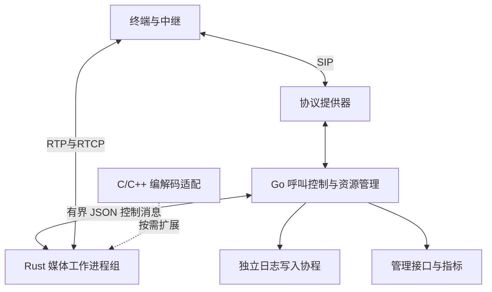

# 云蝠 Voice Runtime 架构决策与实现状态

文档1.9起以[语音智能体研发方向](api/voice-runtime-direction.md)为首期设计依据。下文区分现有原型实现与待建能力，研发顺序见[阶段里程碑](api/voice-runtime-roadmap.json)。完整FreeSWITCH模块宿主不再是首期前置条件。

## ADR-001：语言与进程边界

已按用户指定采用 Rust 核心媒体、Go 控制面、C/C++ 协议与编解码生态适配。



媒体包不通过 Go、不通过 JSON、不经过日志写盘。JSON 只承载建立、连接、释放和统计等低频控制操作。每个工作进程运行一个媒体事件循环以及两个控制管道辅助线程。Linux 绑定 CPU 时只绑定媒体主线程。

当前协议提供器是 Go 实现的受限 IPv4 UDP/TCP/TLS 原型，便于立即验证跨语言呼叫闭环。下一阶段应引入独立的 Sofia-SIP 或 PJSIP 原生提供器，接管事务、传输和 SIP 定时器；Go 继续拥有跨呼叫腿的业务状态。切换时必须移除原型提供器对同一事务的控制，避免双重重传和状态竞争。

## 所有权与生命周期

- 一个呼叫的 A/B 媒体 socket、端点映射、速率桶和待发送数据属于同一个 Rust 工作进程。
- 每路通话分配四个独立 UDP 端口：A RTP、A RTCP、B RTP、B RTCP。
- 工作进程拥有互不重叠的端口分区；全局准入限制叠加每分片配额。
- 在 INVITE 外发与 SDP 广告前，必须收到媒体分配成功响应；在向主叫报告媒体建立前，必须收到连接成功响应。
- 释放命令幂等；控制面收到释放成功或确认对应进程已结束后，才归还呼叫配额。
- 进程代次是控制命令的校验条件，防止延迟到达的旧命令修改重启后的新状态。
- Go 呼叫状态由一个事件循环修改；HTTP 与接收协程只通过原子指标、不可变统计快照或有界事件通道访问它。

## 数据处理

Mio 负责就绪通知。每次轮转每个 socket 最多处理 32 个包，达到配额后继续保留在就绪队列，直到读到 WouldBlock。这避免边沿触发下只读一部分数据就再也收不到通知的问题。

媒体事件循环预分配 8 个 2048 字节接收缓冲并持续复用。Linux 使用非阻塞 `recvmmsg`，不等待凑满一批；Mac 使用逐包接收的兼容路径。Linux 保留逐包来源、截断长度及 `SO_RXQ_OVFL` 信息。批量不足不直接等于耗尽，仍继续读取至 WouldBlock。新增接收系统调用次数、批次数和最大批量指标，用于观察目标机实际批处理收益。

就绪标识直接定位固定会话槽位，并校验代次，避免每包哈希查询和旧就绪事件误操作复用端口的新通话。控制命令仍按会话 ID 查询映射。就绪与待发送队列使用索引去重；每轮最多处理 128 个 socket、8 条控制命令，限制单次工作量。

普通成功转发不申请新堆内存。只有发送端短时不可写时才复制到有界缓冲，每 socket 最多 8 包，过期时间 5ms。达到上限、过期和实际发送错误分别计数。它是有限突发缓冲，不能用来保证任意拥塞下不丢包。发送当前仍逐包提交，尚未实现 `sendmmsg`、io_uring、AF_XDP 或 DPDK；是否引入由 Linux 分层测量决定。

`connect_sockets` 可在协商完成后连接四个 UDP socket，使用固定对端发送路径。重复的同端点 183/200 不重复连接；B 端变化时丢弃待发旧端点数据并计数，再更新 B 端连接。此选项没有启用地址学习；内核对非对端来源的过滤可能发生在应用计数之前。

RTP 做完整基本头、CSRC、扩展头和 padding 边界检查。RTCP 做包长度及常见类型最小长度检查，并透明转发。来源需与已协商地址精确匹配；暂不进行不受约束的 symmetric RTP 地址学习。

## 控制协议 v1

传输为子进程标准输入/输出的逐行 JSON，单行上限 16 KiB。标准错误用于诊断；标准输出专用于协议。

工作进程首先输出：

```json
{"id":0,"ok":true,"type":"ready","protocol_version":1,"worker_id":0,"pid":1234}
```

请求示例：

```json
{"id":1,"op":"allocate","session":42,"a":{"rtp":"192.0.2.20:30000","rtcp":"192.0.2.20:30001"},"payload":0,"dtmf_payload":101}
```

成功响应包括 `a_rtp / a_rtcp / b_rtp / b_rtcp`。随后使用 `connect` 设置 B 端地址；`release` 释放；`stats` 返回计数；`shutdown` 停止工作进程。错误使用 `ok:false,type:error,message`。媒体状态不通过日志复原。

Go 每个工作进程分为 64 项分配队列与 64 项连接/释放优先队列，每轮最多先服务 8 个优先请求，然后轮询普通请求和统计。Rust 收发队列各 128 项；单个请求超时后结束该进程，避免“不知道分配是否成功”造成资源泄漏。该策略优先保证状态一致和其他分片稳定，可能中断故障分片通话。

## 负载准入与控制面内存

启用 `adaptive_admission` 后，每秒采样媒体进程 CPU 时间增量与可观测 socket/发送丢包。默认 CPU 达到 0.85 个核心、丢包计数增长、控制积压达到 32 项或统计超过 3 秒未更新时，暂停该工作进程的新分配。已接纳通话的连接和释放继续执行。三个连续样本满足 CPU 不高于 0.65、队列少于 8 项且没有新增丢包后恢复，避免反复开关。

CPU 指标覆盖整个媒体进程，包括辅助线程，并非硬件最忙核心或纯媒体线程利用率；采样存在延迟。NIC 全局丢包、内存压力和转发尾延迟尚未自动接入此门限。`readyz` 要求至少一个进程允许准入，最终分配还受呼叫配额和端口限制。

Go 定时器按种类、会话与事务键建立索引，相同定时器原位更新。接通/ACK/结束时立即删除不再需要的定时器，避免短通话积累数小时后的过期项。已经结束的通话仍保留有限的 SIP 重传响应缓存和回收定时器；因此呼叫归零后 `active_timers` 不要求立刻为零。

## C/C++ 接口

`native/include/rustswitch_codec.h` 定义 ABI 版本、结构体尺寸、PCM/编码缓冲单位、创建/销毁与编码/解码回调。宿主在动态库卸载前销毁上下文，禁止 C++ 异常跨 ABI，插件不得保留临时缓冲指针。

`native/examples/g711_plugin.c` 是可运行的参考实现。Rust 的 `--check-codec` 对其执行实际 PCM → μ-law → PCM 往返。该验证器当前使用 G.711/8kHz/单声道向量，不能直接当作任意 Opus 等编码器的质量测试。

适配 libopus、libSRTP、Sofia-SIP 或 PJSIP 时，必须针对实际版本实现适配层，不能把原生库文件直接当成此 ABI 的插件。`rustswitch_protocol.h` 目前仅为原生协议提供器预留接口，事件模式和生产接入仍待实现。

## 后续里程碑

1. 现网基线：固定等价FreeSWITCH配置与资源预算，包含接入、录音、安全和AI通信成本。
2. 单Worker音频闭环：单写者状态、固定帧接口与按需采样率、可取消播放时间线、显式缓冲与发送迟到测量。
3. 完整AI闭环：流式ASR/TTS、持续收音、turn版本打断、双轨异步录音，先接真实协议的模拟服务，再接供应商。
4. 多核容量：Worker分片、NUMA和网络I/O实测，联合并发/CPS/音质/尾延迟与最忙Worker保护。
5. 生产替换：目标线路互通、72小时混合负载、故障注入、灰度、排空与回滚；不把活动会话迁移当作首期承诺。

每个里程碑需独立源码、配置、构建和真实执行证据。原生Frame SDK、同格式转发和单路互通均不代表整个AI闭环或更高性能已完成。
