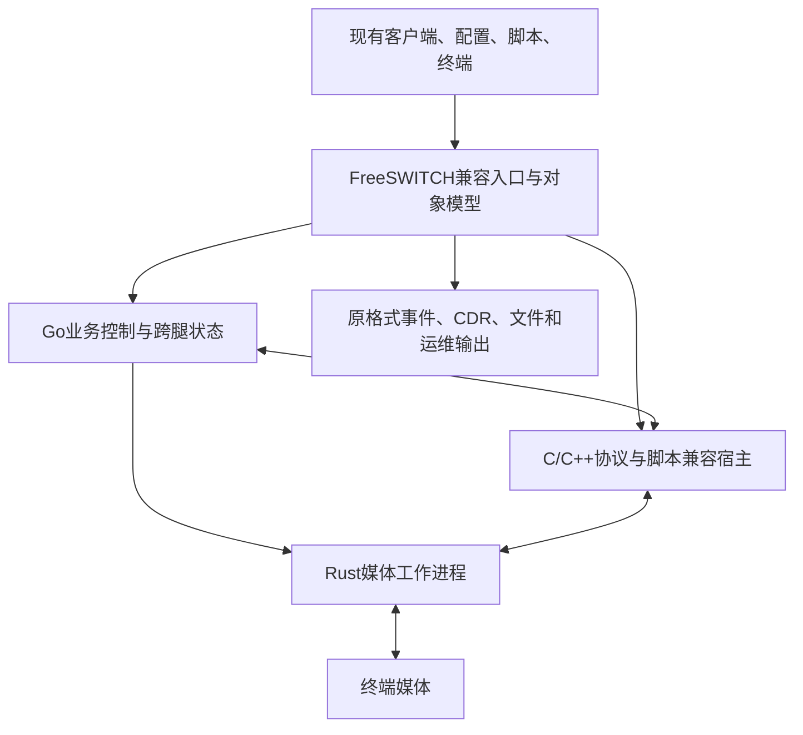

# 07 · 当前实现差距与落实顺序

## 7.1 对照 RustSwitch 0.3（文档发行版本 1.5）

这是对本仓库当前源码与绑定运行证据的检查，不是对未来实现能力的限制，也没有将自有接口或局部通过计为 FreeSWITCH 完整契约通过。本轮已运行原版：26项成对探针中21项限定场景通过、3项行为差异、2项身份/入口发现；Go 413项、端到端96项通过，3979个原条目的完整契约仍无通过认证。

| 兼容面 | 当前能力 | 距离本标准的缺口 |
|---|---|---|
| ESL/fs_cli/libesl | 可选入站监听、认证、api/bgapi、基础订阅/筛选和 plain/JSON/XML 事件子集；console_execute 单 API 路径及原版 fs_cli 三条命令已实测 | 完整入站语义、出站协议、sendmsg 应用执行、别名/批处理/补全及交互、全部客户端与事件行为尚未完成 |
| FreeSWITCH API/应用 | 自有 HTTP 管理接口之外新增9个有限 ESL API 入口，真实 UUID 查询/变量/挂机由呼叫主循环处理 | 其余 API、完整参数/错误/副作用语义、拨号计划应用与模块命名空间；当前9个入口也未获完整契约认证 |
| XML配置/目录/拨号计划 | 自有 JSON 运行配置、固定上游；管理页提供模板编辑和受限 XML 导入/导出 | 原 XML 运行语义、预处理、directory、dialplan/chatplan、原版热重载及 XML Curl 待实现 |
| 事件/CDR | 自有 JSONL 日志和指标之外提供 BACKGROUND_JOB、CHANNEL_CREATE、CHANNEL_ANSWER、CHANNEL_HANGUP 四类 ESL 事件子集 | 完整事件头、CUSTOM 子类、应用事件及 CSV/XML/JSON CDR；不能直接替代全部原消费者 |
| SIP | UDP/TCP/TLS、可信固定中继、有限 INVITE/ACK/CANCEL/BYE/OPTIONS；真实双腿 RTP 与断线回收回归 | 完整 Sofia profile/gateway、注册鉴权、WS/WSS、路由、PRACK、转接、重协商等缺失；三种传输的 OPTIONS 能力比较均保留差异 |
| 媒体 | G.711/G.722/Opus/G.729/G.726 等受限格式的动态 PT 协商和同编码透传、RTCP 与 telephone-event 转发；独立规范 PCM/编解码 SDK | 实时双腿转码、跨腿 PT 改写、SRTP/ICE、完整 RTCP、NAT 学习、录音、会议、IVR 等缺失 |
| 脚本 | 未集成Lua/V8/Python会话宿主 | 原脚本API、模块依赖、回调、XML handler、对象生命周期待实现 |
| 原生模块 | 自定义C codec ABI，G.711示例实际加载；protocol头为预留 | 不是FreeSWITCH C ABI，不支持既有mod_*.so直接加载 |
| 故障与切换 | 分片媒体进程监管、本实例排空 | Go控制进程退出会关闭媒体子进程；未实现FreeSWITCH在途状态/ESL连接接管 |
| 容量 | 历史版本记录保留；本轮 Linux 虚拟机四次新构建及一次旧版对照的5000路运行均负载不足；最新发收各2,407,092包、提供率48.14184%、发生器发送写错误8次 | 当前构建5000路仍未通过；尚无 Linux 万路证明，更无 FreeSWITCH 完整业务组合下的容量认证 |

主要依据：[项目README](../../README.md)、[Go服务入口](../../control/internal/server/server.go)、[自定义配置](../../control/internal/config/config.go)、[Rust媒体](../../media/src/media/worker.rs)、[codec ABI](../../native/include/rustswitch_codec.h)、[protocol ABI](../../native/include/rustswitch_protocol.h)。

## 7.2 架构要求保持用户指定语言边界

Rust继续承担媒体数据处理与资源所有权，Go承担全局呼叫业务与控制，C/C++承担需要复用的协议、编解码及原生生态。兼容层必须面向原FreeSWITCH语义：把旧协议入口翻译成新内部操作还不够，必须保持通道生命周期、变量、事件、文件和回调。

每条SIP事务、每个通道对象和每个事件生命周期必须有明确唯一所有者。C/C++协议宿主拥有协议事务与传输；Go拥有跨腿业务决策；Rust拥有媒体socket和包处理。旧模块要求的宿主内存、锁与回调不能直接跨进程传指针，需要选择能够保持实际语义的边界。

## 7.3 兼容宿主与独立替换是不同阶段

为了尽快保护既有生态，可以在过渡版本保留固定FreeSWITCH核心及必要模块作为原生兼容宿主，在其适配边界逐步引入Rust媒体与Go编排。它有利于保留XML、脚本和原模块调用，但仍依赖原核心；**不能称为已经完成独立Rust/Go替换**。让原模块运行也不自动证明Rust媒体接入后的全部行为和容量相同。

最终独立实现必须逐项实现本标准，并为需原样加载的原生第三方模块提供完整宿主ABI兼容。仍需原FreeSWITCH核心宿主的模块继续归入过渡发行，单列依赖与认证状态，不能计入独立替换完成项。若要求第三方模块重新编译、修改脚本或改SDK，只能声明对应的迁移方式，不能作为“原文件原样工作”验收通过。

这两个阶段不会改变用户外部接口目标，也不能用过渡阶段仍由原FreeSWITCH完成的功能给独立新内核打已实现标签。内部版本报告需标出实际执行者和媒体路径。

## 7.4 实现顺序与退出条件

| 阶段 | 交付 | 退出条件 |
|---|---|---|
| P0 基线与测试框架 | 固定构建、全接口/模块/脚本清单、原版轨迹、可控终端与外部后端 | 接口范围闭合；差分器能识别主动注入的错腿、漏事件和错误格式 |
| P1 对象与兼容入口 | 通道/UUID/变量模型、事件总线、完整ESL帧与客户端适配 | 原fs_cli/libesl连通且ESL异常/并发用例通过；不将仅连通算业务兼容 |
| P2 配置与业务核心 | XML预处理/directory/dialplan、XML Curl、核心API/应用、Sofia集成 | 原配置不改，基本及异常流程同时满足SIP、事件和话单契约 |
| P3 业务模块与生态 | 脚本、CDR、录音、会议、队列、voicemail、原生模块及全部启用扩展 | 各模块完整子命令与副作用通过；第三方原产物验证 |
| P4 性能与可靠性 | 批量I/O、调度、准入、稳定性、故障和逐业务容量报告 | Linux独立发生器实测；万路与全订阅/业务组合分别通过 |
| P5 灰度与切换 | 对话/注册/事件路由、排空、数据对账、回滚 | 当前选择的切换等级演练通过；在线接管若未实现则单独保持未通过 |
| P6 认证发行 | 全部强制合同与场景、发行包和证据 | 无未知/跳过/失败；完整业务客户端零改动；报告精确绑定版本与范围 |

阶段顺序可内部并行，退出条件不能省略。P1的ESL接口通过不代表P3业务通过；P4性能提升不能抵消语义差异。当前已具备标准/源码目录、隔离原版参考构建、限定成对执行器、有限 ESL 与 SIP TCP/TLS 实现；这些进展尚未满足上述全部阶段的退出条件。

## 7.5 当前可对外表述

可以表述“已有 Rust 媒体/Go 控制原型，提供有限 ESL 与 SIP UDP/TCP/TLS，已实际运行 FreeSWITCH 1.11.3 开展限定成对验证，正在按冻结基线继续实现完整兼容”。不能表述“FreeSWITCH用户现在可以直接替换且100%无感”“原生模块已经全部兼容”或“单机万路全功能零丢包已达成”。

下一步需继续扩充已建立的参考构建、运行清单与差分执行器，逐条落实缺失 API、应用、事件、协议及业务副作用，并在足量负载下复验。文档中的 MUST 项仍是完整目标要求，不因本轮有限实现或局部测试通过而自动列为已实现。详见 [1.5 交付验证说明](../api/release-validation-v1.5.md)。
