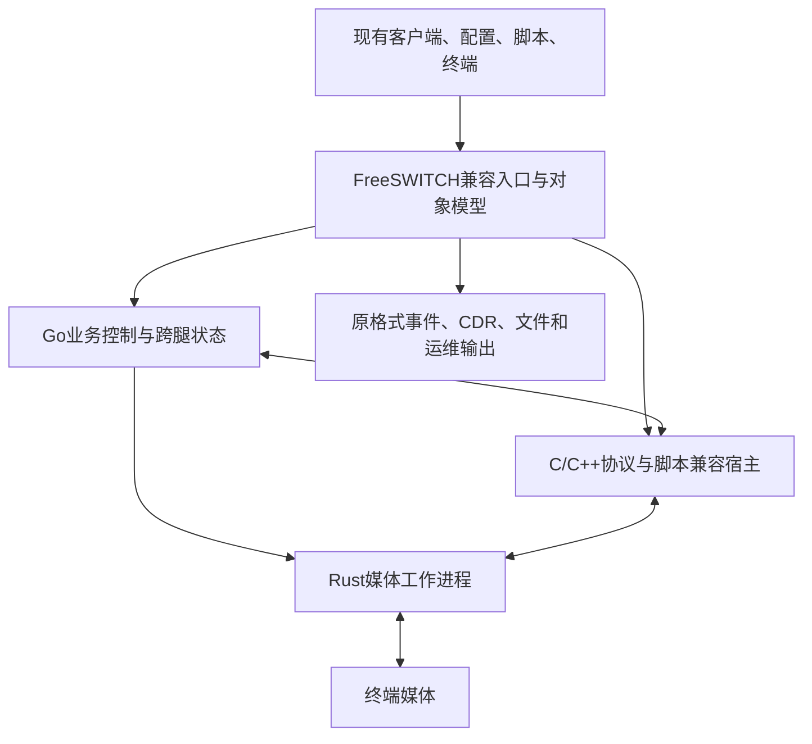

# FreeSWITCH 1.11.3 无感替换接口标准 · 合订版

研发定位现以[云蝠 Voice Runtime方向](../api/voice-runtime-direction.md)为准：优先电话语音智能体及必要FS接口适配。本合订版保留此前完整兼容标准及历史验收记录，未完成的通用PBX/原生宿主能力进入后续范围；最新证据见[1.9交付记录](../api/release-validation-v1.9.md)。


RS-FS-COMPAT-1.0-draft · 2026-09-05。目标标准，当前产品未认证。

完整导航和机器目录见 [标准入口](README.md)。本合订版包含七个正文，详细注册清单与模板另见目录。

# 01 · 范围、基线与统一契约

## 1. 规范词与证据优先级

本标准的“必须 / MUST”是对候选替换实现的强制要求；“应 / SHOULD”是需要记录理由的建议；“可 / MAY”是原基线没有依赖的扩展选择。它们不是对当前 RustSwitch 已实现状态的描述。

基线固定为 FreeSWITCH v1.11.3 的提交 `ef32e205295e29f034f1453ad245ba5efb07b94a`。同版本号下不同补丁、模块、编译选项和运行配置可以有不同行为，必须进一步冻结二进制、动态库、配置、脚本与依赖哈希。

判定顺序是：受控场景中的基线二进制外部观测 → 同一构建的固定源码 → 与该版本对应的官方接口说明。源码与文档冲突要记录反例和用例，不自行挑选更容易实现的描述。未运行原版的行为保持 `not_captured`，不得包装为已经验证的事实。

## 2. 100% 的分母

冻结集合 B 包括基线部署实际暴露、配置引用、脚本调用、模块注册、第三方依赖和合法业务路径可达的全部接口。集合既包括名称，也包括每个接口的子命令、参数形式、默认值、状态前提、失败路径和副作用。

要求：B 中全部强制契约完成，全部强制差分场景通过，无待定条目、无跳过、无未解释差异。`unknown / blocked / not_run / unsupported` 均不能计为通过。发现新增接口必须加入 B 并重新验收，不得把难项移出分母。

“100%”表示**冻结范围内所有强制契约和验收案例通过**，不声称有限测试已经证明无限输入、所有未来版本、任意未知第三方扩展都完全等价。对外声明必须附 profile ID、构建哈希、模块清单、测试集版本、通过日期和性能场景。

若目标是对所有 1.11.3 可编译官方模块通用替换，应分别为其依赖组合建立 profile，覆盖整套发行物；仅验证 vanilla 默认配置不能声称整套 FreeSWITCH 的全部模块兼容。当前静态目录为这些 profile 提供起点，运行清单负责关闭遗漏。

## 3. 必须保持不变的用户资产

| 资产 | 强制要求 |
|---|---|
| ESL 客户端和 SDK | 原版 fs_cli、libesl 及实际使用的语言绑定不修改；原连接参数、鉴权和重连流程可继续使用 |
| XML 配置和拨号计划 | 原文件树、相对路径、预处理、变量展开和查找优先级可直接使用；内部转换不得要求用户重写 |
| 动态 XML/HTTP 后端 | URL、认证、字段、编码、方法、超时、失败回退和响应解释保持相同 |
| Lua/V8/Python 等脚本 | 相同脚本及依赖包，函数、返回值、回调、阻塞点、挂断钩子、异常和对象生命周期一致 |
| SIP 终端与运营商 | 原账户、profile、gateway、域、证书与协商参数继续工作；路由与认证兼容 |
| 业务输出 | 录音、CDR、数据库、消息、事件、文件命名、时间单位和失败重试保持一致 |
| 运维程序 | 启停、排空、重载、路径、权限、日志、pid、健康检查和管理命令按基线工作 |
| 自定义原生模块 | 如部署继续加载原模块文件，必须通过该二进制的符号、布局、线程、锁、内存与回调验证；要求重编译即不属于“原文件直接替换” |

部署层可调整内部进程布局或通过受控网络路由把同一服务地址指向新实现，但不得暗中修改用户脚本、SDK或业务接口。若需客户端变更，只能另行声明迁移方案，不能沿用本严格替换结论。

## 4. 全部兼容面

| 编号 | 兼容面 | 必须收录的内容 |
|---|---|---|
| S01 | 进程与 CLI | 参数、环境、目录、退出码、版本输出、信号和服务管理 |
| S02 | 模块与发现 | load/unload/reload、模块列表、API/application/codec/endpoint/file/timer/管理接口、补全与别名 |
| S03 | ESL | 入站/出站、帧、鉴权、命令、订阅、日志、流控、断连 |
| S04 | 同步/异步 API | api/bgapi/json、所有模块命令及子命令、语法、正文和副作用 |
| S05 | 事件 | 核心/自定义事件、变量、重复字段、时间、相关 ID、顺序与失效边界 |
| S06 | XML 与目录 | 全部绑定 section、预处理、配置重载、用户/组/域/网关和缓存 |
| S07 | 拨号计划与变量 | 条件求值、动作调度、继承、转接、内联、扩展与脚本可见状态 |
| S08 | SIP 与其他 endpoint | Sofia、loopback、Verto/其他被使用模块，各自传输/鉴权/状态机 |
| S09 | 媒体 | RTP/RTCP、编解码、SRTP/ICE、DTMF、播放/录音/转码/视频/传真 |
| S10 | 业务应用模块 | conference、callcenter、voicemail、FIFO、IVR、limit、DB 等所有启用应用 |
| S11 | 脚本与本地 ABI | 各语言运行库、libesl、嵌入式调用、mod_*.so 与宿主 API |
| S12 | 数据与外部集成 | CDR、HTTP/HTTAPI、数据库、AMQP、Erlang等启用连接器和媒体文件 |
| S13 | 切换与恢复 | 注册/订阅、现有通话、ESL连接、作业、队列、调度和数据所有权 |
| S14 | 非功能行为 | 可观测性、鉴权、过载、文件资源、尾延迟、容量、故障与稳定性 |

在核心清单之外发现的接口使用 `EXT:<module>:<type>:<name>` 加入同一规范，不另设默认免验通道。第三方 PBX 平台可使用本标准验收，但没有运行其原始业务用例之前不得宣称该平台已适配。

## 5. 每个接口必须具备的契约

一条完整记录至少包含：唯一 ID；来源与版本；所属模块和编译/加载条件；入口；参数语法/编码/边界/默认值；前置状态；同步响应逐字节样本；异步最终结果；事件集合与偏序；变量、媒体、文件和数据库副作用；超时/撤销/重入/重试/幂等行为；权限；资源与并发边界；错误样本；差分用例与证据。

参数无法展开、帮助为 NULL、动态生成语法、带 C 宏注册或子命令隐藏在处理函数中时，必须继续人工检查并用运行清单补齐。不能把“该参数没有帮助文本”解释为“命令没有参数”。[统一记录模板](templates/interface-contract.json)

## 6. 观察等价规则

| 维度 | 比较规则 |
|---|---|
| 文本响应 | 未经基线证明可忽略的空格、大小写、换行、错误前缀、表头、列序与尾部汇总均精确比较 |
| JSON/XML | 仅在消费者不依赖字节序且基线允许时做结构比较；保留数字/字符串/null/空值区别、数组顺序、重复元素与命名空间 |
| ID | 两次独立执行允许生成不同 UUID/端口，但通过一一映射维护跨 SIP、事件、命令、CDR、文件的关联；不能删除所有 ID 来掩盖串话 |
| 时间 | 对绝对时钟使用已记录的偏移或可控时钟；时长、先后、超时、抖动和尾延迟仍须比较，不能整体删除时间字段 |
| 事件 | 验证必有/可选/禁止事件、每腿因果偏序和重复规则；不臆造跨线程/跨呼叫全局顺序 |
| 状态 | 同样初始状态和输入后得到同样可见状态；排队成功、执行开始、执行完成与资源销毁分开验证 |
| 媒体/文件 | 原样转发按字节与包关联比较；需解码/重采样的路径按已冻结音质/格式/时长门限比较，不能用宽泛听感替代 |
| 异常 | 原版拒绝、关闭连接、终止应用、终止通话、写话单的区别都保留；不得统一映射为 +OK 或一个泛化错误 |

归一化规则必须逐字段登记、有业务依据，并在正反例测试中证明不会掩盖错腿、漏事件、计费或安全差异。任何新规则的引入都要重跑受影响案例。

## 7. 可发现性和版本身份

`help`、`show`、模块查询、补全、命令不存在时的行为及版本输出也是接口的一部分。原系统将模块视为可加载时，替换实现必须保持对应的注册与生命周期语义，不能仅给模块列表示例填上名称。

兼容入口应保持基线消费者依赖的响应结构。产品自身构建信息、内部 Rust/Go 版本和新扩展应通过单独的管理入口提供；不得向旧响应或旧事件追加会破坏解析的说明。

## 8. 文档完成与认证完成分开

本版文档建立了统一标准、分面细则、源目录、验收模板和当前差距。运行基线、各接口状态样本、第三方模块和完整差分证据尚未取得，因此认证状态始终为未通过。静态条目数只用于查漏，不计算兼容完成百分比。

---

# ESL、事件与 fs_cli 无改动接入标准

本章规定 RustSwitch 对 FreeSWITCH Event Socket 的**目标兼容合同**。`MUST` 表示发布验收要求，`MUST NOT` 表示禁止行为，均不表示已经实现。当前应用版本 RustSwitch v0.3、文档发行版本 1.5 已提供可选入站 ESL 的有限子集：9 个 API 入口、4 类事件、api/bgapi、基础订阅与筛选，以及 console_execute 的单 API 命令路径。原版 fs_cli 的中文回显、版本身份与 API JSON 目录三条命令已经实际通过。原版已运行，独立成对报告记录26项探针：21项限定场景通过、3项 SIP OPTIONS 能力差异、2项身份/入口发现；这不是本章完整合同通过数。出站 ESL、sendmsg 应用执行、完整事件/变量语义、控制台批处理/别名/补全及完整交互仍未完成，详见 [当前 ESL 能力](../api/esl-reference.md) 与 [成对报告](../api/conformance-report.md)。

唯一参考版本为 **FreeSWITCH v1.11.3，提交 `ef32e205295e29f034f1453ad245ba5efb07b94a`**。后续出现新版不自动改变本合同。模块启用情况、构建选项、目录认证、拨号计划和业务客户端版本必须随验收记录冻结。一个裸 TCP 服务能接受 `auth`，或者 `fs_cli -x status` 能返回文字，都不构成 ESL 全兼容。

## 1. 无感替换的判定边界

ESL-001：现有 `fs_cli`、原版 C libesl、C++ ESLconnection 及用户正在使用的语言绑定 MUST 无须修改源代码、替换库或增加代理专用参数即可接入。替换服务器地址、沿用已有 VIP/DNS 和原有端口、密码属于部署动作；把业务程序从 ESL 改成 RustSwitch HTTP API 不算无感替换。

ESL-002：验收 MUST 同时覆盖传输、命令、状态变化、事件、配置、错误和客户端等待行为。接口名称相同而桥接对象、变量作用域、应答时机、挂断原因或业务事件不同，判定失败。协议载荷中的 UUID、时间和地址允许按本章规则归一化，业务结果不得归一化掉。

ESL-003：每一项必须关联原版运行轨迹和替代实现运行轨迹。源码可确定实现入口和边界，但不能代替动态验证，特别是并发、模块回调、挂断竞态及慢消费者。未采集对照证据的项目标记 `UNVERIFIED`，不得记为通过或“不适用”。

ESL-004：ESL 是传输入口。其 `api` 可访问的全部 API、`sendmsg execute` 可访问的全部应用、CUSTOM 事件子类，以及 `event_sink` 等模块导出的 API，必须进入总接口清单逐项验收。本章不把“能转发任意字符串”当作这些业务接口已经兼容。

## 2. TCP 连接与帧格式

### 2.1 字节流解析

ESL-010：MUST 按 TCP 字节流组帧，处理任意拆包、粘包、一次读取多帧以及一次写入只能发送部分数据的情况。不能用一次 `read` 对应一次命令，不能用空行查找代替有正文的长度解析。

ESL-011：请求使用命令行、可选头字段、空行、可选正文；响应使用头字段、空行、可选正文。MUST 接受原版接受的 LF 和 CRLF 行结束，发出的格式必须能由原版 libesl 解析。头字段查找大小写行为、命令分隔空格和参数保留规则按参考版本逐项比较；禁止统一小写业务参数或对整条命令做 URL 解码。

ESL-012：`Content-Length` 计量序列化后正文的**字节数**，不是 Unicode 字符数。长度以内的 CR、LF、空行均为正文；读取恰好该长度后，后续字节属于下一帧。外层事件正文可能包含内层事件自己的 `Content-Length`，两者独立。

ESL-013：必须测试缺失正文、零长度、超长头、负数长度、超限长度、数值溢出、非数值、重复长度字段和正文内 NUL。v1.11.3 服务端设置了 16 MiB 正文上限，但原版采用文本事件存储，**不得据此宣称 ESL 是任意二进制透明协议**。有效文本的边界必须相同；畸形输入的原版响应、断连和副作用必须记录，任何主动收紧规则均作为显式兼容差异评审，不得悄悄改变后仍声称百分之百相同。

ESL-014：连接的命令响应、日志和异步事件 MUST 共用合法的有序字节流，不得交叉写坏帧。短写重试、输出队列和关闭过程不能切断一个随后仍被宣称完整送达的消息。实际 EOF、RST 或失败的部分发送必须可在验收证据中区分。

以上解析入口可由固定版本的 [`read_packet` 与发送分支](https://github.com/signalwire/freeswitch/blob/ef32e205295e29f034f1453ad245ba5efb07b94a/src/mod/event_handlers/mod_event_socket/mod_event_socket.c) 对照；客户端兼容性还须按原版 [`esl_recv_event`、`esl_send_recv_timed`](https://github.com/signalwire/freeswitch/blob/ef32e205295e29f034f1453ad245ba5efb07b94a/libs/esl/src/esl.c) 验证。

### 2.2 帧类别

| 外层 Content-Type | 必须保留的含义 | 不能混淆的事项 |
|---|---|---|
| `auth/request` | inbound 连接认证提示 | 不是事件订阅已生效 |
| `command/reply` | 命令层回复，检查 `Reply-Text` 及附加头 | `+OK` 不普遍等于业务成功或媒体动作完成 |
| `api/response` | API 执行返回的正文 | 正文可能是 `-ERR`、多行列表或其他命令专用格式 |
| `text/event-plain` | 外层正文为 plain 事件 | 内层头、正文和长度另行解析 |
| `text/event-json` | 外层正文为 JSON 事件 | 不能转换成自创的统一 JSON 信封 |
| `text/event-xml` | 外层正文为 XML 事件 | 不能只输出与 plain 大致相似的字段 |
| `log/data` | 日志载荷及日志元数据 | 不等同于事件订阅，不得改成 CUSTOM 事件 |
| `text/disconnect-notice` | 协议层断连或 linger 提示 | notice、TCP EOF 与通道挂断是不同事实 |

用于测试长度的文本正文可取 `你好\n\nx`：UTF-8 正好 9 字节。发送端必须发送实际换行；文档中的 `\n` 只是表示法。

以下为固定参考实现的边界采样点，必须带入测试；它们不等于对任意客户端输入的安全保证，也不是可以随意移植到其他版本的通用常数：

| 项目 | v1.11.3 参考值/行为 | 替代实现的验收要求 |
|---|---|---|
| 入站正文范围检查 | 大于 16 MiB 或转换后为负数时关闭读取路径 | 对有效上下界及转换歧义单独测试，不能只测试 1 KiB 消息 |
| 命令头读取阈值 | 10 MiB 阈值进入原版解析路径；不是“所有超长头都规范回复错误” | 对照实际关闭/回复；任何更低限制标为差异 |
| inbound 认证读取、outbound 初次读取 | 调用读取函数时传入 25 秒 | 测量超时边界和不完整正文行为；不能据此承诺整个命令都有 25 秒绝对期限 |
| 每个 listener 的事件队列、日志队列 | 分别最多 100,000 项 | 比较上界、副作用和故障域；更改上界要进入部署合同 |
| 过量入队失败 | 对应丢失计数超过 500 时终止 listener；后续成功入队会清零该计数 | 区分累计历史丢失与这一计数，不能错误实现为进程全局总计 |

这些值来自同一固定提交的 [`mod_event_socket.c`](https://github.com/signalwire/freeswitch/blob/ef32e205295e29f034f1453ad245ba5efb07b94a/src/mod/event_handlers/mod_event_socket/mod_event_socket.c)，必须与运行轨迹一起留证。

## 3. Inbound 连接与认证

ESL-020：MUST 读取原有 `event_socket.conf.xml` 配置对应的监听地址、端口、密码、ACL、绑定失败策略等设置，并验证 IPv4/IPv6 行为。不得在兼容部署时静默改端口、扩大监听地址或绕过原有访问控制。原版默认端口为 8021；验收以用户配置为准。

ESL-021：inbound 由客户端发起 TCP 连接。服务器发出认证提示；客户端发送 `auth <password>`。正确和错误密码、未认证先发命令、空密码、认证超时、ACL 拒绝、客户端在提示前发送数据，均必须与原版对照。原版普通密码认证的成功回复为 `+OK accepted`，错误密码返回 `-ERR invalid` 并结束该连接；不得为了方便客户端而把错误认证维持为已认证状态。

ESL-022：MUST 支持基线使用的 `userauth` 目录用户认证及 `esl-password`、`esl-allowed-api`、`esl-allowed-events`、`esl-allowed-log` 的继承与回复头。域、组、用户覆盖关系、API 包装命令的授权检查和 CUSTOM 子类限制必须逐项验收。仅实现全局密码会破坏使用目录授权的既有系统。

ESL-023：认证成功只建立本连接的身份和权限。订阅、过滤器、日志级别、myevents 绑定和未完成请求都不能从其他连接泄漏过来。重新连接需要按原客户端流程重新认证及订阅；不得在无协议协商的情况下自动套用别人的连接状态。

配置和授权入口见固定版本 [`config`、`parse_command`、`auth_api_command`](https://github.com/signalwire/freeswitch/blob/ef32e205295e29f034f1453ad245ba5efb07b94a/src/mod/event_handlers/mod_event_socket/mod_event_socket.c)。认证与 ACL 的存在不表示本协议自动提供 TLS；原有隧道或 TLS 终结部署也必须纳入环境清单。

## 4. Outbound socket 应用

ESL-030：MUST 支持拨号计划 `socket` 应用，由服务器主动连接既有业务服务。原业务服务接受连接后发送 `connect`，服务器返回包含当前通道数据的连接信息帧。不得反向要求业务端先等待 inbound 的 `auth/request`。连接信息须可被原版 `ESLconnection(fd)`、`getInfo()` 正常消费。

ESL-031：`Socket-Mode`、`Control`、通道 UUID、通道变量及应用执行位置必须与原版一致。MUST 覆盖 `socket host:port`、`socket host:port async`、`socket host:port full`、`socket host:port async full` 四种组合，以及基线使用的多目标连接、IPv6、超时和连接失败继续拨号计划的行为。

ESL-032：`async` 控制事件命令进入通道执行路径的方式；它不等于另开业务会话，也不等于 `bgapi`。单条 `sendmsg` 的 `async: true`、原版客户端 `setAsyncExecute`/`executeAsync` 和 socket 应用参数必须分别验收。

ESL-033：`full` 是原版命令入口的模式标志，不能重新解释为任意自行设计的权限角色。特别是参考实现的 `sendmsg` 分支位于部分 full 限制检查之前，因此不得仅凭名称宣称 single-channel 模式已经隔离全部跨通道操作。必须用“模式 × 命令 × 目标 UUID × 授权配置”矩阵记录真实允许/拒绝行为。

ESL-034：MUST 支持 `getvar`、`myevents`、`divert_events`、`resume`、`linger`、`nolinger` 在适用连接上的行为。`resume`、`socket_resume`、转移、通道 reset 和 socket 断连后的拨号计划续行必须按状态分别测试；不能将所有 outbound 断连都统一转成挂机或统一继续执行。

ESL-035：`linger` 只改变受控通道结束后 socket 的保留行为，不是通话保活，也不等于持久消息订阅。MUST 支持无参数和指定秒数，保留 `Content-Disposition`、`Controlled-Session-UUID`、`Linger-Time` 等原版通知字段。无参数、零值、正常期限、显式 `nolinger` 和客户端主动退出要分别测量；不得把源码中未最终使用的初始值当作无参数默认期限。

以上 socket 应用和连接生命周期由固定版本 [`socket_function`、`listener_run`](https://github.com/signalwire/freeswitch/blob/ef32e205295e29f034f1453ad245ba5efb07b94a/src/mod/event_handlers/mod_event_socket/mod_event_socket.c) 定义；原版客户端接管 socket 的动作见 [`esl_attach_handle`](https://github.com/signalwire/freeswitch/blob/ef32e205295e29f034f1453ad245ba5efb07b94a/libs/esl/src/esl.c)。

## 5. API、后台任务与通道执行

### 5.1 三种不同的完成语义

| 操作 | 立即可观察的结果 | 业务完成判据 |
|---|---|---|
| `api <name> <args>` | 该次 API 调用返回后得到 `api/response` | 按具体 API 契约；调用返回不保证所安排的通话、定时任务已经结束 |
| `bgapi <name> <args>` | 命令层收到 Job UUID | 对应 `BACKGROUND_JOB` 表示该次后台 API 调用返回；API 创建的长期业务还要观察其通道/应用事件 |
| `sendmsg ...` 的 execute | 命令层响应，可能只是入队成功 | 正确关联的应用执行事件、最终业务状态和媒体效果共同判定 |

ESL-040：`api` MUST 保留原 API 的原生文本、多行结构、尾随换行、列表列名、JSON/XML 选项、错误正文以及 `console_execute` 行为。不得统一包装成 `{success:true}`，也不得给失败操作补一个假的成功文本。

ESL-041：`bgapi` MUST 支持服务器生成的 Job UUID 和客户端提供的 `Job-UUID` 头；回复中的 UUID 与最终后台事件匹配。MUST 保留 `Job-Command`、存在时的 `Job-Command-Arg`、`Job-Owner-UUID` 和正文结果。后台任务完成先后由实际工作决定，不按提交顺序伪造排序。

ESL-042：Job UUID 是关联标识，**不是协议级幂等键**。客户端重复提交同一 Job UUID，不得未经标准变更就去重、合并任务或重放缓存结果。原版是否截断异常长度、接受非规范 UUID 等边界必须记录；自动把“客户端超时重发”解释为“原任务未执行”属于错误。

ESL-043：业务端须按原来方式订阅 `BACKGROUND_JOB` 才能依赖该事件。服务端不得把所有后台结果偷偷变成当前请求的同步响应；也不能由于发起 socket 已断开就假定后台工作必然撤销。验收必须分开检查后台 API 是否继续、结果事件是否发出及该连接是否收到。

### 5.2 sendmsg 执行合同

ESL-050：MUST 保留 `sendmsg <uuid>`、`session-id` 头及 outbound 当前会话省略 UUID 的寻址规则、优先级和错误。至少覆盖 `call-command` 的 `execute`、`hangup`、`nomedia`、`unicast`、`xferext`，并按基线实际使用的应用继续扩展；接收这些头但没有实施状态变化不能通过。

ESL-051：execute MUST 支持 `execute-app-name`、`execute-app-arg`；适用情况下支持 `Content-Type: text/plain` 正文作为参数。参数中的变量展开、空值、空格、换行、循环 `loops`、`lead-frames`、`hold-bleg` 和应用错误按原版应用执行层验收，不能只在 ESL 解析层做字符串相等测试。

ESL-052：客户端提供的 `event-uuid` MUST 按参考执行路径关联到事件中的 `Application-UUID`，与通道的 `Unique-ID`、后台任务的 `Job-UUID` 分开。存在的 `event-uuid-name` 与 `Application-UUID-Name` 也须对应。未指定时使用原版等价的自动关联行为，不复用另一个正在执行的应用标识。

ESL-053：`event-lock: true`/`event-lock-pri` 是通道事件执行顺序控制，MUST 与原版私有事件队列及应用执行行为一致；不得实现成锁住全局所有通话，也不得声称它令 TCP 上的每个响应都阻塞到应用成功完成。应用内等待媒体、DTMF、嵌套执行、break、hangup、转移时必须检查锁的释放及后续命令效果。

ESL-054：对不存在的会话、已经挂机的会话、尚在结束的会话、未知应用、缺少应用名和入队失败，必须分别保留原版可观察行为。有些错误可能在应用执行阶段体现而不是立即的 `command/reply`，不能提前统一改写，也不能因为立即 `+OK` 就算用例成功。

以下为用于验证 UUID 关联和顺序的请求形式，`<U>` 和 `<E>` 分别替换为测试通道 UUID 与独立应用 UUID；实际结尾必须有空行：

```text
sendmsg <U>
call-command: execute
execute-app-name: sleep
execute-app-arg: 100
event-uuid: <E>
event-lock: true

```

通道执行的实际头解析见 [`switch_ivr_parse_event`](https://github.com/signalwire/freeswitch/blob/ef32e205295e29f034f1453ad245ba5efb07b94a/src/switch_ivr.c)，应用事件字段见 [`switch_core_session_exec`](https://github.com/signalwire/freeswitch/blob/ef32e205295e29f034f1453ad245ba5efb07b94a/src/switch_core_session.c)，客户端设置见原版 [`ESLconnection`](https://github.com/signalwire/freeswitch/blob/ef32e205295e29f034f1453ad245ba5efb07b94a/libs/esl/src/esl_oop.cpp)。

## 6. 订阅、过滤、事件格式与日志

ESL-060：MUST 支持 `event plain|json|xml`、事件名列表、`ALL`、`CUSTOM` 子类，以及 `nixevent`、`noevents`。连续多次订阅的累加/删除行为、格式切换、无关键字、未知关键字、权限拒绝时已发生的部分变化，均按固定版本验证。不能自行将每次 `event` 解释成替换全部订阅。

ESL-061：`filter`、`filter add`、按头删除、按头和值删除、`filter delete all` 的行为必须保留。**不能采用常见但不正确的“不同头 AND、同名头 OR”概括。**固定版本按过滤项遍历：至少一个正向匹配可选中事件，负向匹配可否决；仅有负向项不自动产生“默认允许”。普通值的比较、以斜杠起始的正则、前缀正负号和缺失头的行为必须以真值表固化，不能替换成 SQL 条件或另一套正则语言。

ESL-062：`myevents` 是连接与会话相关的事件模式，不是普通 `filter Unique-ID` 的别名。默认事件集合、格式选择、重复启用、无效 UUID、与 `event`/`noevents`/filter 的组合，以及由 `Job-Owner-UUID` 关联的后台事件必须测试。不得用一个全局订阅再给所有 socket 广播来代替会话隔离。

ESL-063：plain 事件 MUST 保留头名、字段缺失与空值的区别、百分号编码、数组表示、重复字段和正文。libesl 消费后的值必须与原版一致；不能双重 URL 解码，也不能把 `+` 一律当成空格。JSON 必须保留原版字符串/数组类型及 `_body` 表示，不能把数字形态字符串强制转为数字。XML 必须保留事件、头、正文结构与相应编码；不能采用自定义 SOAP 格式。

ESL-064：`Event-Name`、`Event-Subclass`、`Core-UUID`、`Event-Sequence`、`Event-Date-*`、`Unique-ID`、`Other-Leg-Unique-ID`、`Channel-*`、`Caller-*`、`variable_*` 等存在条件、作用域和语义必须进入事件样本契约。每种事件并不必然具备表中所有头；不得为了“字段齐全”补造不存在的值。扩展字段只能采用不会覆盖标准字段的命名，并检查旧客户端是否拒绝额外字段。

ESL-065：`sendevent` MUST 按原版处理事件名称、自定义子类、正文、路由相关 UUID、生成的事件标识和回复。用户自定义头不得被统一转换成只供 RustSwitch 使用的字段。发布到事件系统、转送到会话、收到 TCP 确认及终端媒体效果是四个不同阶段。

ESL-066：`log`/`nolog`、日志级别解析、授权、重复取消及日志头字段 MUST 可被原版 fs_cli 使用。服务器日志与业务事件各自的缓冲和取消操作必须保持语义；取消日志不能连带清空通道事件。日志文件名/源代码行等实现标识的差异需要明确映射，不得在报告中直接忽略。

序列化及通用事件字段以固定版本 [`switch_event.c`](https://github.com/signalwire/freeswitch/blob/ef32e205295e29f034f1453ad245ba5efb07b94a/src/switch_event.c) 为依据；过滤逻辑以 [`event_handler`](https://github.com/signalwire/freeswitch/blob/ef32e205295e29f034f1453ad245ba5efb07b94a/src/mod/event_handlers/mod_event_socket/mod_event_socket.c) 为依据。源码中的事件枚举只代表可能的事件名称，不能替代每个启用模块产生事件的条件测试。

## 7. 事件偏序、错误与连接故障

ESL-070：一个连接上的 TCP 字节顺序必须正确；但不同线程、不同通道、不同后台任务的事件不存在本合同凭空增加的全局业务顺序。`Event-Sequence` 是进程事件元数据，**不是持久投递序号、订阅确认、断线续传游标或跨重启事务编号**。过滤造成序号间隙也不直接证明丢失。

ESL-071：验收比较因果关系及同一对象的约束。例如，成功返回的普通应用具有对应的执行开始和完成关联；应用动作发生在其执行区间内；正常终结用例的完成状态与挂断原因一致。不得把“CREATE → ANSWER → BRIDGE → HANGUP → DESTROY”强制要求为所有呼叫都出现的事件全集；未接通、早期媒体、取消、转移、嵌套应用具有不同路径。因异步派发造成的网络到达顺序须与原版观测范围对照，不能以本地生成先后直接推断到达先后。

ESL-072：普通命令响应没有通用请求 ID。保持串行请求的原版客户端必须正常工作；流水线、API 与事件交错、多个 `bgapi` 同时完成必须额外测试。原版 libesl 在等待响应时会缓存遇到的非响应消息；替代端不能依赖客户端丢掉这些消息或要求先停订阅再发命令。

ESL-073：未知命令、未知 API、未知应用、权限拒绝、语法错误、资源不足、无效 UUID、连接关闭，必须按类别分别测试帧类型、错误内容、是否继续连接及副作用。错误拼写和尾随换行可能被旧程序直接匹配，修改为更友好的文字也属于可观察差异。

ESL-074：ESL 原生 TCP 订阅不提供全局 exactly-once、持久事件重放或自动重连恢复。本标准不得虚构这些保证。若需要审计存储、按游标重放或业务幂等服务，应作为单独接口交付；不得把历史重放事件混入旧客户端的实时流而不做协商。

ESL-075：慢消费者必须有独立、可观测的资源边界，不能使媒体线程阻塞在 ESL 输出。参考实现存在队列上限、事件/日志入队失败记录及过量丢失后断连的路径；“原版也可能丢事件”不能作为替代实现静默丢失的合格理由。兼容模式须记录边界行为差异；服务目标要求额外测试在规定负载及消费速率内零事件缺失，超载时明确暴露不完整结果，不能仍报告投递成功。

ESL-076：必须测试 FIN、RST、半关闭、超时、未读完响应即断连、bgapi 已受理但回复未收到，以及 outbound 业务进程退出。重连后应重新查询业务状态；服务端不能未经依据撤销或再次执行结果未知的操作。HA 切换若不能保留 TCP 连接及事件状态，必须作为切换能力缺口，不能因新连接成功就宣称存量 ESL 会话无感。

## 8. 原版客户端验收步骤

测试使用两个隔离环境：R 为固定版本原版 FreeSWITCH，S 为 RustSwitch；模块、配置、拨号计划、媒体样本、客户端二进制及试验输入相同。每轮创建独立租户/测试用户、呼叫 UUID 和 CUSTOM 子类后缀，避免事件串入。涉及挂机、长循环或大量事件的用例只操作本轮测试对象。

每个用例至少保存：基线版本和构建清单、输入原始字节、双向 TCP 原始记录、解析后帧、SIP/RTP 证据（适用时）、通道/后台任务关联图、错误及资源统计。报告必须标识 `PASS/FAIL/UNVERIFIED`、首次分歧位置和未采集原因。

### 8.1 必须运行的客户端组合

| 客户端 | 实际操作 | 通过条件 |
|---|---|---|
| 原版 `fs_cli` 命令模式 | 使用已有配置/凭据连接 R 和 S；运行 `status`、`version`、`show channels`、业务实际 API | 原进程可正常退出；输出结构、错误和业务结果符合冻结契约；版本身份差异有明确规定 |
| 原版 `fs_cli` 交互模式 | 自动终端输入状态命令、Tab 补全、`/event`、`/filter`、`/log`、`/nolog`、退出 | `console_complete`、`console_execute`、日志和事件交错均可用；不允许仅命令模式通过 |
| 原版 C libesl | 认证、send/recv、带正文事件、定时等待、订阅中调用 API | 不修改库；帧、超时、错误和缓存事件行为等价 |
| 原版 C++ ESLconnection | inbound 构造、outbound 已接受 fd 构造、getInfo、execute、executeAsync、bgapi、recvEventTimed | UUID 关联、等待行为和应用效果等价 |
| 用户现有语言绑定和业务服务 | 原构建产物回放生产代表性场景 | 不修改业务代码；不能以新写的测试客户端通过替代此项 |

原版 fs_cli 的交互命令并非只转发一个 `status` 字符串，其实现见 [`fs_cli.c`](https://github.com/signalwire/freeswitch/blob/ef32e205295e29f034f1453ad245ba5efb07b94a/libs/esl/fs_cli.c)。

### 8.2 正向、负向与并发用例

表中“对照”表示用同一脚本先执行 R，再执行 S，按帧与业务状态比较；不是允许实现者自选预期。`U1/U2` 为本轮存活通道，`E1/E2` 为应用关联 UUID，`J1/J2` 为后台任务关联 UUID。

| ID | 操作和边界 | 必须检查的结果 |
|---|---|---|
| ESL-T01 | inbound 正确密码；按 1 字节分片发送认证 | 原版客户端成功；只有该连接获得身份 |
| ESL-T02 | 错密码、空值、未认证 `api status`、认证超时 | 回复/断连与 R 一致；无业务副作用 |
| ESL-T03 | ACL 放行/拒绝；IPv4/IPv6；端口被占用 | 监听、拒绝和进程可用性符合原配置 |
| ESL-T04 | `userauth` 域/组/用户覆盖，受限 API 与嵌套包装 API | 相同授权结果及 Allowed 头；事件/日志不越权 |
| ESL-T05 | LF、CRLF；两个命令一次写入；在每个字节位置拆开一次 | 响应个数及帧边界正确；无多执行 |
| ESL-T06 | 9 字节 UTF-8 正文含空行，紧接下一条命令 | 正文完整；下一帧不被吞入 |
| ESL-T07 | 正文长度 0、1、16 MiB、16 MiB+1；负数、溢出、重复长度 | 有效上界与畸形输入逐项对照；无失控分配/跨连接影响 |
| ESL-T08 | 只发送部分正文后 FIN/RST；超长未结束的头 | 不执行半条业务消息；资源回收与关闭证据完整 |
| ESL-T09 | `api` 正常/未知/错误参数/无输出/多行/JSON 输出 | Content-Type、正文及错误层次一致 |
| ESL-T10 | `api` 带 `console_execute`，原版 fs_cli Tab 补全 | 交互客户端无需修改；输出和补全契约正确 |
| ESL-T11 | `bgapi` 自动 UUID 与指定 J1；订阅 BACKGROUND_JOB | 回复与事件 UUID 对应，正文为 API 结果 |
| ESL-T12 | 并行 J1/J2，一个慢一个快；重复 J1 | 按实际任务完成；不串结果、不擅自幂等去重 |
| ESL-T13 | bgapi 受理后立即断开，再建新连接 | 记录任务真实结果与事件缺口；不虚构重放/撤销 |
| ESL-T14 | 四种 outbound socket 模式，用原版 fd 构造客户端 | connect/getInfo、Socket-Mode、Control、当前 UUID 正确 |
| ESL-T15 | outbound 目标拒绝、超时、多目标、业务进程退出 | 呼叫状态及拨号计划后续动作与 R 一致 |
| ESL-T16 | 每种模式中向当前 U1、另一 U2、不存在 UUID 发 sendmsg | 形成实际模式权限矩阵；不将 full 误当完整隔离 |
| ESL-T17 | sendmsg 命令行 UUID、session-id、无 UUID 的优先级组合 | 仅目标通道发生动作；失败路径无误操作 |
| ESL-T18 | execute sleep，指定 E1，随后执行带 E2 的 set/log | 两组 Application-UUID、开始/完成、变量效果对应 |
| ESL-T19 | executeAsync 与默认 execute；event-lock 开/关 | 原版等待行为与应用顺序对照；TCP 回复不当完成证据 |
| ESL-T20 | 锁内等待 DTMF/媒体；同时 break、hangup、转移 | 无死锁；后续执行、挂断原因和结束事件一致 |
| ESL-T21 | 应用参数用头/正文；空参数、Unicode、空行、变量展开 | 应用收到相同参数与作用域；不双解码 |
| ESL-T22 | loops=0/1/2/负值，随后中断；lead-frames、hold-bleg | 循环数、关联事件、中断与 B 腿状态符合 R |
| ESL-T23 | 未知应用、无应用名、无效/已挂机/正在结束 UUID | 区分命令接收与执行失败；错误及副作用一致 |
| ESL-T24 | sendmsg hangup、nomedia、unicast、xferext 的有效/无效参数 | 不只检查回复；核验 SIP、媒体和拨号计划效果 |
| ESL-T25 | event 两次累加、ALL 后 nixevent、noevents 后重订阅 | 对照收到的事件集合和队列清理边界 |
| ESL-T26 | 订阅中切换 plain/json/xml；正文含百分号、加号、中文 | 原版解析值、数组、空值、正文均等价 |
| ESL-T27 | filter 正值、两种不同头、两个同名头、负值、仅负值、缺头 | 对照完整真值表，特别排除错误的跨头 AND 实现 |
| ESL-T28 | filter 正则及正负前缀；删除单值、单头、全部 | 匹配语言与删除范围正确；其他连接不受影响 |
| ESL-T29 | myevents U1、同时 U2 活动；重复启用及无效 UUID | 事件集合、错误和 Job-Owner 例外均对照 |
| ESL-T30 | myevents 与 filter/event/noevents 交叉切换 | 会话绑定与订阅状态不被简单别名化 |
| ESL-T31 | sendevent CUSTOM，指定业务头、正文和 Unique-ID | 发布/路由/返回标识及接收者内容与 R 一致 |
| ESL-T32 | log 全级别、非法级别、nolog 两次、受限目录用户 | 级别和错误准确；不损坏事件订阅 |
| ESL-T33 | linger 无参数/0/2 秒、nolinger，通道正常/异常挂机 | notice 头、保留时间和 TCP 关闭对照 |
| ESL-T34 | resume/socket_resume 开/关，socket 断开及显式退出 | 后续拨号计划只按正确状态执行 |
| ESL-T35 | 多 socket 同时控制 U1；U1/U2 并行执行相同应用 | 不串通道、UUID、回复；只验证原版支持的因果约束 |
| ESL-T36 | 一个连接持续事件流中顺序调用 API/bgapi | 原版 sendRecv 能取得回复，并在后续 recv 中取回交错事件 |
| ESL-T37 | 一个消费者暂停读，另一个正常读，同时媒体承载 | 资源有界；慢连接影响及丢失/断连可观测；正常连接和媒体符合 SLO |
| ESL-T38 | consumer 重连、服务端重启、Core-UUID 变化 | 重新认证订阅；不复用旧 epoch，也不伪造断档的事件 |
| ESL-T39 | 1 万双腿通话（通常约 2 万 channel），另冻结 ESL 连接/订阅数；统计事件总量/延迟/队列 | 全量事件与窄订阅分别验收；媒体负载与事件负载均需证据 |
| ESL-T40 | 用户原业务产物完成呼叫、DTMF、播放、转接、挂断流程 | 业务代码零改动，输出/CDR/事件/媒体结果均合格 |

T07、T22、T37、T39 必须设置外部超时和资源上限；这属于可重复测试的运行约束，不得把超时终止的测试记为通过。涉及参考实现边界缺陷时，必须留下完整分歧记录，并将拟采取的修复列为标准差异。

## 9. 比较规则与发布门槛

ESL-080：字节比较首先验证长度、分隔符、帧类别和原版客户端可解析性；语义比较再使用显式允许清单处理本来就动态的值。UUID 必须保持全程一一映射及 A/B 腿、Job、Application 三类关系；时间只能调整环境偏移，不能掩盖先后关系或超时差异。

ESL-081：字段存在性、空字符串、`_undef_`、`_none_`、数字形态字符串、数组、失败原因和返回格式不能全局删除后再比较。主机名、IP、Core UUID、源文件/行号及真实产品版本属于需要逐项决定的实现身份字段。兼容产品不得仅伪装版本字符串来欺骗客户端探测；如果既有客户端严格依赖这些值，必须在兼容合同中明确映射及影响。

ESL-082：一次“命令成功”的验收至少包含接受结果、最终业务状态、关联事件及副作用四类证据中适用的全部项。一次“无感切换”的验收还包括现有客户端产物零修改和原部署配置生效。SIP 接通率、媒体无丢包和 ESL 事件完整率分别统计，不得互相替代。

发布为“v1.11.3 ESL 全兼容”之前，本章所有适用条款、总清单中的 API/应用/事件合同和用户业务回归必须全部通过；任何 `FAIL` 或 `UNVERIFIED` 都阻止该宣称。当前状态是**接口标准已定义，有限 ESL 实现及限定探针已实测；完整 ESL 实现与全部合同对照验收仍未完成**。

---

# 03 · 配置、拨号计划与业务集成兼容契约

本章定义“更换服务程序后，既有配置文件、业务脚本、HTTP 后端和话单消费者继续工作”的验收标准。固定参考是 FreeSWITCH **v1.11.3，提交 `ef32e205295e29f034f1453ad245ba5efb07b94a`**。版本、编译选项、依赖库和实际加载模块共同决定接口集合；本章的重点契约不替代逐模块接口清单。

**当前应用版本 RustSwitch 0.3（文档发行版本 1.5）仍未完成本章所列 FreeSWITCH XML 运行语义、dialplan、脚本、CDR、HTTAPI 或 AMQP 兼容。现有 XML 模板编辑与受限导入/导出、自有 JSON 配置、HTTP 管理接口及有限 ESL 事件，不能作为本章完整接口已经兼容的证据。** 下文“必须”指目标要求；用例均为待实现、待运行的验收定义。

## 3.1 兼容结果与配置输入

同一基准配置、脚本和受控外部响应，必须得到同一业务路由、呼叫腿关系、变量值、应用执行次序、外部请求及最终话单。不得要求用户把 XML 改写为 RustSwitch JSON、把 Lua 重写成 Go，或修改原有 HTTP 后端字段后才称为无感替换。Rust/Go/C++ 如何划分属于内部实现。

每一项配置参数必须登记：模块与文件、XML 路径、参数名及大小写规则、类型、单位、有效范围、源码默认、随包默认、重复值处理、未知值处理、启动或运行时生效点、依赖项、失败表现、对应验收用例。**“源码默认”和“vanilla 配置默认”必须分列**，不能合并为一个默认值。

| 兼容面 | 必须保留的输入与行为 | 验收观察点 |
|---|---|---|
| XML 注册表 | `document/section` 与配置模块的查询键；`configuration`、`directory`、`dialplan`、`phrases`、`languages` 等实际使用 section；节点/属性/文本/实体解析 | 查询得到的目标节点及未命中结果；XML 语法错误与配置缺项的区分 |
| 主配置及包含文件 | `freeswitch.xml`、`vars.xml`、`autoload_configs/`、`directory/`、`dialplan/`、`sip_profiles/`、`lang/`；相对目录、通配符、包含次序及重复定义 | 预处理后的 XML 与实际路由顺序 |
| 预处理指令 | `X-PRE-PROCESS` 的 `set`、`include`、`exec`、`exec-set`、`env-set`、`stun-set`；该版本支持的注释式预处理写法应分别取样 | 设置/读取时点、相对工作目录、标准输出处理、失败与递归上限 |
| 两阶段变量 | `$${name}` 的配置展开与 `${name}` 的运行时展开；转义、嵌套、未定义值和内联 API | 修改全局变量前后、`reloadxml` 前后、同一通话不同执行时点 |
| 模块加载 | `pre_load_modules.conf.xml`、`modules.conf.xml`、`post_load_modules.conf.xml` 与 `load/reload/unload` 的依赖顺序 | XML provider 在消费者初始化前可用；加载失败不得报成功 |
| 热更新 | `reloadxml`、模块自己的 reload/rescan、目录缓存清理各自的范围 | 配置重新解析不等价于所有模块都已重新加载；在途呼叫、新呼叫分别观察 |

预处理必须复现 FreeSWITCH 的读取流程，不可仅用通用 XML 解析器替代；例如包含包装和预处理指令的处理次序会改变结果。源码入口为 [`switch_xml.c` 的预处理实现](https://github.com/signalwire/freeswitch/blob/ef32e205295e29f034f1453ad245ba5efb07b94a/src/switch_xml.c#L1462)。模块装载配置见[官方模块加载说明](https://developer.signalwire.com/freeswitch/configuration/module-loading/)。

配置解析与认证/计费有关的异常必须显式记录，不能悄悄套用一份新默认配置。若为了隔离进程或运行权限调整 `exec`、脚本目录、外部库访问等行为，该项必须登记为兼容差异；不能在验收中排除后仍声称全量兼容。

## 3.2 Directory 与租户边界

| 对象 | 字段契约 | 必须覆盖的语义 |
|---|---|---|
| Domain | `name`、`params`、`variables`、`profile-variables`、`groups/users` | 域名解析与匹配；同名分机在不同域内分离 |
| Group | `name`、用户列表、用户指针及继承参数 | 分组查询、用户指针解析、重复用户的查找次序 |
| User | `id`、`number-alias`、`type`、`cacheable`、`params`、`variables` | 用户不存在、存在但无认证参数、别名命中、静态与动态目录结果 |
| 认证/业务参数 | `password`、`a1-hash`、`dial-string`、`vm-password` 等实际模块使用值 | 消费者读取方式；Digest/注册的线协议见信令章节，目录不得自行改变认证域 |
| 业务变量 | `user_context`、`domain_name`、`accountcode`、主叫显示变量及用户自定义字段 | 进入呼叫腿的时点、覆盖优先级、桥接传播和话单归属 |

用户合并时，同名参数/变量以 user 已有值优先，再补 group，再补 domain；`params`、`variables`、`profile-variables` 要分别处理。动态目录的缓存属于核心用户查询层，不是 `mod_xml_curl` 通用 HTTP 缓存。`cacheable` 数值按毫秒计算，非空非数字走无期限缓存分支，不能把字符串 `false` 想当然解释为不缓存。必须测试过期边界、清缓存、reload 与同名跨域用户。依据：[`switch_xml_merge_user` 与用户缓存实现](https://github.com/signalwire/freeswitch/blob/ef32e205295e29f034f1453ad245ba5efb07b94a/src/switch_xml.c#L2051)。

RustSwitch 内部租户键必须包括域/用户/所需 profile 维度；外部仍保持原有 FreeSWITCH 字段。域名并非自动涵盖所有资源的安全隔离：共享全局变量、ESL 管理权限、脚本、缓存、录音目录、队列和会议的原有命名方式都要纳入迁移清单。验收须使用两个租户的相同分机号、相同业务名及不同密码，检查认证、目录缓存、路由、媒体、录音、事件和 CDR 均无串用。

## 3.3 XML Dialplan 是执行语义，不只是 XML 格式

| 项目 | 必须复现的契约 |
|---|---|
| Context/extension | 选择 context，按文档顺序遍历 extension；extension 的 `continue` 控制后续 extension 是否继续评估 |
| Condition | 字段读取、`${}` 展开、表达式、日期时间条件、时区、无 field 的条件；多 regex 的 `all/any/xor` 与捕获值 |
| `break` | 缺省 `on-false`；`on-true`、`on-false`、`always`、`never` 分别基于该条件结果控制后续处理；不能实现为普通语言的全局 break |
| action/anti-action | 当前条件结果选择分支；保持文档次序；非空元素文本优先于 `data`；`loop` 的默认与零/负/非数字边界 |
| `inline` | 路由评估时立即执行；仅允许模块注册标志包含 `SAF_ROUTING_EXEC` 的应用；未注册应用与已注册但禁止 inline 的失败行为分别测试 |
| 普通执行 | 路由阶段构建应用队列，运行阶段执行；不能把所有应用都提前执行，或把全部 `${}` 都冻结为同一个时间点 |
| 捕获与展开 | 条件捕获 `$1…`、`DP_MATCH`、变量及内联 API 不是一种替换；保持捕获覆盖、空值、转义及展开时点 |
| 嵌套 | condition 的直接子 condition 递归评估；读取父 condition 的 `require-nested`，默认 true；嵌套失败、break 和 anti-action 共同影响结果 |
| 路由改变 | `transfer`、`execute_extension`、bridge 返回、hangup 后可执行动作及重入限制；保留 caller profile/callflow 历史 |

实现必须以参考解释器的控制流程为准：先评估条件并处理 action/anti-action，再检查 break，只有未被 break 截断且 `proceed` 非零时才进入嵌套条件。该版本 anti-action 分支也可能把 `proceed` 设为非零。因此不能把嵌套规则简化成“父条件正则为真才会执行子条件”，也不能把 peer condition 无条件归约为一次布尔 AND。具体依据：[`parse_exten`](https://github.com/signalwire/freeswitch/blob/ef32e205295e29f034f1453ad245ba5efb07b94a/src/mod/dialplans/mod_dialplan_xml/mod_dialplan_xml.c#L467)。

另一个需要差分的边界：不存在的 inline 应用会产生 `DESTINATION_OUT_OF_ORDER` 挂断路径；存在但没有 `SAF_ROUTING_EXEC` 的应用在 `exec_app` 中走拒绝执行分支，不能自动当成同一种挂断。依据：[`exec_app`](https://github.com/signalwire/freeswitch/blob/ef32e205295e29f034f1453ad245ba5efb07b94a/src/mod/dialplans/mod_dialplan_xml/mod_dialplan_xml.c#L47)。

建议路由兼容执行器输出仅供测试的执行轨迹：`context → extension → condition序号 → 判断结果 → 捕获值 → inline/queued应用 → 当时变量快照 → 状态改变`。比较时 UUID 使用双射映射，不能删除主被叫、租户、失败原因或应用参数等真实业务差异。

若参考构建加载 `mod_sms`，还必须适配独立的 XML chatplan：消息事件头、正文/内容类型、发送方与接收方、context、应用/anti-action、inline 与投递结果均入契约。不能直接套用音频 dialplan 的嵌套解释器；该版本 chatplan 遇到子 condition 会记录禁止嵌套并退出相应解析路径。依据：[`mod_sms` 条件处理](https://github.com/signalwire/freeswitch/blob/ef32e205295e29f034f1453ad245ba5efb07b94a/src/mod/applications/mod_sms/mod_sms.c#L142)。

## 3.4 常用变量与应用的最低契约

以下为优先实现集合，**不是“只兼容这些就算 100%”**。完整目标还包含参考构建已加载模块注册的所有应用/API、模块配置及用户自定义变量。

| 变量组 | 代表字段 | 值与生效点要求 |
|---|---|---|
| 身份与关联 | `uuid`、`call_uuid`、`bleg_uuid`、`bridge_uuid`、`channel_name`、`direction` | 呼叫腿/逻辑通话/桥接关联分开；创建、分叉、转接及桥接解除后均核对；不得把 SIP Call-ID 当作所有 UUID |
| 路由/租户 | `destination_number`、`context`、`domain_name`、`user_context`、`accountcode` | 保持缺省、目录注入、transfer 后取值和跨腿传播 |
| 主叫/被叫 | `caller_id_name`、`caller_id_number`、`effective_caller_id_*`、`origination_caller_id_*`、`callee_id_*` | caller profile 与 channel variable 分开；修改变量后何时影响 SIP/事件/CDR 由执行路径决定 |
| 超时/桥接结果 | `call_timeout`、`originate_timeout`、`leg_timeout`、`continue_on_fail`、`hangup_after_bridge`、`ignore_early_media`、`originate_disposition`、`bridge_hangup_cause` | 秒/毫秒不能混用；原因列表、布尔值、分叉和早期媒体对计时的影响逐项验收 |
| 媒体 | `absolute_codec_string`、`codec_string`、`bypass_media`、`proxy_media`、`rtp_secure_media`、`read_codec`、`write_codec` | 设置时点与实际媒体模式对应；返回字符串不能替代转码/安全媒体能力 |
| DTMF/录音 | `playback_terminators`、`playback_terminator_used`、`read_terminator_used`、`RECORD_STEREO`、`recording_follow_transfer` | 消费端读取的大小写规则、终止键是否进入结果、录音跨转接时的文件和声道 |
| 结算时间 | `start_stamp`、`answer_stamp`、`end_stamp`、`duration`、`billsec`、`mduration`、`billmsec`、`hangup_cause` | 未接通、早挂断、长呼叫、时间精度/取整和时区按相应生成器取值；不得用内部事件日志估算代替 |
| 执行钩子 | `execute_on_answer`、`api_on_answer`、`api_hangup_hook`、`session_in_hangup_hook` | 钩子作用的呼叫腿、执行时点、可读状态及失败传播 |

变量处理必须覆盖全局、呼叫腿、caller profile、应用局部作用域和新建腿参数。`set/unset`、`export`、`export nolocal:`、`bridge_export`、`{…}`、`[…]`、`<…>`、`local_var_clobber` 各自记录覆盖顺序；不可把它们全部实现为同一张可变 map。用户任意自定义字段必须原样贯穿其应有的作用域。参考：[`switch_channel` 的变量与 export 实现](https://github.com/signalwire/freeswitch/blob/ef32e205295e29f034f1453ad245ba5efb07b94a/src/switch_channel.c#L1255)、[`switch_ivr_originate`](https://github.com/signalwire/freeswitch/blob/ef32e205295e29f034f1453ad245ba5efb07b94a/src/switch_ivr_originate.c#L3105)。

| 应用族 | 代表入口 | 除参数可解析外，必须验证 |
|---|---|---|
| 变量/条件 | `set`、`unset`、`multiset`、`export`、`bridge_export`、`set_global`、`set_profile_var` | 空值/删除、分隔符、作用域、路由时与运行时可见性 |
| 接通/结束 | `ring_ready`、`pre_answer`、`answer`、`hangup` | 180/183/200 与媒体状态、重复执行、挂断原因及事件 |
| 桥接/路由 | `bridge`、`transfer`、`execute_extension`、`park` | 双腿生命期、串行/并行目标、超时/取消竞争、返回后下一应用是否执行 |
| 播放/收号 | `playback`、`read`、`play_and_get_digits`、`sleep`、`break` | 真实音频、打断、终止符、位间/总超时、重试、无输入/无效输入 |
| 录音 | `record`、`record_session`、`stop_record_session`、`record_session_pause/resume` | 文件格式、暂停时间轴、停止/挂断关闭、双声道、事件与失败变量 |
| 定时 | `sched_hangup`、`sched_transfer`、`sched_broadcast`、`sched_cancel` | 相对/绝对时间、任务 ID、归属组、取消竞争、通话结束后的任务处理 |
| 业务模块 | `conference`、`callcenter`、`fifo`、`voicemail`、`ivr`、`phrase`、`say`、ASR/TTS/传真等已启用入口 | 会议成员、队列代理、语音信箱、状态数据库、事件与音频效果；不可用普通 bridge 冒充 |

应用注册与可执行标志以固定版 [`mod_dptools`](https://github.com/signalwire/freeswitch/blob/ef32e205295e29f034f1453ad245ba5efb07b94a/src/mod/applications/mod_dptools/mod_dptools.c#L6628) 及各业务模块为准。按基线逐路径验证应有的状态、副作用与事件存在条件；无副作用应用、拒绝、未开始和异常中断不强制套用同一完成事件模板。需要实际业务效果的应用不能用空函数成功返回替代。

## 3.5 `mod_xml_curl` 的 HTTP 契约

### 请求

| 字段/设置 | 契约 |
|---|---|
| 传输 | 默认 POST；`Content-Type: application/x-www-form-urlencoded`；`User-Agent: freeswitch-xml/1.0` |
| 核心字段 | `hostname`、`section`、`tag_name`、`key_name`、`key_value`；hostname 来自 switchname；可空查询键保留空字符串 |
| 查询上下文 | 核心目录查询会增加 `key`、`user`、`domain`、`ip` 中实际存在的字段；呼叫方还可带 `action`、SIP 认证、Caller-*、variable_* 等事件头。它们不是所有请求都必填 |
| `enable-post-var` | 对事件参数应用允许列表；核心五字段不受该列表过滤；不得因为客户端不认识自定义字段就擅自删去 |
| 编码 | 五个核心字段由固定格式直接拼接，额外事件的值由 `switch_event_build_param_string` URL 编码，键保留原名；必须按抓包验证空格、`+`、`%`、`&`、UTF-8 与重复键，不得假设所有字段统一经过标准 form encoder |
| 非 POST method | 配置的 method 保留；参数附加到 URL 查询串，已有 `?` 时使用 `&`；动态 URL 展开及 `file:` 读取路径另行覆盖 |
| 请求选项 | URL、凭据、auth scheme、cookie、证书/主机校验、客户端证书、本地绑定、timeout、重定向、响应大小上限全部纳入基准配置 |

请求构造依据：[`xml_url_fetch`](https://github.com/signalwire/freeswitch/blob/ef32e205295e29f034f1453ad245ba5efb07b94a/src/mod/xml_int/mod_xml_curl/mod_xml_curl.c#L141) 和 [`switch_event_build_param_string`](https://github.com/signalwire/freeswitch/blob/ef32e205295e29f034f1453ad245ba5efb07b94a/src/switch_event.c#L2555)。基准必须同时保存原始 HTTP 和解码后的多值字段，禁止仅比较最后一个同名值而漏掉编码/重复键差异。

该版本五字段的 `basic_data` 缓冲为 512 字节，hostname 临时缓冲为 256 字节；长字段边界须留单独样例。若候选修复长度截断、歧义编码或其他既有缺陷，要登记差异与受影响的输入，不能既改变外部请求又标成该样例字节兼容。

### 返回、错误与 fallback

**本章采用固定源码行为。官方新版 XML Curl 手册中“绑定 section 后排他、不回退本地”的叙述，与该版本 `switch_xml_locate` 的实现不一致，不能据此设计替代程序。** 手册页为[XML Curl and HTTAPI](https://developer.signalwire.com/freeswitch/integration/xml-curl/)，判定依据为 [`switch_xml_locate`](https://github.com/signalwire/freeswitch/blob/ef32e205295e29f034f1453ad245ba5efb07b94a/src/switch_xml.c#L1795)。

| 外部响应 | 固定参考路径 | 必须验证 |
|---|---|---|
| HTTP 200 + 可解析且含目标的 XML | provider 返回 XML，核心找到指定 section/tag/key | 按返回节点工作 |
| HTTP 200 + `section name="result"` / `result status="not found"` | 核心继续查后续匹配 binding；无结果时查本地 XML root | 第二 HTTP 后端命中、本地命中、本地也未命中三种结果 |
| 非 200、无法解析的 XML、回调无结果 | provider 返回 NULL 或核心拒绝错误 XML；继续 provider 链，最终可查本地 | 204/404/500/连接拒绝/超时/空正文/非法 XML，分别捕获后续请求次序 |
| 可解析 XML，但缺所查 section 或 tag/key | 选中该 XML 后，查找失败转本地 XML root；不会为该情况再恢复遍历后续 binding | 必须与明确 not-found 区分，不允许统一实现成 HTTP failover |
| 超过响应限制/临时文件写失败 | fetch 无可用结果，后续由核心查找路径决定 | 默认限制 1 MiB、限制前后各一字节、写失败、错误计数及本地结果 |

`mod_xml_curl` 只将 HTTP **200** 的正文送入解析路径，不能把“任意 2xx 都成功”照搬过来。接收到 200 但传输中途出错的情况，仍需按 curl 结果、文件完整性与 XML 解析的组合做差分，不能仅依据状态码。模块内没有通用“所有 section 永久缓存”；Directory 用户缓存见 3.2。以上 fetch 行为依据 [`mod_xml_curl` 返回处理](https://github.com/signalwire/freeswitch/blob/ef32e205295e29f034f1453ad245ba5efb07b94a/src/mod/xml_int/mod_xml_curl/mod_xml_curl.c#L296)。

## 3.6 脚本兼容层

脚本必须在原入口、原参数和原对象模型下运行。C/C++ 生态保留不等于 FreeSWITCH 语言模块的二进制可直接装载：其底层 `switch_*` 与会话对象依赖需要兼容适配，必须逐接口验证。

| 模块 | 调用入口 | 对象/运行契约 |
|---|---|---|
| Lua / `mod_lua` | dialplan `lua`；同步 API `lua`；后台 API `luarun` | `session`、`argv`、`stream`、`freeswitch.API/Session/Event/EventConsumer`、日志、全局变量；XML handler 的 `XML_STRING`、section/tag/key/params；事件 hook/startup script |
| JavaScript / `mod_v8` | `javascript`、`jsapi`、`jsrun`；版本中的 `jsps/jsmon/jskill` | V8/绑定版本、`Session` 和事件/API 对象、参数/异常/后台任务、XML handler；不可假设 Node.js 环境等价 |
| Python 3 / `mod_python3` | `python`、`pyrun` | `freeswitch` 绑定、handler/API 函数调用约定、模块查找、GIL/回调交互、异常及输出；不是简单命令行启动同名文件 |
| 其他已启用语言 | Perl/Java 等实际构建入口 | 单独纳入注册清单，不能因本表只详列三种语言而豁免 |

入口已核对固定源码：[Lua](https://github.com/signalwire/freeswitch/blob/ef32e205295e29f034f1453ad245ba5efb07b94a/src/mod/languages/mod_lua/mod_lua.cpp#L687)、[V8](https://github.com/signalwire/freeswitch/blob/ef32e205295e29f034f1453ad245ba5efb07b94a/src/mod/languages/mod_v8/mod_v8.cpp#L1578)、[Python 3](https://github.com/signalwire/freeswitch/blob/ef32e205295e29f034f1453ad245ba5efb07b94a/src/mod/languages/mod_python3/mod_python3.c#L619)。

绑定最小验收应覆盖 `Session(uuid/dialstring)`、`ready/answered/hangupCause`、`answer/preAnswer/hangup`、`execute`、`setVariable/getVariable`、`streamFile/getDigits/playAndGetDigits`、`sleep`、输入回调/挂断钩子、`API.execute/executeString` 和 Event/EventConsumer 的订阅、取出、超时及销毁。各语言不保证具有完全相同的拼写、返回类型或入口参数，必须从本语言绑定生成清单。公共 C++ 绑定基准见 [`switch_cpp.h`](https://github.com/signalwire/freeswitch/blob/ef32e205295e29f034f1453ad245ba5efb07b94a/src/include/switch_cpp.h)。

挂断与脚本回调并发时，保持可读取的数据和失效对象的可观察行为；不得暴露已释放的 Rust/Go 对象。原有脚本的 `require/import`、数据库驱动、文件读写、路径、环境变量和加载的原生扩展都属于无感迁移依赖。用独立进程隔离脚本可以作为内部方案，但通信方式不能改变阻塞、超时、返回值或回调时序。`luarun` 返回成功仅代表后台启动的相应结果，不能伪造脚本已经成功结束。

## 3.7 CDR 与外部计费系统

CDR 兼容单位是**呼叫腿 + 输出模块 + 输出目标/模板**。A/B 两腿不能不经配置合并成一条；多个 CDR 模块同时启用也不能内部去重成一个模块。生成时点应对应 reporting 状态处理，而非仅收到 BYE 时抓取字段。各输出的分腿开关名称不同：CSV 使用 `legs`；XML/JSON 使用 `log-b-leg` 并有 `force_process_cdr` 路径，不能提供一个通用 `legs` 参数冒充全部模块。参考：[CSV](https://github.com/signalwire/freeswitch/blob/ef32e205295e29f034f1453ad245ba5efb07b94a/src/mod/event_handlers/mod_cdr_csv/mod_cdr_csv.c#L180)、[XML](https://github.com/signalwire/freeswitch/blob/ef32e205295e29f034f1453ad245ba5efb07b94a/src/mod/xml_int/mod_xml_cdr/mod_xml_cdr.c#L185)、[JSON](https://github.com/signalwire/freeswitch/blob/ef32e205295e29f034f1453ad245ba5efb07b94a/src/mod/event_handlers/mod_json_cdr/mod_json_cdr.c#L439)。

| 输出面 | 字段/封装契约 | 关键边界 |
|---|---|---|
| CSV | 按原模板展开变量；列序、引号、分隔符、空值、空格、行末；`Master.csv`、账户文件、`cdr_csv_base` | 不可用通用 CSV 库重新格式化后声称字节兼容；rotate、SIGHUP、文件权限和并发写入 |
| XML CDR | 原 XML 节点层级、变量编码、callflow/times/app_log；文件后缀与 `a_` 前缀；`xml_cdr_base` | `encode=textxml` 发 `text/xml` 原文；其他模式使用 `cdr=`，分别是 URL 编码、Base64 或原文 |
| JSON CDR | `core-uuid`、`switchname`、`channel_data`、`callStats`、`variables`、可选 `app_log`、`callflow`；`json_cdr_base` | 原生 JSON 类型、可选字段/空对象/缺省字段；`encode-values` 与整个 HTTP body 编码分开 |
| HTTP XML URL | URL 上加入 `uuid=`，已有查询串使用 `&`；A-leg 前缀配置影响相应值 | 重试不换业务 UUID；后端按查询串识别记录的方式保持 |
| HTTP JSON URL | 固定源码按 `configuredURL + ?uuid=…` 构造 | 已含查询串的 URL 要保留专门差分样例，不能擅自套用 XML 模块的拼接规则 |
| HTTP JSON body | `encode=false` 为 `application/json` 原 JSON；URL/Base64 模式为 `cdr=` 对应编码 | Base64 不能误当成表单 URL 编码；Unicode 与特殊字符双重编码问题 |
| HTTP 交付 | XML/JSON 的 HTTP 2xx 判为成功；`retries`、`delay`、timeout、URL 轮转、错误目录与磁盘回退 | 成功与连接中断的歧义；多 URL 并非默认每台广播；日志落盘与 HTTP 成功条件分开 |
| 队列 | JSON `queue-capacity`、队列满的 backup 路径与关机处理 | 内存队列不能被描述成断电后自动可靠恢复；计数器和积压上界需观测 |
| 数据库/其他模块 | ODBC、SQLite、PostgreSQL、`mod_format_cdr` 等已启用模块的 schema、SQL模板、事务、错误转存 | 原查询/报表无需改动；数据库驱动和 schema 迁移另行验证 |

JSON 中 callflow 的 `times.*` 在固定版生成器中使用十进制**字符串**；不要重写成 JSON 浮点数而损失精度。应用日志数组顺序不可排序。CDR 可出现“字段缺失”“空字符串”“0”三种不同状态，验收必须区分。结构依据：[`switch_ivr_generate_json_cdr`](https://github.com/signalwire/freeswitch/blob/ef32e205295e29f034f1453ad245ba5efb07b94a/src/switch_ivr.c#L3335)。HTTP 封装依据：[XML CDR 交付](https://github.com/signalwire/freeswitch/blob/ef32e205295e29f034f1453ad245ba5efb07b94a/src/mod/xml_int/mod_xml_cdr/mod_xml_cdr.c#L281)、[JSON CDR 交付](https://github.com/signalwire/freeswitch/blob/ef32e205295e29f034f1453ad245ba5efb07b94a/src/mod/event_handlers/mod_json_cdr/mod_json_cdr.c#L309)。

交付可靠性与格式兼容需同时定义。标准要求替代实现维护持久化交付记录，内部去重键至少含实例身份、leg UUID、输出模块和目标/模板标识，且不把内部键强加为后端必填字段。HTTP 响应丢失可造成重复提交；跨 HTTP 和数据库无法仅靠更换软交换承诺端到端“恰好一次计费”。必须用后端原有幂等机制或实际验证过的适配层处理重复；若原后端没有幂等能力，应在验收结果中报告，不能删除重试记录伪造零重复。持久化增强的默认与显式选项不得暗改原系统可观察到的交付时点和重试配置。

## 3.8 HTTAPI、事件输出与文件/服务接口

`mod_httapi` 是会话中的多轮 HTTP 业务控制，不能等同于 XML Curl 的配置查询。每轮请求携带 session_id；`HTTAPI_SESSION_ID` 的来源、cookie、持久参数与 one-time 参数、method、URL 和 action/temp-action 更新必须一致。返回的 `params`、`variables`、`work` 有不同处理权限与生效位置；work 子节点按文档顺序执行。依据：[`parse_xml` 与请求构造](https://github.com/signalwire/freeswitch/blob/ef32e205295e29f034f1453ad245ba5efb07b94a/src/mod/applications/mod_httapi/mod_httapi.c#L1141)。

HTTAPI 契约至少包含 `execute`、`dial`、`answer/preAnswer/ringReady`、`hangup`、`playback/pause`、`record/recordCall`、`getVariable`、`conference`、`voicemail`、`sms`、`say/speak`、`continue/break`，以及媒体上传、下载缓存和输入回传。profile 的 set/get/expand 变量、应用执行、API、拨号等权限允许列表不得遗漏。音频播完后的下一轮、DTMF 无输入/无效输入、临时 action 仅一次、录音文件上传失败、返回未知节点、权限拒绝、超时和挂断竞争都必须抓 HTTP 并同时验证通话行为。标签注册见 [`mod_httapi` 固定入口](https://github.com/signalwire/freeswitch/blob/ef32e205295e29f034f1453ad245ba5efb07b94a/src/mod/applications/mod_httapi/mod_httapi.c#L3234)。

| 可选外部集成 | 必须进入验收清单的契约 |
|---|---|
| `mod_amqp` producer | 原 profile/connection 参数、AMQP 0-9-1、exchange/routing key、事件过滤、JSON 结构、消息属性、断连重连与队列满处理 |
| AMQP commands/logging | 原命令消息、响应 exchange/key 头与响应字段；日志字段/级别/路由；不得只支持事件发布却把整个模块标为兼容 |
| 其他事件/监控模块 | Erlang、multicast、SNMP、syslog/Graylog 等实际已启用出口；消息结构、订阅与故障行为独立登记 |
| `fs_cli` 与进程启动 | 原二进制入口可由兼容启动器提供；参数、退出码、标准输出/错误、PID 与 `freeswitch.pid`、服务用户、工作目录、前后台模式及信号行为 |
| 文件路径 | `-conf/-cfgname/-log/-run/-db/-mod/-scripts/-storage/-sounds` 等参考参数；相关全局目录变量；录音、语音信箱、CDR、数据库、证书和声音文件位置 |
| 运行维护 | reload、日志轮转、排空/关机、重启、端口绑定失败、PID 冲突；原 systemd/容器启动、日志收集与监控探针可直接执行 |

AMQP 不能默认承诺任意 broker 故障下零丢失；须记录 producer 队列满及熔断路径的基准结果，并单独验证增强交付模式。依据：[固定 producer 源码](https://github.com/signalwire/freeswitch/blob/ef32e205295e29f034f1453ad245ba5efb07b94a/src/mod/event_handlers/mod_amqp/mod_amqp_producer.c)、[官方 AMQP 模块参考](https://developer.signalwire.com/freeswitch/module-reference/event-handlers/mod_amqp/)。进程参数和信号入口依据：[`switch.c`](https://github.com/signalwire/freeswitch/blob/ef32e205295e29f034f1453ad245ba5efb07b94a/src/switch.c#L418)。

原有 FreeSWITCH `.so` 模块依赖核心 ABI；只把文件放进原 `mod_dir` 并不能使其运行。原数据库格式、录音/语音信箱内容以及升级/回退时的可读性也必须验证。替换运行程序与“正在通话中途无中断接管”是不同验收：后者还需要信令、媒体、脚本、队列和计费状态接管，本章接口标准不能单独证明该能力。

## 3.9 可执行验收用例定义

每例在固定 FreeSWITCH 基准与 RustSwitch 候选各运行一次以上，收集配置哈希、版本/模块清单、原始请求、事件轨迹、最终变量、文件及外部副作用。表内“相同”允许的 UUID/时间归一化规则必须事先登记，失败原因、字节编码、类型和业务次序不得被归一化抹掉。

| ID | 输入/故障 | 核心断言 |
|---|---|---|
| CFG-001 | 两个 include 文件有先后依赖，混用 `$${}` 与 `${}`，修改变量后 reload | 预处理、后续呼叫与既有通话的值分别一致 |
| CFG-002 | 缺少包含文件、非法 XML、递归 include、重复参数、未知参数 | 退出/保留旧配置/日志行为按基准匹配；无静默新默认 |
| CFG-003 | XML provider 早加载与晚加载两种配置 | 依赖模块初始化请求次序和失败行为一致 |
| DIR-001 | user/group/domain 三层同名与独有变量 | 合并后的每个参数一致；用户值不被域值覆盖 |
| DIR-002 | 同分机号跨两个域，静态/动态目录混合 | 正确密码与账户归属；无跨域缓存命中 |
| DIR-003 | `cacheable=100`、非数字值、缺失；查询/修改/过期/清缓存 | HTTP 次数与返回用户值一致；毫秒单位正确 |
| DP-001 | 真/假条件分别组合四种 break 与 continue | extension/condition/应用轨迹完整一致 |
| DP-002 | 三层 nested，require-nested true/false；父 false 加 anti-action、break never | 不按简化布尔模型执行；递归与反向动作顺序一致 |
| DP-003 | 普通 set 与 inline set 后立刻检查 `${}`；捕获 `$1` 被后续 regex 覆盖 | route-time 与 run-time 的差异及捕获范围一致 |
| DP-004 | inline 未注册应用、已注册但不允许 inline 应用、loop=0/-1 | 拒绝、挂断原因及后续应用是否执行一致 |
| DP-005 | A/B 变量冲突，export/nolocal/bridge_export、每腿参数及 local_var_clobber | A 与全部 B 腿最终值及事件/CDR 传播一致 |
| DP-006 | 启用 chatplan，消息正文/事件头含特殊字符；普通/inline/反向动作及嵌套输入 | 路由、投递报告、正文与嵌套错误路径符合 chatplan 基准 |
| APP-001 | 早期媒体→接通→bridge 对端忙线/拒绝/超时/主动挂断 | continue_on_fail、hangup_after_bridge、原因与执行位置一致 |
| APP-002 | 播放中收 DTMF，首位/位间/总超时，终止键，挂断与收号竞争 | 实际音频、数字、终止变量及完成事件一致 |
| APP-003 | 录音开始/暂停/恢复/转接/停止，文件打不开、磁盘满 | 声道、文件可读性、时间轴、失败表现与话单一致 |
| XML-001 | 中文/空格/`+%&`/重复字段；开关 enable-post-var；GET/custom method | 原始 HTTP 和多值解码结果均符合参考 |
| XML-002 | 首 binding not-found，第二命中；两者 not-found 且本地命中 | 请求先后和最终路由一致，证实 fallback |
| XML-003 | 首 binding 返回有效但缺目标 XML，第二后端和本地均可命中 | 不误走第二后端；本地目标选择符合参考 |
| XML-004 | 204/404/500、超时、空/坏/超大 XML、200 传输截断 | 请求次数、错误类别、最终来源及呼叫结果一致 |
| SCRIPT-001 | 同一 Lua/JS/Python 脚本从会话、同步 API、后台入口执行 | 参数、session 可用性、返回值、输出和完成时点一致 |
| SCRIPT-002 | 输入回调、hangup hook、XML handler、EventConsumer 超时/销毁 | 对象生命期、状态可见性、事件与异常行为一致 |
| CDR-001 | 接通/未接通/拒接/转接，A/B 全部组合，CSV/XML/JSON 并用 | 每模块正确数量；UUID 关联、字段类型、精度、模板字节一致 |
| CDR-002 | URL 带查询串；三种 JSON 编码、四种 XML 编码、特殊字符 | 原始请求 URL/body/Content-Type 逐模式一致 |
| CDR-003 | 后端 500、超时、已入账但响应丢失；多 URL；错误目录不可写 | 先比对基线的尝试次数、路由与可能重复提交；可靠计费另以原后端幂等或已验证适配层为前提验收，不得偷偷吞重试 |
| CDR-004 | 队列满、进程退出、磁盘满、日志轮转 | 缺失/备份/重复计数可解释；可靠性增强有独立测试 |
| HTT-001 | playback 收号→临时 action→下一轮→dial→挂断 | session_id、cookie、一次性参数及 work 次序一致 |
| HTT-002 | 变量/应用权限拒绝、录音上传失败、未知标签、超时 | 不越权执行，不误报成功；后续 HTTP/媒体行为一致 |
| INT-001 | AMQP 路由/过滤、断连/恢复、满队列、命令响应 | 消息头/正文与错误行为一致；未测试类型不标兼容 |
| OPS-001 | 原启动脚本和 fs_cli、PID 冲突、路径覆盖、信号/轮转/排空 | 脚本无需修改；退出码、文件、在途呼叫结果符合基准 |

通过本章需要全部适用用例、实际用户脚本与实际后端契约都通过；以“不使用某模块”排除范围必须来自冻结的参考构建/使用清单，不能在测试失败后缩小分母。当前这些用例尚未运行，不能将标准的完整性写成产品已通过率。

---

# 04 SIP、媒体、原生模块与切换连续性标准

文档状态：接口目标与验收规范，**不是已经实现或通过认证的能力清单**。按用户确认，目标锁定 FreeSWITCH 最新正式版 `v1.11.3`，固定 commit `ef32e205295e29f034f1453ad245ba5efb07b94a`。用户部署的编译选项、模块、配置及终端清单尚待导入。认证必须绑定具体基线二进制、配置和模块哈希。在线官方手册用于定位功能，默认值、特殊行为和响应格式由上述固定源码与基线实测共同确定，不能将持续更新的手册当作固定版本行为完全相同的证明。[固定版本源码](https://github.com/signalwire/freeswitch/tree/ef32e205295e29f034f1453ad245ba5efb07b94a)

本章的“必须”指替换产品获得对应兼容性声明前必须满足的要求。未实现、未执行、阻塞、已知差异均不能记为通过；业务当前未启用的可选模块可以标注“本部署未启用”，但不得从面向所有 FreeSWITCH 用户的完整兼容分母中删除。

## 4.1 兼容目标与当前差距

对现有客户而言，兼容必须表现为：原终端、运营商中继、SIP 代理、ESL 客户端、拨号计划和媒体文件流程，在相同配置下获得相同的呼叫结果。仅能接收相同方法名、完成一次 PCMU 呼叫或复用一个编解码库，都不能证明兼容。

协议级验收比较的是外部可观察行为。随机 Call-ID、tag、branch、UUID、端口和时间戳允许通过**预先声明的映射**对齐；映射必须保持两条呼叫腿、事务、事件、话单和录音之间的引用关系。不能把错误原因码、缺失事件、错误号码、认证放宽、媒体方向或计费时间归入“随机差异”。SIP 合法的头域顺序变化可在语义比较器中归一化；依赖特定字节格式的真实设备另做原始报文回归。

截至应用版本 v0.3、文档发行版本 1.5：

| 范围 | 当前实际状态 | 取得本章认证还缺少什么 |
|---|---|---|
| Go SIP 提供器 | 可信中继上的有限 UDP/TCP/TLS `INVITE/ACK/CANCEL/BYE/OPTIONS`，双腿呼叫、可靠连接归属及断线回收；TCP/TLS 已完成真实 Rust 双向 RTP 呼叫回归 | 完整 Sofia 配置与 SIP 行为；注册、路由、重协商、WS/WSS 等仍缺失；现有测试通过不等于 Sofia 等价 |
| Rust 媒体 | G.711、G.722、Opus、G.729、G.726 等受限格式的同编码 RTP 透传、RTCP 与 telephone-event 转发；批量收包、地址校验、容量保护 | 完整协商、NAT、终结型 RTCP、加密、实时转码和录音/会议等媒体应用，以及 FreeSWITCH 变量语义 |
| C 编解码器 | 自定义 `rs_codec_v1` ABI 与 G.711 插件；离线音频 SDK 提供规范 PCM、G.711 及可选 G.722/Opus 后端 | 实际转码通话、全部选定 codec 的参数和错误行为；离线 SDK 通过不代表实时转码 |
| 原生协议提供器 | `rs_protocol_v1` 预留契约 | Sofia-SIP/PJSIP 实际集成及与 Go 状态机的完整衔接 |
| FreeSWITCH 模块 | 不能直接加载原 `mod_*.so` | 原生模块运行环境或逐模块移植；两者需要不同认证 |
| 无中断切换 | 尚无完整现网切换验收 | 呼叫排空方案、入口路由、事件和话单收敛、回滚；活动状态迁移另验 |

当前代码事实见项目 [README](../../README.md)、[codec ABI](../../native/include/rustswitch_codec.h) 与 [protocol ABI](../../native/include/rustswitch_protocol.h)。

## 4.2 Sofia profile、gateway 与终端配置的契约

配置兼容必须保留对象名、配置入口、继承关系、变量展开时机、默认值以及修改后的生效边界。把旧 XML 转换为内部结构是实现选择；要求客户重写 gateway、终端密码、拨号字符串或管理脚本，不能获得“原配置直接替换”的认证。官方将 profile 与 gateway 作为明确的配置与运行对象，gateway 的拨号入口包括 `sofia/gateway/<name>/<number>`。[Sofia profiles](https://developer.signalwire.com/freeswitch/users-and-endpoints/sip-profiles/)、[Gateways](https://developer.signalwire.com/freeswitch/users-and-endpoints/gateways/)

下表是本项目制定的最小差分测试集，每行必须按启用的 profile、传输和真实终端扩展。

| 编号 | 需保持的契约 | 最少测试输入 | 通过条件与证据 |
|---|---|---|---|
| SIP-C01 | profile 名称、监听地址、域、context、dialplan、alias | 多 profile、同名冲突、IPv4/IPv6、端口被占用、禁用 profile | 加载结果、失败范围、监听集合、入口 context 和查询输出与基线一致 |
| SIP-C02 | gateway 名称与所有参数的作用域、优先级、缺省值 | 注册/不注册中继；proxy、register-proxy、outbound-proxy 分离；入/出方向变量 | 实际请求目的地、From/Contact、认证身份、路由变量与基线一致；不能忽略未知配置却报告完整成功 |
| SIP-C03 | profile/gateway 生命周期 | `start/stop/restart/rescan/killgw` 等基线可用命令；`reloadxml` 后新旧呼叫并存 | 接受的命令语法、返回值、影响的呼叫范围及生效时机与基线一致；完整命令清单来自基线能力目录 |
| SIP-C04 | REGISTER 用户目录与 Digest | 正确/错误口令；realm、nonce 过期、stale、qop、重放；现网使用的算法 | 挑战头、校验、重试、注册状态和事件一致；不得以不校验认证实现表面接通 |
| SIP-C05 | 注册绑定与刷新 | 多 Contact、重复 REGISTER、过期边界、注销单个/全部绑定、多设备同账号 | 绑定数量、寻址结果、到期行为、通知和持久化作用域一致 |
| SIP-C06 | 注册传输与连接寿命 | UDP/TCP/TLS/WS/WSS；连接复用、空闲、重连、断线后注册刷新 | 原终端不更改配置可注册与回呼；记录旧绑定可达性和恢复时限 |
| SIP-C07 | 注册中继恢复与 OPTIONS 探活 | 401/407、拒绝、丢响应、DNS 故障、连续成功/失败、超时重试 | 状态转换、下一次重试时间窗口、路由可用性及 `sofia::gateway_state` 类事件与基线匹配 |
| SIP-C08 | 身份与透传头 | From、PAI、RPID、Privacy、Diversion、History-Info、自定义 `sip_h_*` 等现网变量 | A/B 腿头域、主被叫显示、隐私行为及变量可见性符合基线；不盲目跨信任域复制所有头 |
| SIP-C09 | ACL 与域隔离 | 同账号跨域、目录不存在、ACL 命中/未命中、网关入口与用户入口交叉 | 访问控制、认证触发和失败事件一致；合法用户未被新的默认策略阻断 |
| SIP-C10 | 地址、端口和 DNS | `sip-ip/rtp-ip/ext-sip-ip/ext-rtp-ip`；A/AAAA/SRV/NAPTR 的基线启用组合与故障 | 对外公布地址、实际发送地址、重试路由和生存时间行为与基线一致 |
| SIP-C11 | 证书与 TLS 策略 | 现有证书路径、链、私钥口令、有效期、对端验证策略、协议/套件限制 | 无需重新签发证书或改客户端信任配置；成功和拒绝边界一致；不自动降级加密 |
| SIP-C12 | 存量注册与监控可见性 | 查询注册、联系人查找、profile/gateway 状态、刷新配置 | 业务和运维脚本的原命令、字段及状态语义保持；注册在线迁移需另过 MIG-03 |

**实现约束：**Sofia-SIP 可优先作为协议库候选，但 `mod_sofia` 还连接 FreeSWITCH 的目录、变量、事件、数据库与媒体状态。换用 PJSIP 或直接调用 Sofia-SIP 都必须过同一套行为测试，不能以“使用相同协议库”替代验收。

## 4.3 SIP 事务、对话与 SDP 行为矩阵

协议测试同时采用标准检查与 FreeSWITCH 差分。SIP 基本事务/对话、可靠临时响应、会话定时器及 WebSocket 传输分别以 [RFC 3261](https://www.rfc-editor.org/rfc/rfc3261.html)、[RFC 3262](https://www.rfc-editor.org/rfc/rfc3262.html)、[RFC 4028](https://www.rfc-editor.org/rfc/rfc4028.html)、[RFC 7118](https://www.rfc-editor.org/rfc/rfc7118.html) 为协议依据。历史特殊行为若与标准或现代安全要求冲突，应记录为明确的基线差异，并经部署方决定是否启用兼容配置；不能默默改变现网行为后仍宣称完全一致。

| 编号 | 场景 | 必须观察的行为 |
|---|---|---|
| SIP-D01 | UDP 基本呼入/呼出；同终端双向并发 | 请求/响应、独立呼叫腿、ACK、媒体建立、BYE、事件和话单完整闭环 |
| SIP-D02 | TCP/TLS 分片、粘包、多消息、连接中断 | Content-Length、消息边界、连接复用、失败传播；不得把一次读取视为完整 SIP 消息 |
| SIP-D03 | WS/WSS 升级、子协议、分帧、控制帧、连接关闭 | 握手与 SIP 消息边界兼容；浏览器原客户端无需改库；WSS、DTLS 证书分别核验 |
| SIP-D04 | 初始 INVITE 带 SDP / 无 SDP | offer/answer 所在消息、ACK 中 SDP、早协商/晚协商时机与基线一致 |
| SIP-D05 | 100/180/183 的不同组合；早期媒体变更 | 振铃、回铃音、计费前媒体、`ignore_early_media` 等基线配置及进展事件一致 |
| SIP-D06 | 100rel、PRACK，RSeq/RAck 错误/重复/超时 | 双腿可靠临时响应分别维护；不重复回答、重复启动媒体或跨腿混用序号 |
| SIP-D07 | 丢失 INVITE/1xx/200/ACK/BYE/最终失败响应 | 基线的重传与清理时间窗口、重复报文幂等性；一个业务呼叫不因重传生成额外话单 |
| SIP-D08 | CANCEL 早于/晚于 200；CANCEL 与 B 腿接通竞争 | CANCEL 事务结果、INVITE 最终结果、必要 ACK/BYE、所有胜出/失败分支资源释放；不以已发 CANCEL 忽略迟到 200 |
| SIP-D09 | 上游/下游并发 BYE；未知对话；错误 CSeq/tag | 响应、关闭原因、事件次序和计费结束点；无串话或双重业务结算 |
| SIP-D10 | Route/Record-Route、loose/strict route、Contact 更新 | 对话内请求沿正确路由集发送；代理存在时双腿独立；不能只按最近包源地址返回 |
| SIP-D11 | 3xx 重定向、多 Contact、目标环路 | 跟随与透传策略、重试上限、认证和自定义头传播、最终失败原因与基线一致 |
| SIP-D12 | 并行/顺序 fork；多个 18x、多分支 200、全分支失败 | 胜出分支、早期媒体选择、取消未胜出分支、失败原因合并和事件关联一致 |
| SIP-D13 | re-INVITE/UPDATE 保持恢复；`sendrecv/sendonly/recvonly/inactive`、零地址保持 | 单向/双向媒体、保持音乐、CHANNEL_HOLD/UNHOLD、SDP 版本变化与基线一致 |
| SIP-D14 | 同时 re-INVITE 的 glare、拒绝重协商、ACK 缺失 | 旧协商状态回退、重试、失败处理一致；拒绝新 offer 后仍能维持原通话 |
| SIP-D15 | 通话中改 codec/ptime/媒体 IP/端口；增加/关闭媒体 m-line | 双腿协商原子性、PT 映射、资源切换和旧包处理；无已确认 SDP 与实际媒体路径不一致 |
| SIP-D16 | Session-Expires、Min-SE、refresher、422、刷新丢失 | 主动/被动刷新角色、方法、重试和释放时机与配置基线一致；长通话持续覆盖多次刷新 |
| SIP-D17 | REFER 盲转、带 Replaces 的咨询转接、失败转接恢复 | REFER/NOTIFY 订阅结果、桥接关系、UUID 关联、旧腿关闭时机及话单结果一致 |
| SIP-D18 | INFO DTMF、MESSAGE、SUBSCRIBE/NOTIFY、MWI/BLF/Presence | 按现网启用模块逐项测试内容类型、事件包、订阅刷新、通知版本、权限和拒绝结果；不能统一返回 200 |
| SIP-D19 | 畸形/过长消息、重复头、未知 Require、未知方法、multipart SDP | 与基线的接受/拒绝边界、错误码和连接处置对齐；不会损坏其他会话 |
| SIP-D20 | 本地 drain、CPS/会话/媒体资源耗尽、下游拥塞 | 对外错误码、Retry-After 是否存在、相关变量和事件一致；已接通呼叫服务质量单独计量 |
| SIP-D21 | 非 SIP 终端模块被使用 | `mod_verto`、其他 endpoint 的协议与命令另列模块测试；通过 SIP over WSS 不能替代 Verto JSON-RPC 兼容 |

为避免状态分裂，每条 SIP 事务只能由一个协议提供器拥有重传、连接和事务定时器；Go 控制面拥有跨腿业务决策。协议提供器必须把临时对话、最终对话、路由集、协商提交/回滚、transport 关闭及原因码上报到统一契约。当前 `rs_protocol_v1` 仅定义传递字节的函数指针，还没有这些完整事件 schema 和幂等规则。

## 4.4 媒体、DTMF、编解码、录音、会议与传真

FreeSWITCH 的 normal、proxy、bypass 是不同媒体行为：normal 可处理媒体；proxy 保留服务端转发路径；bypass 让端点直接交换媒体。选用 bypass 后取得的并发数不能称为服务器转发容量。相关控制项应与 [官方媒体说明](https://developer.signalwire.com/freeswitch/media-and-codecs/handling/) 对齐。编解码优先级、早晚协商和参数交集必须分别验证，依据 [官方 codec 协商说明](https://developer.signalwire.com/freeswitch/media-and-codecs/codecs/) 定位固定版本实现。

| 编号 | 兼容面 | 必须覆盖的输入与结果 |
|---|---|---|
| MED-01 | normal / proxy / bypass / bridge 后 bypass | 每模式抓取两腿 SDP 与媒体路径；切换保持、转接和录音时按基线恢复媒体；模式未支持不可自动改为另一模式 |
| MED-02 | RTP 包与时间轴 | SSRC、sequence 回绕、timestamp 回绕、marker、CSRC、header extension、padding、重复/乱序；验证透明转发或终结重建是否符合所选模式 |
| MED-03 | 动态 PT 与多速率 codec | 同 codec 不同 PT、两腿 PT 不同、fmtp/ptime/maxptime、音频采样率与 RTP clock 区别、CN/DTX；协商成功必须能实际双向播放 |
| MED-04 | codec 集合与优先级 | 按基线实际加载清单逐个及成对验收 PCMU/PCMA、G722、Opus、其他语音/视频 codec；验证 absolute/inherit codec 类变量、禁用转码和协商失败 |
| MED-05 | 转码与重采样 | 每个已声明支持的有向 codec 对、声道数/采样率/帧长组合；音质、音量、延迟、CPU、解码错误处理和两腿 RTP 节奏均达预先冻结门槛 |
| MED-06 | 抖动缓冲、PLC、FEC、VAD | 确定性注入延迟/乱序/丢失/重复；输出音频和计数与基线功能设置一致；网络真实丢包与补偿输出分别统计 |
| MED-07 | RFC 2833/4733 telephone-event | 动态 PT、不同 clock、0–9/*/#/A–D、长按、结束包重传、跨包间隔、双腿重复；一次按键产生的事件数量、持续时间单位和顺序与基线相同 |
| MED-08 | SIP INFO 与带内 DTMF | INFO 内容类型、duration、无效数字；语音与双音混合；检测、生成、透传和模式转换分别验证；重复来源不导致重复业务输入 |
| MED-09 | DTMF 与应用交互 | IVR、收号、play-and-get-digits、放音打断、DTMF 绑定与注入；相同输入得到相同业务分支和相关变量 |
| MED-10 | NAT 与源地址学习 | 对称 RTP、SDP 私网地址、rport/received、NAT 映射变化、合法媒体换源、禁止 auto-adjust 的配置、陌生源注入；学习窗口及安全边界与基线对齐 |
| MED-11 | RTCP | 独立端口/rtcp-mux、SR/RR/SDES/BYE、扩展反馈、报告间隔、丢包/jitter 统计、终结与透明转发分别测；不能用转发 RTCP 证明生成报告兼容 |
| MED-12 | SRTP/SDES | 现网加密套件、mandatory/optional/forbidden、方向覆盖、重协商/换密钥、重放、认证失败；不能回落明文而报告加密成功 |
| MED-13 | DTLS-SRTP、ICE 与 WebRTC | fingerprint/角色、握手重传、候选选择、ICE restart、网络切换、rtcp-mux、多媒体协商；按基线支持的组合测真实浏览器；记录失败事件与恢复窗口 |
| MED-14 | 放音、提示音、TTS/ASR/流式源 | 文件 URI、相对路径、语言/声音资产、媒体格式、seek/stop、播放完成/打断、外部服务超时；音频产物与应用事件同时验证 |
| MED-15 | 双腿录音与媒体 bug | record_session、uuid_record 及所用 API；单声道/立体声/方向、开始停止暂停恢复、追加、通话转接、录音跟随；文件可打开、声道归属、时长、路径及事件正确 |
| MED-16 | 录音故障 | 目录不存在、无写权限、磁盘满、编码失败、进程故障；API/事件错误与通话是否继续的行为对齐；不得发成功事件但缺文件 |
| MED-17 | 音频会议 | 按房间和成员数拓扑验收入会/离会、静音、主持人、PIN、锁定、DTMF 菜单、音量、旁听、成员控制、录音；输出音频、成员查询与 CUSTOM 事件一致 |
| MED-18 | 视频与会议 | codec/PT/fmtp、分辨率、帧率、关键帧请求、PLI/FIR/NACK、音画同步；passthrough、转码、混屏分别验收，房间布局/屏幕共享按启用基线覆盖 |
| MED-19 | G.711 传真、T.38、网关转换 | txfax/rxfax、T.38 re-INVITE 接受/拒绝/回退、UDPTL 冗余、页数、ECM、超时、音频↔T.38；收发文件、页内容、结果变量和完成钩子一致 |
| MED-20 | 超时、静音、保持期间超时 | RTP inactivity、hold timeout、早期媒体超时、合法 DTX 和单向媒体；不因丢一包或合法无声误杀通话；终止时间、原因和事件与基线相同 |
| MED-21 | 通话媒体资源释放 | 正常挂断、失败、fork、CANCEL race、re-INVITE 回滚、worker 故障后，端口、文件、codec context、定时器和共享缓冲最终回收；旧会话包不能进入复用后的新会话 |

**当前特别缺口：**Rust 可选 connected UDP 将 peer 固定到协商地址；这不是 FreeSWITCH RTP auto-adjust/NAT 学习语义。优化不能阻止合法终端换源，也不能为追求兼容而放开无条件换源。实现时应在 MED-10 明确定义学习状态和可认证变更，然后在新 peer 生效时原子更新目的地并清理旧队列。

WebRTC 的 SIP over WS/WSS 与 Verto 是两种信令入口；加密传输与媒体安全也有独立的证书与状态。支持其中一个入口不能推出另一个入口可用。[官方 WebRTC over SIP 文档](https://developer.signalwire.com/freeswitch/users-and-endpoints/webrtc-sip/)

媒体功能的结果不只是一条 `+OK`。录音/放音必须核对相应开始和停止事件、路径和完成状态；会议应核对房间/成员事件及控制结果；传真应核对实际页内容与结果变量。事件名与字段以固定版本采集为准，不为方便实现而创造“等价但改名”的事件。[官方事件目录](https://developer.signalwire.com/freeswitch/programming/events-catalog/)、[会议](https://developer.signalwire.com/freeswitch/applications/conferencing/)、[传真](https://developer.signalwire.com/freeswitch/applications/fax/)

## 4.5 SIP / Q.850 / FreeSWITCH 原因码的映射

原因码是业务接口：呼叫中心重拨、计费、告警及运营商重试会读取它。必须同时保存原始协议结果与 FreeSWITCH 语义，不得仅将所有非 2xx 合并为“呼叫失败”。应逐腿验证 `hangup_cause`、`Hangup-Cause`、`sip_term_status`、`proto_specific_hangup_cause`、`last_bridge_hangup_cause`、`originate_disposition` 与话单中的对应值。[官方呼叫失败说明](https://developer.signalwire.com/freeswitch/troubleshooting/call-setup/)

以下覆盖已核对的 `v1.11.3` 函数 `sofia_glue_sip_cause_to_freeswitch()` 全部显式分支和默认分支。它是该函数的映射表；更高层的 Reason 覆盖、配置与实际调用时机仍须运行测试，也不能通过反向查表生成所有出站响应。[固定源码：sofia_glue.c](https://github.com/signalwire/freeswitch/blob/ef32e205295e29f034f1453ad245ba5efb07b94a/src/mod/endpoints/mod_sofia/sofia_glue.c#L1814)

| 输入的最终 SIP 响应 | 应核对的 FreeSWITCH 原因名称 |
|---|---|
| 200 | `NORMAL_CLEARING` |
| 401 / 402 / 403 / 407 / 603 / 608 | `CALL_REJECTED` |
| 607 | `UNWANTED` |
| 404 | `UNALLOCATED_NUMBER` |
| 408 / 504 | `RECOVERY_ON_TIMER_EXPIRE` |
| 410 | `NUMBER_CHANGED` |
| 413 / 414 / 416 / 420 / 421 / 423 / 505 / 513 | `INTERWORKING` |
| 480 | `NO_USER_RESPONSE` |
| 484 | `INVALID_NUMBER_FORMAT` |
| 485 / 604 | `NO_ROUTE_DESTINATION` |
| 486 / 600 | `USER_BUSY` |
| 487 | `ORIGINATOR_CANCEL` |
| 488 / 606 | `INCOMPATIBLE_DESTINATION` |
| 502 | `NETWORK_OUT_OF_ORDER` |
| 405 | `SERVICE_UNAVAILABLE` |
| 406 / 415 / 501 | `SERVICE_NOT_IMPLEMENTED` |
| 482 / 483 | `EXCHANGE_ROUTING_ERROR` |
| 400 / 481 / 500 / 503 | `NORMAL_TEMPORARY_FAILURE` |
| 428 | `NO_IDENTITY` |
| 429 | `BAD_IDENTITY_INFO` |
| 437 | `UNSUPPORTED_CERTIFICATE` |
| 438 | `INVALID_IDENTITY` |
| 没有显式映射的其他值 | `NORMAL_UNSPECIFIED` |

必须补全三类独立测试：

1. **协议→内部：**遍历源码中的全部显式分支及未知状态码；比较带/不带 Reason/Q.850 的响应、BYE，验证配置是否允许 Reason 覆盖 SIP 映射。
2. **内部→协议：**遍历基线原因枚举与 `respond`、`hangup`、`uuid_kill`、路由失败、资源不足、超时等入口；核对 wire status、reason phrase、Reason 头和变量。多个 SIP 状态可能归并为同一原因，反向映射不保证可逆。
3. **多腿聚合：**同时忙线/无应答/拒绝、fork 全失败、先失败后重试成功、取消与接通竞争；比较最终 A 腿、各 B 腿以及业务返回结果。不能只检查最后到达的 B 腿原因。

可记录的测试证据必须包含触发入口、两腿报文、事件、最终话单与源码分支；只核对一个 HTTP 状态码不满足要求。

## 4.6 C/C++ 生态兼容与 FreeSWITCH 模块 ABI

FreeSWITCH 模块通过宿主提供的接口注册端点、应用、API、codec 等，并参与加载、运行与卸载生命周期；模块开发使用其开发头文件和相关核心服务。[官方模块开发](https://developer.signalwire.com/freeswitch/FreeSWITCH-Explained/Community/Contributing-Code/Creating-New-Modules/)、[模块加载](https://developer.signalwire.com/freeswitch/configuration/module-loading/)

固定版源码中 `SWITCH_API_VERSION` 为 `5`，模块定义暴露函数表，装载器检查该版本，模块接口同时持有多类接口指针、锁、引用计数和内存池。版本号相同只是一个检查条件，不是所有结构与运行行为兼容的充分条件。[模块定义](https://github.com/signalwire/freeswitch/blob/ef32e205295e29f034f1453ad245ba5efb07b94a/src/include/switch_types.h#L2604)、[模块接口结构](https://github.com/signalwire/freeswitch/blob/ef32e205295e29f034f1453ad245ba5efb07b94a/src/include/switch_loadable_module.h#L64)、[装载器检查](https://github.com/signalwire/freeswitch/blob/ef32e205295e29f034f1453ad245ba5efb07b94a/src/switch_loadable_module.c#L1757)

必须把下列四种兼容声明分开，且给每个原生组件标记一种：

| 等级 | 客户可继续使用的东西 | 实现与验收要求 | 不能推出的结论 |
|---|---|---|---|
| N-LIB 库复用 | libopus、libsrtp、SpanDSP、Sofia-SIP 等选定库 | 为确定版本库编写适配器；验证参数、线程、内存、错误和媒体/协议结果 | 不能直接加载原 `mod_opus.so`、`mod_sofia.so` 或客户模块 |
| N-SRC 源码移植 | 有源码的客户/社区模块 | 逐模块调整或提供源码 API 兼容层后重新编译，实际执行功能用例 | 不是原 `.so` 文件原样可用，也不是所有模块都能重编译 |
| N-BIN 二进制兼容 | 客户现有且哈希不变的 `.so` | 在同 CPU/OS/动态库环境下，完整满足所需符号、结构布局、调用约定、生命周期与语义；原文件通过全部业务测试 | 仅 `dlopen` 成功或提供同名函数不代表 ABI/行为兼容 |
| N-HOST 原版兼容宿主 | 经认证的原模块与其对应 FreeSWITCH 运行环境 | 保留匹配版本的 FreeSWITCH 宿主和依赖，原模块在宿主中运行；内部连接 Rust/Go 新能力 | 这是一套含原版核心的兼容发行方案，不能宣称已完整移除 FreeSWITCH C 核心 |

现有 RustSwitch 的 `rs_codec_get_v1`、`rs_codec_v1`、`rs_protocol_v1` 是新项目自己的 ABI。它们不含 FreeSWITCH channel/session、内存池、事件总线、codec/frame、media bug、数据库、XML 查询、状态处理器等宿主服务，所以不能把“保留 C/C++ 生态”写成“所有 FreeSWITCH 二进制模块均兼容”。Go 对象也不能直接作为原模块期待的 FreeSWITCH 结构体指针传递。

**建议实施路线：**先建立外部兼容面，由 Go 承担兼容控制逻辑、Rust 提供经过验证的媒体能力；必须保留的原模块先在 N-HOST 环境内运行，再逐模块移到 N-LIB/N-SRC 或完成 N-BIN 服务。进程隔离的协议/codec 服务本身并不能接纳任意依赖 channel/media-bug 的模块；这些模块需要完整宿主。对宿主到 Rust 的媒体分流，必须实现明确的接入模块与媒体边界，并重新测试录音、转码、会议、事件及变量。当前代码尚没有这个兼容宿主或分流模块。

若交付物要求完全 Rust/Go 替换原核心，则 N-HOST 只能是过渡阶段，完整验收最终仍需消除外部对原核心的依赖，并通过本部署全部模块与业务用例。若客户要求现有任意闭源模块原样加载，必须先取得模块清单与运行样本才能定义有限、可测的 N-BIN 范围；不能承诺未知模块的无限兼容性。

| 编号 | 原生验收场景 | 通过标准 |
|---|---|---|
| NAT-01 | 模块清单与装载 | 文件哈希、版本、CPU/OS、依赖、load/unload/reload 与失败返回均已记录；未满足依赖不会误报加载成功 |
| NAT-02 | 原有注册接口 | 模块注册的 applications、APIs、events、codecs、file formats 与实际能力目录一致 |
| NAT-03 | 内存和对象寿命 | session/channel/frame/内存池指针在其规定寿命内有效；错误退出、取消及卸载无越界、悬空引用或泄漏 |
| NAT-04 | 线程、回调与重入 | 媒体线程与控制线程语义、阻塞规则、回调次序、锁与重入行为满足被移植模块实际要求 |
| NAT-05 | codec 生命周期 | 初始化、fmtp、编码、解码、PLC/FEC、reset/destroy、非法长度及并发；不能跨 Rust/Go/C 边界传播异常或 unwinding |
| NAT-06 | 运行中卸载/故障 | 活跃调用对模块的引用、拒绝/等待卸载、孤立模块进程退出、重启后的资源回收与基线声明一致 |
| NAT-07 | 非 codec 原生模块 | media bug、ASR/TTS、MRCP、存储、CDR、文件格式、定时器及自定义模块分别用真实工作流验证 |
| NAT-08 | ABI 认证复现 | 客户原二进制未经修改在认证环境执行；结果必须包含功能测试而非只列动态符号检查 |

## 4.7 “无感替换”与“活动状态在线迁移”分别验收

**原客户端无需改造**和**切换时连接不断**是不同目标。前者解决接口兼容，后者还需要复制或保持正在运行的协议、传输、媒体、应用与持久化状态。DNS/VIP 改向只能改变后续流量的到达位置；不能自然生成目标节点不存在的 SIP 对话、TLS/ESL 连接、SRTP 密钥、RTP 时间轴和文件句柄。

| 编号 | 切换目标 | 必须设计的机制 | 通过条件 |
|---|---|---|---|
| MIG-01 | 原配置与原客户端替换后可用 | 安装路径、配置、证书、入口地址、账号、模块和管理命令兼容 | 基线业务全回归；客户业务代码、终端设置和运营商配置不变，允许预先约定的运维部署步骤 |
| MIG-02 | 存量呼叫排空后切换 | 旧节点保留已有对话/媒体；新呼叫通过已存在或新增并经认证的入口策略去新节点；等待旧呼叫自然结束后停机 | 排空期间已有通话不中断，旧新节点事件/话单归属正确；记录最长等待时间及新呼叫可用性，超时不能自动强拆还称无损 |
| MIG-03 | 存量注册/订阅平滑接续 | 注册绑定、过期时间、凭据校验策略、NAT/transport 可达性、订阅版本及网关刷新所有权 | 已注册终端继续可被叫；重注册风暴可控；数据库复制不被误认为 TCP/TLS/WS 连接也已迁移 |
| MIG-04 | 活动通话在线迁移 | 两腿事务/对话、路由、应用执行点、定时器、媒体 SSRC/序列、抖动缓冲、SRTP/DTLS/ICE、codec 状态、录音等完整方案 | 无需等通话结束；故障注入后媒体缺口、信令成功率、重复执行、录音/话单连续性均达冻结指标；若只能恢复部分功能必须明确范围 |
| MIG-05 | 活动 ESL/脚本连接在线迁移 | TCP/TLS 连接保持层或明确重连方案；订阅过滤器、linger、job/execute 关联、未完成命令、事件游标与客户端解析状态 | 原客户端无需重连才可称连接不断；若要重连则按重连兼容验收，不能将重放伪装成原版具备的可靠续传 |
| MIG-06 | 故障回滚 | 防止同一呼叫双主、地址归属、命令幂等、计费去重、注册归属与残留状态清理 | 失败切换能在冻结窗口内恢复；不产生重复扣费、重复外呼或两端同时接管 |

本阶段应优先形成可验证的 MIG-01/MIG-02 方案。MIG-02 在有合适入口路由时能让新旧版本并存、等待旧通话结束；若现场只有单个地址且没有对话路由/保留旧流量的机制，则不能默认推导出新呼叫零停机。MIG-04/MIG-05 属于独立工程与独立认证，当前原型并未实现，单机故障也不能通过接口文档获得零中断保证。

## 4.8 万路容量必须按功能组合认证

容量单位先冻结：本项目目标中的一“路”默认是**一通同时成立的双向桥接呼叫**，通常涉及两个 channel；FreeSWITCH 的 session/channel 指标必须明确换算，不能把 10,000 个 channel 宣称为 10,000 通双腿呼叫。多方会议以参与者和房间数描述，不能强行沿用双腿呼叫数字。

以 G.711、20 ms、160 字节音频负载、IPv4 且无加密/扩展为算例：10,000 通双向呼叫对媒体服务器贡献约 1,000,000 RTP 收包/秒及 1,000,000 发包/秒；按 RTP/UDP/IPv4 共 40 字节头计算，约 1.6 Gbit/s 入站和 1.6 Gbit/s 出站。该估算尚未包含以太网开销、RTCP、DTMF、重传/冗余或隧道；它是测试规划算例，不是硬件性能结论。

以下每一组合都必须独立报告达标容量。不能用 PCMU proxy 的成绩覆盖 Opus 转码、SRTP、录音或会议。

| 容量档案 | 冻结的功能组合 | 除通话数外的关键负载 |
|---|---|---|
| CAP-01 | G.711 双向媒体转发，20 ms，SIP/UDP | 双向真实满额包率；注册/事件/CDR 工作量；独立发生器和接收端 |
| CAP-02 | normal 媒体，同 codec，含 DTMF/RTCP | 媒体处理开销、定时器、播放/收号真实比例；不是 proxy 的更名 |
| CAP-03 | codec A→B 与 B→A 转码 | 每种 codec、帧长、声道、复杂度、采样率及质量门槛 |
| CAP-04 | SIP/TLS 或 WSS + DTLS/SRTP/ICE | 活动连接数、TLS 握手/秒、注册刷新、ICE restart 比例、加密包率 |
| CAP-05 | 录音 | 同时录音通话比例、单/双声道、文件格式、实际磁盘带宽/延迟、文件关闭与持久化时间 |
| CAP-06 | 音频会议 | 例如 1,000 房×10 人与 10 房×1,000 人分别测试；发言比例、采样率、混音与录音配置 |
| CAP-07 | 视频或传真 | 每路码率/分辨率/帧率、透传/转码/混屏；传真页数、图像复杂度、并发和成功率 |
| CAP-08 | 现网混合业务 | 根据真实使用比例组合以上能力，持续有建呼/拆呼、转接、保持、刷新及事件消费 |

验收报告必须包含：

1. **稳定性：**预热后目标并发持续运行，建议容量门槛至少连续 60 分钟，另做不少于 24 小时的目标业务稳定性运行；具体时长与容错阈值在执行前冻结，失败后不能缩短窗口以获得通过。
2. **满额供给：**发生器完成目标 CPS、同时在话数和每流实际包率；发送量不足时标记“负载不足”，不能以低丢包率通过。每个方向逐流校验内容、序列、重复、乱序和接收窗口。
3. **SLO：**分别规定建呼成功率、p95/p99 建呼时延、DTMF 延迟、媒体时延/缺口、系统新增丢包、意外掉话、事件缺失、录音完整率、话单正确率。若目标是实验条件下系统新增丢包为零，应将阈值写为零，并保留所有失败包及窗口；它不构成对任意公网丢包的承诺。
4. **完整证据：**服务与发生器 CPU/内存/文件描述符、网卡/内核/socket 丢包、收发计数、事件队列、磁盘和录音、两腿协议结果，以及时间同步误差。硬件型号、NUMA、网卡队列、内核、构建参数、依赖与配置哈希一并归档。
5. **压力边界：**目标负载下做注册风暴、瞬时 CPS、慢 ESL 消费者、XML 后端/磁盘变慢、外部中继拒绝和媒体故障；验证准入拒绝的基线语义以及已有呼叫的质量。稳定目标性能与超载保护效果分别给结论。
6. **清理收敛：**停止供给后，呼叫、对话、注册/订阅保留项、定时器、端口、文件和事件队列按各自生命周期收敛；不能将仍有活动通话的压测进程强杀后称“资源释放通过”。

历史本机千路记录和历史 1.4 Linux 虚拟机两次五千路通过记录保留各自版本边界。本轮 1.5 四次新构建及一次旧版对照，共五轮均未提供足量负载；最新 capacity-04 实际发收各 2,407,092 包，标称提供率 48.14184%，另有发生器发送写错误 8 次，未通过验收。这些记录不能认证 10,000 路、完整 FreeSWITCH 兼容、生产网卡路径或任意上述功能组合；独立 Linux 服务器到位后仍需按冻结档案复验。详见 [1.5 交付验证说明](../api/release-validation-v1.5.md)。

---

# 05 · API 命令与业务行为契约

## 5.1 接口层次

必须区分 ESL 传输命令、FreeSWITCH 注册 API、拨号计划应用、JSON API 和 Chat 应用。同名不代表同参数或同执行上下文。例如 API `sched_hangup` 显式传 UUID，拨号计划应用使用当前会话；两者必须建立不同记录。[固定注册来源](https://github.com/signalwire/freeswitch/blob/ef32e205295e29f034f1453ad245ba5efb07b94a/src/mod/applications/mod_commands/mod_commands.c#L7645) · [应用注册](https://github.com/signalwire/freeswitch/blob/ef32e205295e29f034f1453ad245ba5efb07b94a/src/mod/applications/mod_dptools/mod_dptools.c#L6628)

本章加上 [538 个宏注册位置目录](catalog/api-and-applications.md) 定义 API 覆盖工作的入口。静态目录尚不是 538 份经过原版运行验证的完整语义合同。每个候选接口必须展开子命令和配置条件，填写 [契约模板](templates/interface-contract.json) 并关联实测。

## 5.2 语法不可以只靠 help 推断

注册表中的语法是原版帮助元数据，参数最终由处理函数解析。固定版本中 `create_uuid` 注册帮助引用了 `UUID_SYNTAX`，其文本是两个 UUID 参数，而实际 `uuid_function` 直接生成 UUID；`uuid_bridge` 注册帮助为空，处理函数却要求 UUID，并有备用目标分支。替换实现既要保持原帮助输出，又要保持实际执行语法，不能将帮助文本直接当作唯一校验器。[帮助注册](https://github.com/signalwire/freeswitch/blob/ef32e205295e29f034f1453ad245ba5efb07b94a/src/mod/applications/mod_commands/mod_commands.c#L7653) · [UUID 生成](https://github.com/signalwire/freeswitch/blob/ef32e205295e29f034f1453ad245ba5efb07b94a/src/mod/applications/mod_commands/mod_commands.c#L3192) · [桥接解析](https://github.com/signalwire/freeswitch/blob/ef32e205295e29f034f1453ad245ba5efb07b94a/src/mod/applications/mod_commands/mod_commands.c#L4720)

必须分别记录：公布语法、实际接受语法、无效输入处理。`NULL`/空帮助不表示无参数；宏或运行期拼接不表示可任意透传；HTTP 的 `json` 输出选项不表示该模块提供 OpenAPI/REST 服务。

## 5.3 通用 API 要求

| 编号 | 强制要求 |
|---|---|
| API-R01 | 入口大小写、前后空格、引号、反斜杠、Unicode、分隔符、可选尾参和变量展开保持原行为；不全局套用 shell 或 JSON 解析规则 |
| API-R02 | 同步 API 的返回正文与调用层状态分开；正文可以包含错误，模块处理函数的成功状态不能被误解为业务成功 |
| API-R03 | api、ESL bgapi、API 名为 bgapi 的包装、脚本 API.execute、JSON API 和 HTTP 包装各自测试；不能默认不同入口的鉴权/展开/返回都相同 |
| API-R04 | 无通道、正在结束通道、跨进程通道、A/B腿、已桥接/未桥接、未应答/已应答分别验证；不能只在单路正常接通状态下测试 |
| API-R05 | 先明确线性化点与并发竞态的原版允许结果集合，再比较命令完成、相关事件及最终状态；不擅自增加全局串行顺序 |
| API-R06 | 调用超时、断连和重试不代表未执行；按原版说明任务是否继续及如何关联，不增加未经协议约定的幂等键 |
| API-R07 | 参数长度、数字范围、缺值、空值、无效目标、权限、资源不足等错误分别保留；不得统一 +OK、HTTP 200 或一个泛化 -ERR |
| API-R08 | 查询命令必须读取实时对应状态，控制命令必须产生真实副作用；模块列表、统计与事件不能使用静态假数据 |
| API-R09 | 破坏性命令的语义仍要兼容，但只在隔离实验基线运行，不能把清单采集器变成 load/unload、重启或挂机脚本 |

## 5.4 核心命令族与必验行为

语法逐项见注册目录；下表补充不能由语法推断的合同。表中入口为代表，所在模块的其余注册和子命令仍然强制收录。

| 命令族 | 入口 | 必须验收的行为 |
|---|---|---|
| 发现与状态 | version/status/uptime/banner/help/show/console_complete | 原 fs_cli/SDK 可解析；short、CSV/XML/JSON、排序、表头、空列表、未知类型、实例身份与启动时间 |
| 原版控制 | fsctl/load/unload/reload/reloadxml/reloadacl | 所有子命令；新旧呼叫配置可见点、重载失败处理、模块在用时卸载结果、事件与资源生命周期 |
| UUID | create_uuid/uuid_exists/uuid_dump | 配置的 UUID 版本、唯一性、查询值、通道不存在/结束中行为；dump字段与可选格式 |
| 发起呼叫 | originate | originate字符串语法、A/B腿变量、串行/并行目标、origination_uuid、caller ID、早期媒体、超时、取消、失败原因、返回对象 |
| 桥接与转接 | uuid_bridge/uuid_transfer/uuid_dual_transfer/uuid_simplify | 目标腿选择、已桥接腿处理、备用目标、上下文、拨号计划入口、转接后续行与旧腿销毁 |
| 接通与结束 | uuid_answer/uuid_pre_answer/uuid_ring_ready/uuid_outgoing_answer/uuid_kill/hupall | 180/183/200与媒体状态；重复调用、指定cause、过滤范围；受理后真实挂断与话单完成 |
| 会话变量 | uuid_getvar/uuid_setvar/uuid_setvar_multi | 未定义/空字符串/删除、数组索引、多值变量、重复键、顺序更新、部分非法数据与副作用 |
| 全局及目录变量 | global_getvar/global_setvar/domain_data/user_data/user_exists | 查询来源、缓存、作用域、权限、域隔离、空值与未找到结果 |
| 表达式与包装 | eval/expand/escape/url_decode/url_encode/regex/cond/coalesce/json/xml_wrap | 原表达式与编码规则、嵌套命令授权、参数边界、输出类型；不能让包装绕过权限 |
| 放音与中断 | uuid_broadcast/uuid_displace/uuid_fileman/uuid_break | 路径或应用语法、A/B/both、排队、停止当前或全部、文件句柄、完成/打断事件、真实音频 |
| DTMF | uuid_send_dtmf/uuid_recv_dtmf/uuid_flush_dtmf/uuid_drop_dtmf | 发送与注入不同；持续时间、队列、mask、转发/检测模式、一次用户按键的业务效果 |
| 保持与媒体变更 | uuid_hold/uuid_pause/uuid_media/uuid_media_3p/uuid_media_reneg | SIP保持、媒体暂停、bypass/proxy、重新协商、失败回退；不将不同功能映射到单一暂停标志 |
| 录音 | uuid_record、相应 record_session 应用 | start/stop/mask/unmask、路径与变量、方向、限制；文件与事件、通话结束自动关闭、I/O故障 |
| 调度 | sched_api/sched_hangup/sched_transfer/sched_broadcast/sched_del/unsched_api | 相对/绝对/周期时间、组与任务ID、取消竞争、结束后的任务处理、时钟变化和重启边界 |
| 资源与数据 | limit*/hash*/db*/group*/fifo* | 所用后端和SQL语义、原子操作、TTL/配额、多实例作用域、错误恢复，不能用内存占位替代持久行为 |
| SIP管理 | sofia/sofia_contact/sofia_count_reg/sofia_presence_data 等 | profile/gateway/注册/contact/状态/trace/恢复子命令；命令层结果与SIP网络变化对应 |
| 会议 | conference 与相关应用 | 创建、加入、成员ID、mute/deaf/kick、播放、录音、转移、布局/视频、事件与XML/JSON状态 |
| 呼叫中心 | callcenter_config 与 callcenter 应用 | queue/agent/tier全部子命令、代理status/state、队列分配、超时、恢复、SQL与CUSTOM事件 |
| 语音信箱与业务 | voicemail*/ivr/say/phrase、所用传真/TTS/ASR模块 | 用户目录与邮箱、原存储格式、提示音、收号分支、外部引擎结果与失败行为 |
| 对外消息 | chat/uuid_send_message/uuid_send_info、AMQP/事件类API | 目的路由、内容类型、返回与交付区别、权限、事件/消息头、重试与故障域 |

以上是验收族划分，不把名称相似但未注册的字面字符串视为真实入口；带 `*` 和“等”表示按固定版本目录和现场运行清单展开。模块缺失时原版的错误也是该 profile 的行为；全模块产品目标还需在启用该模块的 profile 验证正向功能。

## 5.5 几个可明确到字节的源码契约

下列结果来源于固定源码。本轮已运行原版并对缺失 UUID、语法及有限 API 分支取得成对证据，具体已执行输入见 [成对报告](../api/conformance-report.md)；不能把这些分支的通过扩大为表中全部状态、存在通道的副作用或完整 API 合同已验证。`\n` 表示一个 LF 字节，客户端应比较真实字节而非反斜杠文本。

| 输入与前提 | 参考 API 正文 | 必须保留的区别 |
|---|---|---|
| `uuid_exists U`，U 不存在 | `false` | 没有 +OK，源码不追加 LF |
| `uuid_exists U`，U 存在 | `true` | 不是 JSON 布尔信封，不等于该通道已接通 |
| `uuid_getvar U missing_key`，U 存在且无该变量 | `_undef_` | 不替换成 null、空字符串或 404 |
| `uuid_getvar U x`，U 不存在 | `-ERR No such channel!\n` | 与变量不存在不同 |
| `uuid_setvar U key`，U 存在 | 调用成功时 `+OK\n`，缺值进入删除/空值的原 setter 语义 | 必须继续读取变量，不能只验 +OK |
| `uuid_kill U`，U 不存在 | `-ERR No such channel!\n` | 不能因幂等设计自行改为成功 |

来源：[exists/getvar/setvar](https://github.com/signalwire/freeswitch/blob/ef32e205295e29f034f1453ad245ba5efb07b94a/src/mod/applications/mod_commands/mod_commands.c#L6144) · [kill](https://github.com/signalwire/freeswitch/blob/ef32e205295e29f034f1453ad245ba5efb07b94a/src/mod/applications/mod_commands/mod_commands.c#L2880)

`uuid_setvar_multi` 逐段处理变量，不应凭命令名自行实现为全有或全无的数据库事务；坏片段可能与成功片段并存。必须构造混合有效/无效输入观察多行返回和部分写入，不偷偷“修正”为整体回滚。[源码](https://github.com/signalwire/freeswitch/blob/ef32e205295e29f034f1453ad245ba5efb07b94a/src/mod/applications/mod_commands/mod_commands.c#L6197)

示例：在确定 U 不存在的隔离场景，客户端请求是 `api uuid_exists U\n\n`；服务器外层为 `api/response`，正文长度 5，正文 `false`。外层帧要求见 ESL 章节，不能把正文的 false 当作 TCP、鉴权或解析失败。

## 5.6 originate 的独立合同

必须建立字符串文法回归集，覆盖括号、花括号、方括号、分隔符、转义和变量展开。保持超时值单位，endpoint拨号串、网关、循环回环、user路由和应用尾部参数各自解析；不能只按空格拆开。基线模块支持的并行/顺序fork需展开胜出、早期媒体、迟到200和全部失败场景。

`origination_uuid` 是通道关联，ESL Job UUID 是后台任务关联；两者不能互相代替。调用返回、通道应答、应用完成、B腿结束和CDR交付是独立时点。拒接/忙线/超时后的API正文、hangup_cause、originate_disposition、SIP码和事件必须一致。[调用入口](https://github.com/signalwire/freeswitch/blob/ef32e205295e29f034f1453ad245ba5efb07b94a/src/mod/applications/mod_commands/mod_commands.c#L5107) · [originate核心](https://github.com/signalwire/freeswitch/blob/ef32e205295e29f034f1453ad245ba5efb07b94a/src/switch_ivr_originate.c)

## 5.7 子命令与动态接口闭合

conference、sofia、callcenter_config、fsctl、limit、hash、db、voicemail及模块管理命令均可能只注册一个顶层名称，再由处理函数分派多种命令。目录必须递归到实际可执行分支：作用域、命令路径、参数、选项与输出格式形成不同用例，不以顶层注册数代替子命令数。

源码候选与参考机 `show api/application/interfaces`、`help` 和实际模块调用清单合并；条件编译、生效模块、接口允许列表、别名、JSON与语言扩展再补齐。对未出现但配置可达的功能主动构造输入，不用一次业务抓包证明不存在。

已补充 [Conference与Sofia子命令目录](catalog/conference-and-sofia-subcommands.md)：会议静态表84条声明与6个全局入口、Sofia 38个解析路径候选及2个仅帮助文本候选。它们保留分发名与帮助名差异，仍需逐处理器展开参数及运行验收。

## 5.8 API 验收用例

每个用例族按适用的全部命令展开，表中 20 项不是只运行 20 次即能认证。

| ID | 场景 | 判定 |
|---|---|---|
| API-T01 | 全部发现接口及所有输出格式，含空集合/未知命令 | 实际注册与帮助/列表结构一致，未声明接口零漏项 |
| API-T02 | 每个命令的合法输入、缺参、多参、空值、Unicode和边界 | 原生响应及副作用匹配，不由统一解析器改变文法 |
| API-T03 | uuid查询存在/不存在/结束中，变量未定义/空值/数组 | 正文逐字节、值类型与通道状态一致 |
| API-T04 | 同一变量多次写、删除、多值、批量混合非法片段 | 部分成功与最终值符合参考，无隐式事务增强 |
| API-T05 | 100个不同originate Job UUID/通道UUID混合并发 | 一一关联，无串腿、假完成或自动重复去重 |
| API-T06 | originate忙线/拒接/超时/早期媒体/取消及迟到接通 | API/事件/原因码/实际媒体与最终资源一致 |
| API-T07 | 顺序与并行originate目标、特殊字符和变量作用域 | 胜出腿、剩余腿清理及变量传播一致 |
| API-T08 | 两腿和多腿桥接，目标消失、备用目标、重复桥接 | 返回目标及真实桥接对象一致，无旧腿残留 |
| API-T09 | A/B/both转接、不同context/dialplan、咨询转接失败 | 业务执行位置和后续通道关联保持一致 |
| API-T10 | 同一腿执行放音、break、转接、挂机竞争 | 只接受基线允许结果；无死锁与完成事件伪造 |
| API-T11 | DTMF生成/注入/清队列/mask与应用收号 | 数字、时长、终止键、业务分支和媒体匹配 |
| API-T12 | 录音全部动作，路径与磁盘故障、转接跟随 | 声道、文件、事件、API错误与生命周期匹配 |
| API-T13 | sched全部时间模式，取消边界、时钟变更 | 任务ID、执行次数、取消后的事件与业务结果一致 |
| API-T14 | reloadxml/profile/模块忙碌重载及无效配置 | 既有/新呼叫可见点一致，不静默丢配置 |
| API-T15 | 受限目录API与eval/expand/json等嵌套包装 | 与基线同权限；不能通过包装越权 |
| API-T16 | API返回前/后断连，客户端按旧策略重试 | 实际执行与重复副作用可对账，无虚假幂等 |
| API-T17 | conference全部成员与媒体子命令 | 状态、事件、输出和实际多方音频均匹配 |
| API-T18 | callcenter/voicemail/FIFO/limit全部启用子命令 | 原数据库/后端、状态机、结果与故障恢复一致 |
| API-T19 | API、脚本、JSON/HTTP相同底层操作的入口组合 | 各入口独立满足参数、权限、等待、格式与完成语义 |
| API-T20 | 万路双腿媒体期间运行现网API与全量/窄事件订阅 | 控制延迟、拒接、事件缺口、媒体SLO和资源均有证据 |

---

# 06 · 差分验收与无感切换

## 6.1 认证产物

认证对象是“候选构建 + 冻结基线 + 接口范围 + 测试集 + 部署方式”，不能只给产品名称打永久兼容标签。参考版本固定 v1.11.3；模块、配置、脚本、动态库和数据后端必须固定到可复现内容。

交付的三类模板是 [基线](templates/baseline-profile.json)、[单接口合同](templates/interface-contract.json)、[认证结果](templates/certification-report.json)。本轮填写的是标准骨架与来源，运行证据留空，结果保持未认证。模板不是自动认证程序；生产门禁需要由差分执行器、产物校验和完整性审查共同实现。

每份证据必须可追溯：构建与配置SHA256、基线/候选版本、场景ID、种子、输入、外部依赖响应、开始/结束时间、原始SIP/ESL/HTTP轨迹、事件、最终状态、媒体/文件/数据库结果及错误。多个进程和所有呼叫腿使用一致关联映射。

## 6.2 先关闭接口清单的遗漏

1. 以静态源码目录起步，检查所有注册候选、模块条件、动态语法、子命令、变量、事件子类和原生接口。静态候选不能直接视为运行期激活。
2. 在配置匹配的原版环境采集只读发现结果。原版 `fs_cli -x` 可用于 `version`、`status`、`show modules as json`、`show api as json`、`show application as json`、`show interfaces as json`、`show interface_types as json`、`show codec as json` 和 `help`。必须保留原始正文和失败状态，不能把失败采集当空列表。[show实现](https://github.com/signalwire/freeswitch/blob/ef32e205295e29f034f1453ad245ba5efb07b94a/src/mod/applications/mod_commands/mod_commands.c#L5716)
3. 获取实际模块文件、第三方库与脚本依赖、配置树和所有业务接入清单。文件引用、HTTP binding、消息出口、数据库 schema、cron/启动脚本和客户端语言绑定也进入范围。
4. 将已发现运行接口、配置可达接口、业务观测接口与源码候选作并集，对条件编译和未启用项逐项记录范围理由。不能在一次抓包里没看到就判定不使用。
5. 为每条强制接口关联参数变体、状态变体、失败/并发/边界用例。接口计数、用例计数和功能负载计数分别保存，不互相替代。

只读采集不包含 reload、originate、hupall、数据库写入或卸载模块；这些命令的兼容性在隔离场景中测试。当前没有对用户现网执行任何采集或变更。

## 6.3 差分执行方法

| 层 | 基线与候选的运行方式 | 比较对象 |
|---|---|---|
| 字节协议 | 同一客户端产物、同一输入拆包/粘包/断连计划 | 帧、正文、编码、错误及连接处置 |
| 业务状态 | 同一配置与依赖快照，重建相同初始通道状态 | 原因码、变量、事件偏序、路由和后续动作 |
| 媒体 | 相同音频/视频向量、时钟和确定性网络扰动 | 实际包流、音频、DTMF、格式、延迟和统计 |
| 文件/数据 | 各自独立目录与数据库副本，回放相同外部响应 | CDR、录音、语音信箱、队列与SQL结果 |
| 并发与故障 | 多个种子、多次重复；明确可接受的竞态结果集合 | 无串话、无死锁、资源回收和故障影响范围 |
| 实际业务 | 原SDK、PBX应用、终端、运营商及脚本的完整流程 | 用户可观察结果与下游数据，不只统计成功响应 |

基线与候选的随机 UUID 建立双射；对相同逻辑对象的映射不得中途改变。保留A/B腿、Job、Application、会议成员、任务与CDR之间的联系。动态字段归一化需逐字段批准到测试集配置，禁止删除所有时间/UUID/原因/版本字段后宣告相同。

业务影子验证需要隔离候选系统的 SIP 出口、HTTP计费、消息发布、文件和数据库副作用。相同 originate 不得向生产终端实际拨打两次；影子系统使用受控终端与后端响应。仅镜像输入而没有重建状态，也不能产生有效的业务等价结论。

## 6.4 门槛与统计

| 门槛 | 发布时必须满足 |
|---|---|
| G01 基线闭合 | 原版二进制/构建/依赖/模块/配置/脚本/客户接入均采集完整，无未知项 |
| G02 接口闭合 | 全部运行与配置可达接口已归档，包括模块子命令、CUSTOM事件、语言绑定和原生依赖 |
| G03 合同完整 | 每条强制接口具有参数、返回、状态、异常、并发、边界和适用副作用要求；帮助元数据不能替代合同 |
| G04 正确性 | 冻结用例中 passed=mandatory；failed、not_run、blocked、unsupported、skipped、unknown均为0 |
| G05 证据 | 基线/候选原始产物、配置哈希与运行信息齐全；归一化规则审查完成；无用假响应替代业务 |
| G06 用户零改动 | 所有实际用户客户端、XML、脚本、终端与后端产物不变，通过完整业务流程 |
| G07 稳定性与性能 | 每个声明的功能组合满足冻结SLO，负载真实持续，资源无持续增长；不能沿用其他场景容量 |
| G08 切换与回滚 | 所选择切换方式的在途状态、数据对账、失败检测与回滚已演练 |
| G09 发行物 | 安装/升级/停止/卸载行为、文件权限、依赖和回退数据兼容实测；原生模块单列结论 |

未获得分母时用 `null`，不能用0制造“0/0=100%”。未采集原版的项目不是“不适用”；适用性在基线冻结时决定，变更范围需要生成新profile而非修改旧报告。不得把接口存在率、单元测试通过率或静态扫描完成率作为使用兼容率。

建议报告至少列出：强制接口数、已完成合同数、强制场景数、各互斥结果计数、未关闭差异数、缺失证据数、业务客户端覆盖、媒体负载与切换方式。使用兼容、原生二进制兼容、万路性能、排空切换、在线接管五个结论分别给出。

## 6.5 万路性能合同

本项目的一路为双腿通话，10000路通常约20000个FreeSWITCH channel，不能用10000个channel替代。参考与候选均记录真正同时建立的数量及整个媒体阶段的持续在线情况，累计接通数不够。

G.711/20ms双向转发的万路目标约为入站100万包/秒、出站100万包/秒，普通IPv4各约1.6Gbit/s，不含链路额外开销。发生器名义量、成功提交量、唯一接收量、服务端与NIC计数必须对齐。把丢包转成静音、PLC补偿或关闭媒体不能算零丢包。

冻结下列SLO字段后才能验收：建立CPS/突发、接通率、控制API及事件P99/P99.99延迟、媒体新增转发延迟、实际提交比例、按段丢包、异常掉话、音质门槛、CPU/内存/文件资源余量、测试时长和故障影响范围。当前profile未给出的延迟等数值保留null，不由实现完成后临时放宽。

分场景至少覆盖：透明转发、转码、录音、会议、加密/WebRTC、IVR/ASR/TTS、满事件订阅和实际业务组合。每类按1000→5000→10000分档，附集中突发、500 CPS、持续周转与72小时稳定性目标。合法业务触发的拒接/结束与异常掉话分别统计。

目前已取得本地 Go 413 项及端到端 96 项通过证据，并实际运行原版完成26项限定探针：21项通过、3项差异、2项发现。容量方面保留历史版本记录，本轮 Linux 虚拟机五轮五千路运行均负载不足；最新 capacity-04 标称提供率48.14184%，发生器发送写错误8次，未通过。详见 [1.5 交付验证说明](../api/release-validation-v1.5.md)。这些证据不能替代上述完整 FreeSWITCH 兼容或万路认证。Linux采集工具及现有负载工具见 [Linux验收步骤](../linux-validation.md)；当前callbench尚不足以独立完成所有业务、尾延迟和72小时周转场景。

## 6.6 无感切换的两种方式

### A. 保持存量会话的排空滚动切换

目标是新业务逐步进入候选，旧通话仍由原实例服务直至结束。实际可执行步骤为：冻结并备份配置/数据；在独立端口/地址启动候选；通过功能与容量门槛；在SBC/代理按对话和注册所有权固定路由；将新呼叫分批导入候选；旧实例停止新接纳并保留媒体与事件连接；等待会话、任务与交付队列满足退出条件；完成对账后退出旧实例。

已有注册、SUBSCRIBE、ESL控制连接和后台作业不能简单随新INVITE一起改路由。路由层必须认识旧对话及其所有者；原版ESL一个TCP连接可能控制大量旧通道，若业务需要同连接同时控制新旧通道，必须先实现可兼容的会话路由入口并独立验收。仅切DNS或移动VIP不具备这一能力。

排空可有等待时间，旧ESL连接也可能按原客户端流程重建；若合同要求连接不断，必须按下面的在线接管要求另验。不能把等待旧通话自然结束的方案写成在途通话迁移。

### B. 活动状态在线接管

必须另行实现并验证：SIP事务/对话/路由/计时器、注册与订阅、RTP/RTCP序列与时钟、SRTP密钥与重放窗口、ICE/DTLS、安全关联、通道变量、正在执行的应用/脚本栈、录音文件/媒体bug、会议/队列、ESL认证/订阅/过滤/在途回复与TCP连接、后台任务和交付队列。

状态传输还需确定唯一所有者、写入epoch、旧节点隔离和失败恢复。复制数据库或内存对象不能自动迁移TCP连接及内核网络状态；密码与密钥迁移也不能以重新握手必然无影响为前提。该功能当前未实现，不与使用接口兼容合并通过。

## 6.7 回滚合同

回滚触发条件在切换前固定，例如异常掉话、接通率下降、事件缺口、计费差异、尾延迟超限或数据无法对账。先停止候选接收新业务，按原所有者处理在途会话，再恢复新业务入口到基线。不能在候选已有活跃通话时直接杀进程并声称完成无损回滚。

升级后的数据库、录音和CDR是否仍能被旧版本读取、两边任务ID是否冲突、重复HTTP提交如何对账均需实测。每个阶段留存回滚点和唯一写入方，避免两个实例同时计费或重复执行后台任务。

## 6.8 切换与认证用例

| ID | 场景 | 必须断言 |
|---|---|---|
| CERT-01 | 比较静态注册、运行发现、配置和实际业务清单 | 不遗漏子命令、条件模块和第三方入口；未知项阻止认证 |
| CERT-02 | 丢掉一份基线轨迹或修改候选哈希 | 报告不通过，不能复用其他构建的结果 |
| CERT-03 | 归一化故意交换A/B腿或删除错误码 | 差分器能判失败，证明不会掩盖业务差异 |
| CERT-04 | 任一强制场景跳过/超时/无分母 | 不计入通过，不产生100%数字 |
| CUT-01 | 旧呼叫持续媒体，新呼叫分批导入候选 | 旧对话路由与媒体连续；新业务只执行一次 |
| CUT-02 | 注册与订阅刷新跨切换窗口 | 账户位置、认证、通知、Contact与恢复窗口正确 |
| CUT-03 | 一个原ESL连接同时控制新旧通话 | 所声明路由入口完整工作；若需重连明确判到对应切换等级 |
| CUT-04 | 旧实例存在录音、队列成员、定时任务与后台API | 退出条件涵盖全部在途对象，不能仅等active_calls=0 |
| CUT-05 | 切换中CDR后端超时、已处理但响应丢失 | 原重试语义和实际业务对账一致，可靠交付结论单列 |
| CUT-06 | 候选未接业务前失败/部分导流后失败 | 两阶段回滚分别通过，不中断仍归候选所有的活跃会话 |
| CUT-07 | 候选写入新数据后回滚 | 原基线仍可消费数据，或按已验证恢复机制处理 |
| CUT-08 | 宣称在线接管时源节点断开/恢复/分区 | 单一所有者、媒体与长连接连续性符合专门合同；不因源恢复发生双主 |

此文为验收定义，目录中的完整兼容案例仍未完成成套执行；独立成对探针已有上述限定结果，不自动替代完整案例。目录中的用例定义是测试生成入口，不是已经可以直接对生产执行的自动化脚本。

---

# 07 · 当前实现差距与落实顺序

## 7.1 对照 RustSwitch 0.3（文档发行版本 1.5）

这是对本仓库当前源码与绑定运行证据的检查，不是对未来实现能力的限制，也没有将自有接口或局部通过计为 FreeSWITCH 完整契约通过。本轮已运行原版：26项成对探针中21项限定场景通过、3项行为差异、2项身份/入口发现；Go 413项、端到端96项通过，3979个原条目的完整契约仍无通过认证。

| 兼容面 | 当前能力 | 距离本标准的缺口 |
|---|---|---|
| ESL/fs_cli/libesl | 可选入站监听、认证、api/bgapi、基础订阅/筛选和 plain/JSON/XML 事件子集；console_execute 单 API 路径及原版 fs_cli 三条命令已实测 | 完整入站语义、出站协议、sendmsg 应用执行、别名/批处理/补全及交互、全部客户端与事件行为尚未完成 |
| FreeSWITCH API/应用 | 自有 HTTP 管理接口之外新增9个有限 ESL API 入口，真实 UUID 查询/变量/挂机由呼叫主循环处理 | 其余 API、完整参数/错误/副作用语义、拨号计划应用与模块命名空间；当前9个入口也未获完整契约认证 |
| XML配置/目录/拨号计划 | 自有 JSON 运行配置、固定上游；管理页提供模板编辑和受限 XML 导入/导出 | 原 XML 运行语义、预处理、directory、dialplan/chatplan、原版热重载及 XML Curl 待实现 |
| 事件/CDR | 自有 JSONL 日志和指标之外提供 BACKGROUND_JOB、CHANNEL_CREATE、CHANNEL_ANSWER、CHANNEL_HANGUP 四类 ESL 事件子集 | 完整事件头、CUSTOM 子类、应用事件及 CSV/XML/JSON CDR；不能直接替代全部原消费者 |
| SIP | UDP/TCP/TLS、可信固定中继、有限 INVITE/ACK/CANCEL/BYE/OPTIONS；真实双腿 RTP 与断线回收回归 | 完整 Sofia profile/gateway、注册鉴权、WS/WSS、路由、PRACK、转接、重协商等缺失；三种传输的 OPTIONS 能力比较均保留差异 |
| 媒体 | G.711/G.722/Opus/G.729/G.726 等受限格式的动态 PT 协商和同编码透传、RTCP 与 telephone-event 转发；独立规范 PCM/编解码 SDK | 实时双腿转码、跨腿 PT 改写、SRTP/ICE、完整 RTCP、NAT 学习、录音、会议、IVR 等缺失 |
| 脚本 | 未集成Lua/V8/Python会话宿主 | 原脚本API、模块依赖、回调、XML handler、对象生命周期待实现 |
| 原生模块 | 自定义C codec ABI，G.711示例实际加载；protocol头为预留 | 不是FreeSWITCH C ABI，不支持既有mod_*.so直接加载 |
| 故障与切换 | 分片媒体进程监管、本实例排空 | Go控制进程退出会关闭媒体子进程；未实现FreeSWITCH在途状态/ESL连接接管 |
| 容量 | 历史版本记录保留；本轮 Linux 虚拟机四次新构建及一次旧版对照的5000路运行均负载不足；最新发收各2,407,092包、提供率48.14184%、发生器发送写错误8次 | 当前构建5000路仍未通过；尚无 Linux 万路证明，更无 FreeSWITCH 完整业务组合下的容量认证 |

主要依据：[项目README](../../README.md)、[Go服务入口](../../control/internal/server/server.go)、[自定义配置](../../control/internal/config/config.go)、[Rust媒体](../../media/src/media/worker.rs)、[codec ABI](../../native/include/rustswitch_codec.h)、[protocol ABI](../../native/include/rustswitch_protocol.h)。

## 7.2 架构要求保持用户指定语言边界

Rust继续承担媒体数据处理与资源所有权，Go承担全局呼叫业务与控制，C/C++承担需要复用的协议、编解码及原生生态。兼容层必须面向原FreeSWITCH语义：把旧协议入口翻译成新内部操作还不够，必须保持通道生命周期、变量、事件、文件和回调。



每条SIP事务、每个通道对象和每个事件生命周期必须有明确唯一所有者。C/C++协议宿主拥有协议事务与传输；Go拥有跨腿业务决策；Rust拥有媒体socket和包处理。旧模块要求的宿主内存、锁与回调不能直接跨进程传指针，需要选择能够保持实际语义的边界。

## 7.3 兼容宿主与独立替换是不同阶段

为了尽快保护既有生态，可以在过渡版本保留固定FreeSWITCH核心及必要模块作为原生兼容宿主，在其适配边界逐步引入Rust媒体与Go编排。它有利于保留XML、脚本和原模块调用，但仍依赖原核心；**不能称为已经完成独立Rust/Go替换**。让原模块运行也不自动证明Rust媒体接入后的全部行为和容量相同。

最终独立实现必须逐项实现本标准，并为需原样加载的原生第三方模块提供完整宿主ABI兼容。仍需原FreeSWITCH核心宿主的模块继续归入过渡发行，单列依赖与认证状态，不能计入独立替换完成项。若要求第三方模块重新编译、修改脚本或改SDK，只能声明对应的迁移方式，不能作为“原文件原样工作”验收通过。

这两个阶段不会改变用户外部接口目标，也不能用过渡阶段仍由原FreeSWITCH完成的功能给独立新内核打已实现标签。内部版本报告需标出实际执行者和媒体路径。

## 7.4 实现顺序与退出条件

| 阶段 | 交付 | 退出条件 |
|---|---|---|
| P0 基线与测试框架 | 固定构建、全接口/模块/脚本清单、原版轨迹、可控终端与外部后端 | 接口范围闭合；差分器能识别主动注入的错腿、漏事件和错误格式 |
| P1 对象与兼容入口 | 通道/UUID/变量模型、事件总线、完整ESL帧与客户端适配 | 原fs_cli/libesl连通且ESL异常/并发用例通过；不将仅连通算业务兼容 |
| P2 配置与业务核心 | XML预处理/directory/dialplan、XML Curl、核心API/应用、Sofia集成 | 原配置不改，基本及异常流程同时满足SIP、事件和话单契约 |
| P3 业务模块与生态 | 脚本、CDR、录音、会议、队列、voicemail、原生模块及全部启用扩展 | 各模块完整子命令与副作用通过；第三方原产物验证 |
| P4 性能与可靠性 | 批量I/O、调度、准入、稳定性、故障和逐业务容量报告 | Linux独立发生器实测；万路与全订阅/业务组合分别通过 |
| P5 灰度与切换 | 对话/注册/事件路由、排空、数据对账、回滚 | 当前选择的切换等级演练通过；在线接管若未实现则单独保持未通过 |
| P6 认证发行 | 全部强制合同与场景、发行包和证据 | 无未知/跳过/失败；完整业务客户端零改动；报告精确绑定版本与范围 |

阶段顺序可内部并行，退出条件不能省略。P1的ESL接口通过不代表P3业务通过；P4性能提升不能抵消语义差异。当前已具备标准/源码目录、隔离原版参考构建、限定成对执行器、有限 ESL 与 SIP TCP/TLS 实现；这些进展尚未满足上述全部阶段的退出条件。

## 7.5 当前可对外表述

可以表述“已有 Rust 媒体/Go 控制原型，提供有限 ESL 与 SIP UDP/TCP/TLS，已实际运行 FreeSWITCH 1.11.3 开展限定成对验证，正在按冻结基线继续实现完整兼容”。不能表述“FreeSWITCH用户现在可以直接替换且100%无感”“原生模块已经全部兼容”或“单机万路全功能零丢包已达成”。

下一步需继续扩充已建立的参考构建、运行清单与差分执行器，逐条落实缺失 API、应用、事件、协议及业务副作用，并在足量负载下复验。文档中的 MUST 项仍是完整目标要求，不因本轮有限实现或局部测试通过而自动列为已实现。详见 [1.5 交付验证说明](../api/release-validation-v1.5.md)。

---
